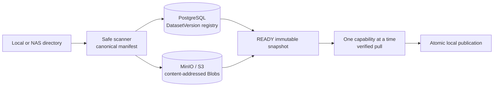

# RoboLake

RoboLake is an immutable dataset registry for large robotics data. It transfers regular-file-tree
snapshots into content-addressed object storage using deterministic manifests, integrity
verification, deduplication, resumable file-level push, and atomic pull.

Robot teleoperation datasets commonly live on NAS appliances or researcher workstations and are
copied manually to training servers. Those transfers can fail, repeat bytes, lose provenance, or
leave a directory whose completeness is unclear. RoboLake v0.1.0 makes that one workflow explicit
and verifiable.

## What v0.1.0 does

- Scans a Linux/macOS regular-file tree without following symlinks.
- Builds a deterministic manifest of relative paths, sizes, and SHA-256 digests.
- Registers immutable DatasetVersions and deduplicated content-addressed Blobs.
- Pushes missing Blobs directly to S3-compatible storage with create-only presigned requests.
- Resumes an interrupted push at verified whole-file boundaries.
- Pulls a READY Version, verifies every byte, and atomically publishes the reconstructed tree.

Run the complete synthetic demo from a clone with Docker and Python 3.12:

```bash
scripts/demo-v01.sh
```

v0.1.0 intentionally does not provide multipart upload, within-file or pull resume, authentication,
multi-tenancy, ROS2/MCAP interpretation, training workflows, a frontend, or continuous storage
scrubbing. It is not a complete robot MLOps platform or a production-ready SaaS service.

## Architecture



The CLI sends control metadata to FastAPI and transfers file bytes directly to object storage using
short-lived presigned URLs. PostgreSQL stores logical identity and workflow state; MinIO stores raw
immutable Blob bytes. See the [architecture overview](docs/ARCHITECTURE_OVERVIEW.md) and
[ADR index](docs/ADR_INDEX.md) for the decisions behind these boundaries.

## Requirements

- Python 3.12
- [uv 0.11.28+](https://docs.astral.sh/uv/getting-started/installation/)
- Docker Engine with Docker Compose
- Linux or macOS for the supported filesystem contract

Install the pinned uv version without changing shell configuration:

```bash
curl -LsSf https://astral.sh/uv/0.11.28/install.sh \
  | env UV_INSTALL_DIR="$HOME/.local/bin" UV_NO_MODIFY_PATH=1 sh
```

## Ten-minute quickstart

```bash
uv sync --locked
docker compose up -d --build --wait
uv run alembic upgrade head

uv run robolake example generate /tmp/robolake-demo --seed 7
uv run robolake push /tmp/robolake-demo --dataset demo/pick-place
uv run robolake status demo/pick-place@v1
uv run robolake manifest demo/pick-place@v1
uv run robolake pull demo/pick-place@v1 --output /tmp/robolake-restored
diff -qr /tmp/robolake-demo /tmp/robolake-restored
```

Local endpoints:

- API and OpenAPI: <http://localhost:18000>, <http://localhost:18000/docs>
- PostgreSQL: `localhost:15432`
- MinIO S3 API and console: <http://localhost:19000>, <http://localhost:19001>

Check service health with:

```bash
curl --fail http://localhost:18000/health
docker compose ps
```

Stop services without deleting their volumes with `docker compose down`.

## CLI workflow

```bash
robolake push DIRECTORY --dataset NAMESPACE/NAME
robolake status NAMESPACE/NAME@v1
robolake manifest NAMESPACE/NAME@v1
robolake pull NAMESPACE/NAME@v1 --output NEW_DIRECTORY
```

`push` returns only after the Version is READY. Repeating an unchanged push resolves the same
Version and reuses verified Blobs. `status` separates logical file-tree progress from deduplicated
content progress. `pull` refuses to replace an existing output directory.

## Integrity and security boundary

- Canonical manifests and file SHA-256 values define snapshot identity.
- Blob object keys are derived from SHA-256 and are create-only.
- Provider system checksums are reconciled before publication; missing checksums trigger a streamed
  full-object verification fallback.
- Downloads are written to private staging, checked, fsynced, and published atomically.
- Presigned URLs are bearer capabilities and must never be logged or shared.
- v0.1.0 has no authentication. Run it only inside a trusted network with external TLS and access
  controls when traffic leaves the local Compose environment.

Read the [security summary](docs/SECURITY_MODEL_SUMMARY.md), full
[threat model](docs/THREAT_MODEL_V0_1.md), and
[known limitations](docs/KNOWN_LIMITATIONS_V0.1.0.md) before deployment.

## Configuration

[`.env.example`](.env.example) contains synthetic development values only. An ignored `.env` may
override them. Application settings use the `ROBOLAKE_` prefix; Compose also reads PostgreSQL and
MinIO bootstrap values. Never commit real credentials.

Host ports can be changed without editing Compose:

```bash
ROBOLAKE_API_PORT=28000 ROBOLAKE_MINIO_PORT=29000 docker compose up -d
```

M1 rejects any file larger than 5,000,000,000 bytes before creating registry or storage state.

## Development and verification

```bash
make up            # start local services
make migrate       # apply Alembic migrations
make unit          # isolated tests
make integration   # real PostgreSQL and MinIO tests
make check         # Ruff, formatting, mypy, and all tests
make demo          # synthetic push/status/manifest/pull verification
make down          # stop services without deleting volumes
```

The release checklist is [docs/RELEASE_CHECKLIST_V0.1.0.md](docs/RELEASE_CHECKLIST_V0.1.0.md).
Measured M1 results are in [docs/reports/M1_BASELINE.md](docs/reports/M1_BASELINE.md).

## Repository structure

```text
apps/api/                  FastAPI transport and composition
apps/cli/                  Typer transport and composition
robolake/domain/           framework-free identities and state rules
robolake/application/      framework-free workflows and ports
robolake/infrastructure/   PostgreSQL, S3, HTTP, filesystem adapters
migrations/                Alembic revisions and database invariants
tests/unit/                isolated domain and boundary tests
tests/integration/         real PostgreSQL and MinIO contract tests
docs/adr/                  accepted architecture decisions
scripts/                   demo and benchmark entry points
```

See the [v0.1.0 release notes](docs/RELEASE_NOTES_V0.1.0.md), [changelog](CHANGELOG.md), and
[M0–M5 roadmap](docs/ROADMAP.md). RoboLake is released under the [MIT License](LICENSE).
