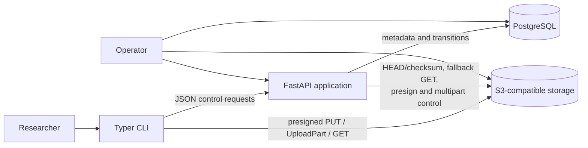
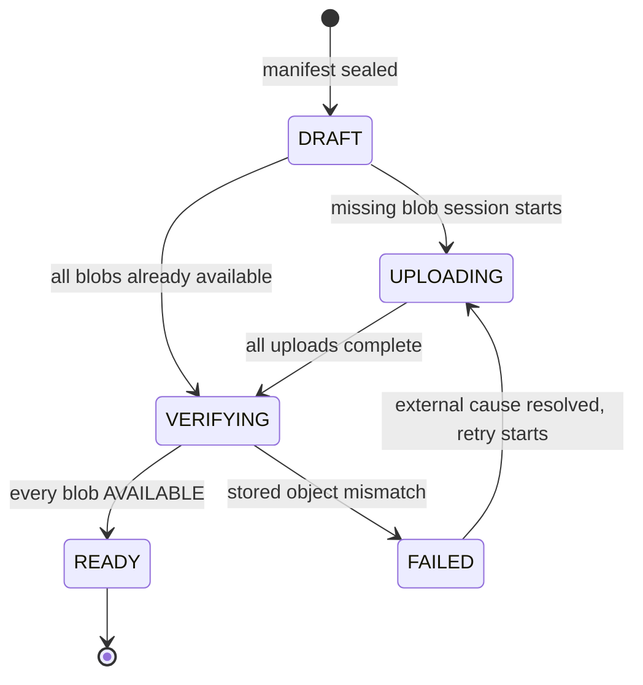
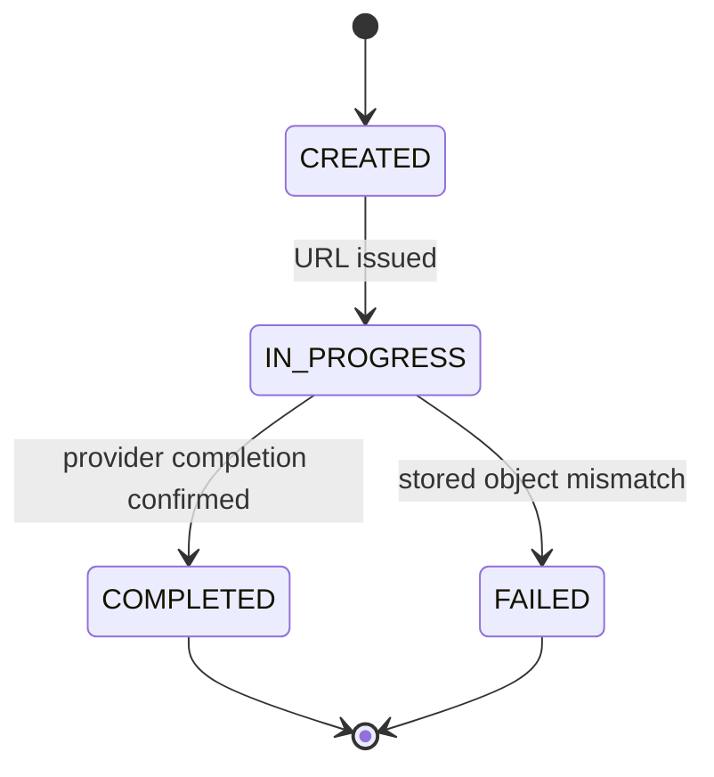
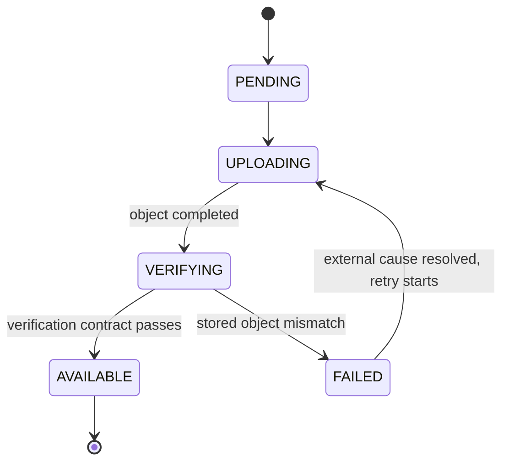

# RoboLake v0.1 Architecture

- **Status:** Accepted
- **Date:** 2026-07-10
- **Scope:** Local directory transfer, immutable registry, S3-compatible storage, and reconstruction

## 1. Decision summary

RoboLake v0.1 is a modular monolith with two entry points: a Typer CLI and a FastAPI service. The API
owns metadata, lifecycle transitions, idempotency, and object-store control operations. The CLI reads
local files and transfers bytes directly to S3-compatible storage using short-lived presigned URLs.
PostgreSQL is the metadata and workflow source of truth; object storage is the source of file bytes.

Files remain opaque. The design deliberately excludes downstream processing and every non-goal in
[the product brief](PRODUCT_BRIEF.md).

## 2. Upload approach comparison

| Approach | Advantages | Costs and failure modes | Decision |
| --- | --- | --- | --- |
| **A. API proxies all bytes** | Few client/storage concepts; credentials stay server-side | Doubles network traffic through API; long requests consume API capacity; restart and horizontal scaling complicate resume; API becomes the bottleneck | Reject |
| **B. CLI uses permanent storage credentials** | Simple high-throughput data path; native SDK resume | Long-lived credentials must be distributed, stored, scoped, rotated, and revoked on research machines; CLI can address more keys than one transfer | Reject |
| **C. API creates uploads and presigns part operations** | Bytes bypass API; URLs are limited to one method/key/part and expire; server retains lifecycle control; multipart resume fits large files | More control-plane endpoints; URL renewal, part reconciliation, and ambiguous completion require explicit handling | **Choose** |

Approach C is the smallest credible design for multi-gigabyte MCAP, video, and sensor files. M1 uses
one create-only `PutObject` per Blob and rejects a file above 5,000,000,000 bytes before persistent
mutation. M2 introduces multipart/within-file resume with a 64 MiB default part that grows to stay
below 10,000 parts. S3 permits at most 10,000 parts, with 5 MiB–5 GiB parts except the final part
([AWS multipart limits](https://docs.aws.amazon.com/AmazonS3/latest/userguide/qfacts.html)).

Presigned URLs are time-limited bearer capabilities, not identities. They permit direct transfer
without giving the CLI storage credentials, but they must be protected and narrowly scoped
([AWS presigned URL guidance](https://docs.aws.amazon.com/AmazonS3/latest/userguide/using-presigned-url.html)).

## 3. System context and component boundaries



The recommended physical package layout keeps one deployable codebase:

```text
apps/
  api/                   # FastAPI schemas, routes, exception mapping, composition
  cli/                   # Typer commands, progress, local filesystem adapter
robolake/
  domain/                # entities, value objects, invariants, state machines
  application/           # use cases and ports expressed as Protocols
  infrastructure/        # SQLAlchemy, S3 client, HTTP adapters, settings
tests/
  unit/
  integration/
docs/adr/
examples/
```

Dependency rules:

- `domain` imports only the standard library and other domain modules.
- `application` imports `domain` and defines repository, object-store, clock, and hashing ports. It
  does not import FastAPI, Typer, SQLAlchemy, or an S3 SDK.
- `infrastructure` implements application ports using SQLAlchemy/PostgreSQL and an S3-compatible
  client.
- `apps/api` and `apps/cli` translate transport input into application commands and map domain
  exceptions to HTTP responses or stable CLI exit codes.
- Neither entry point calls another entry point. Both use application services.

## 4. Primary data flows

### 4.1 Scan and registration

1. CLI opens the selected root without following symlinks and walks through directory descriptors;
   child opens are dirfd-relative and no-follow.
2. For each regular file it validates the relative path, records size, streams SHA-256,
   and checks that file identity/size/timestamps did not change during the read.
3. CLI sorts entries, writes canonical manifest bytes, and computes the manifest SHA-256.
4. CLI creates or finds the dataset, then registers the complete manifest with an idempotency key.
5. API validates canonical rules, inserts the version, entries, and missing `Blob` rows in one
   transaction, seals the manifest, and reports which blobs are already `AVAILABLE`.

### 4.2 M1 upload and resume

1. CLI rescans the source, derives the immutable manifest identity, and applies the per-file limit
   before any persistent operation.
2. For each unique missing Blob, CLI gets/reuses the one active session and requests a URL signed
   for exact key, length, SHA-256, and `If-None-Match: *`.
3. CLI streams directly to object storage and interprets status only: `200` created, `412` requires
   race reconciliation, and `409` requires reconciliation then retry if no object is visible.
4. API completion performs HEAD with checksum mode. Exact provider system SHA-256 and size satisfy
   the verification contract; an absent system checksum triggers a streamed full-GET fallback.
5. Matching content becomes `AVAILABLE`; a poisoned key is reported and never overwritten/deleted.
6. An interrupted PUT resumes at Blob granularity. M2 extends the same contract with UploadPart and
   `ListParts`; ETags remain opaque receipts.

### 4.3 Verification and publication

1. Finalization locks the version row and verifies every entry resolves to `AVAILABLE`.
2. The version moves to `VERIFYING`.
3. It recomputes canonical manifest identity, logical/unique immutable totals, contiguous ordinals,
   and Blob availability without rereading an already `AVAILABLE` Blob.
4. The transaction moves the version to `READY` and records
   `ready_at`. A retry returns the same `READY` representation.

`AVAILABLE` is a reusable verification attestation. `READY` means all referenced Blobs passed the
contract before publication; it is not a continuous scrub or per-Version reread guarantee.

### 4.4 Download

1. CLI fetches the sealed manifest, revalidates the complete path set, and creates a private sibling
   staging tree.
2. API returns exactly one ordinal-bound entry and one GET capability per request. The same
   Version-bound cursor replays the same entry with a fresh URL and consumes no server state.
3. CLI prepares a safe temp file before requesting the URL, immediately streams/hash-checks it, and
   advances only after materializing that entry inside staging.
4. After the whole manifest is present, Linux `renameat2(RENAME_NOREPLACE)` or macOS
   `renamex_np(RENAME_EXCL)` publishes the tree. Unsupported no-replace semantics fail closed.
5. Parent directories are implied. Empty child directories and filesystem metadata are not
   reconstructed. M1 promises atomic visibility, not power-loss durability or pull resume.

## 5. Domain model

| Model | Responsibility and invariants |
| --- | --- |
| `Dataset` | Stable UUID and unique name. Serializes dataset-scoped manifest-registration numbers. |
| `DatasetVersion` | UUID business resource plus dataset-scoped manifest identity, lifecycle, and immutable logical/unique totals. Entries never change; `READY` is terminal. |
| `DatasetEntry` | Immutable canonical ordinal and normalized logical file path referencing one Blob. |
| `Blob` | UUID relational resource with globally unique SHA-256 physical identity. Size must agree; `AVAILABLE` is a reusable verification attestation. |
| `UploadSession` | One M1 single-PUT attempt to materialize a Blob. M2 extends it with provider multipart state. |
| `UploadPart` | M2-only expected byte range and opaque receipt; M1 creates no fake one-part row. |
| `IdempotencyRecord` | Scope, key, request fingerprint, and stable response/resource for a mutating API call. |

Domain value objects include `Sha256Digest`, `RelativePath`, `ManifestHash`, `ObjectKey`,
`DatasetName`, `VersionNumber`, `ByteCount`, and `PartNumber`. Invalid values cannot construct these
objects. Exceptions describe domain outcomes such as `ManifestMismatch`, `IllegalTransition`,
`UnsafePath`, `ContentConflict`, and `UploadExpired`.

## 6. PostgreSQL schema proposal

All timestamps are `timestamptz`; all IDs are UUIDs generated by the application. States use text
columns with `CHECK` constraints so migrations can evolve them explicitly.

### `datasets`

- `id uuid primary key`
- `name text not null unique` with trimmed/non-empty/length checks
- `created_at timestamptz not null`

### `dataset_versions`

- `id uuid primary key`
- `dataset_id uuid not null references datasets(id)`
- `version_number bigint not null check (version_number > 0)`
- `manifest_schema_version integer not null check (= 1)`
- `manifest_sha256 char(64) not null` with lowercase-hex check
- `state text not null check (state in ('DRAFT','UPLOADING','VERIFYING','READY','FAILED'))`
- `file_count bigint not null check (file_count >= 0)`
- `logical_bytes bigint not null check (logical_bytes >= 0)`
- `unique_blob_count bigint not null check (unique_blob_count >= 0)`
- `unique_blob_bytes bigint not null check (unique_blob_bytes >= 0)`
- `sealed_at`, `created_at`, `ready_at`, `failure_code`, `failure_detail`
- `unique (dataset_id, version_number)`, `unique (dataset_id, manifest_sha256)`, and an index on
  `(dataset_id, created_at)`

### `blobs`

- `id uuid primary key`
- `sha256 char(64) not null unique`
- `size_bytes bigint not null check (size_bytes >= 0)`
- `object_key text not null unique`
- `state text not null check (state in ('PENDING','UPLOADING','VERIFYING','AVAILABLE','FAILED'))`
- `verified_at`, `created_at`, `failure_code`
- a duplicate SHA-256 with another size is an integrity conflict

### `dataset_entries`

- `dataset_version_id uuid not null references dataset_versions(id)`
- `manifest_ordinal bigint not null check (manifest_ordinal >= 0)`
- `relative_path text not null` with non-empty and length checks
- `blob_id uuid not null references blobs(id)`
- primary key `(dataset_version_id, relative_path)`
- unique `(dataset_version_id, manifest_ordinal)`
- indexes on `blob_id` and `(dataset_version_id, blob_id)`

### `upload_sessions`

- `id uuid primary key`
- `blob_id uuid not null references blobs(id)` and initiating-version UUID foreign key
- `strategy text not null check (strategy = 'SINGLE_PUT')` in M1
- `state text not null check (state in ('CREATED','IN_PROGRESS','COMPLETED','FAILED'))`
- opaque `etag`, bounded failure fields, and activity/completion timestamps
- partial unique index on `blob_id` while state is `CREATED` or `IN_PROGRESS`

### `upload_parts` (M2)

- `upload_session_id uuid not null references upload_sessions(id) on delete cascade`
- `part_number integer not null check (part_number between 1 and 10000)`
- `offset_bytes bigint not null check (offset_bytes >= 0)`
- `size_bytes bigint not null check (size_bytes > 0)`
- `sha256 char(64) not null`, `etag text null`
- `state text not null check (state in ('PENDING','UPLOADED'))`
- `uploaded_at timestamptz null`
- primary key `(upload_session_id, part_number)`

### `idempotency_records`

- `scope text not null`, `key text not null`, `request_sha256 char(64) not null`
- `resource_type text`, `resource_id uuid`, `http_status integer`, `response_json jsonb`
- `created_at`, `expires_at null`
- primary key `(scope, key)`

Resource-creation records are retained for the resource lifetime in v0.1. Short-lived capability
responses may expire because requesting a fresh URL does not create a new domain resource.

Migrations add triggers that reject entry insert/update/delete after `sealed_at`, changes to manifest
identity after sealing, illegal lifecycle transitions, and any update to a `READY` version except
non-semantic audit fields. Application checks provide clear errors; database enforcement is the
last line of defense.

## 7. Object key layout

One unversioned bucket, configurable but called `robolake-blobs` locally, stores only content blobs:

```text
blobs/sha256/<first-2-hex>/<next-2-hex>/<64-char-lowercase-sha256>
```

Example shape:

```text
blobs/sha256/ab/cd/abcdef...<64 hex total>
```

Logical filenames, dataset names, version numbers, and source paths never enter an object key. A
multipart upload targets its final content key but is invisible as an object until completion.
Every M1 PUT is create-only and signs `If-None-Match: *`, exact Content-Length, and expected
SHA-256. RoboLake never issues a write URL for an `AVAILABLE` Blob. Provider system checksum is
verification evidence; caller metadata and ETag are diagnostic only.

## 8. Manifest schema and canonical hash

Version 1 has one JSON object:

```json
{
  "schema_version": 1,
  "entries": [
    {
      "relative_path": "camera/front.mp4",
      "size_bytes": 123456,
      "sha256": "0123456789abcdef0123456789abcdef0123456789abcdef0123456789abcdef"
    }
  ]
}
```

Canonicalization rules are part of the versioned contract:

1. Accept Unicode scalar text, normalize paths to NFC, and store `/` separators.
2. Reject absolute/drive/UNC/backslash forms, controls, empty/dot segments, a segment over 255 UTF-8
   bytes, a path over 1,024 UTF-8 bytes, symlinks, and non-regular files.
3. Reject exact/NFC/case-folded duplicate and ancestor-prefix collisions.
4. Sort entries by `relative_path` UTF-8 bytes and assign contiguous zero-based manifest ordinals.
5. Use only the field order shown above. Media/format hints and filesystem metadata are not
   canonical, accepted from clients, or persisted in M1.
6. Serialize UTF-8 without BOM, indentation, insignificant whitespace, ASCII escaping, or trailing
   newline. Integers are base-10 JSON numbers.
7. Hash exactly those bytes with SHA-256.

No hostname, absolute root, owner, permissions, timestamps, or traversal order enters the manifest.
Parent directories are implicit and nested empty directories are ignored. The API rejects a
supplied hash or ordering that does not match re-canonicalized content. Validity limits are fixed
protocol constants shared by all deployments.

## 9. State machines

### Dataset version



Transient or ambiguous upload/storage failures do not fail the version. `FAILED` means the same
immutable registered content cannot currently be published. A poisoned key requires operator
inspection/removal outside RoboLake; M1 has no repair/delete command. A later push can return the
same Version to `UPLOADING` after that external condition is resolved. `READY` is terminal.
Status also derives a blocking failure/action from referenced Blob state, so another non-READY
Version sharing the same poisoned Blob reports `CONTACT_OPERATOR` without storing a duplicate
action field.

### Upload session



A failed M1 session is replaced for the same Blob only after its cause is safe to retry; the sealed
DatasetVersion is never changed. `ABORTING`/`ABORTED` enter with M2; provider upload disappearance
does not create an application `EXPIRED` session state.

### Blob



## 10. Idempotency and concurrency

- Mutating create/register calls require `Idempotency-Key`. The server hashes the canonical request,
  inserts `(scope, key)` under a uniqueness constraint, and stores the stable response in the same
  transaction as the resource. Same key/same hash replays; same key/different hash conflicts.
- DatasetVersion resource identity is UUID; `(dataset_id, manifest_sha256)` is snapshot identity;
  `<dataset>@vN` is a human reference. Numbers are registration order, not READY order, and are
  allocated while locking the Dataset row.
- Upload-session creation locks the blob row and uses the partial unique index to return an existing
  active session rather than create a competitor.
- M1 URL issuance signs exact create-only preconditions. `200` means this client created; `412`
  requires reconciliation; `409` reconciles once and remains retryable if no object is visible.
  Conflict paths never overwrite/delete and concurrent pushes converge on one Blob/Version.
- Completion is resource-idempotent and accepts no required ETag. HEAD system SHA-256/size or the
  missing-checksum full-GET fallback is authoritative.
- Finalization locks the Version. `READY` replays; `FAILED` can retry the same manifest only when its
  external cause is resolved.
- M2 part acknowledgement is keyed by `(session, part_number)` and ambiguous multipart completion
  reconciles the same deterministic key before any final state.

An unavoidable orphan window exists if the process crashes after provider multipart creation but
before persisting its upload ID. Storage stale-upload cleanup is the compensating control.

## 11. Retry, URL renewal, and resume semantics

- M1 PUT URLs default to 15 minutes and are issued just before one sequential Blob transfer. A
  dropped single PUT restarts that Blob from byte zero.
- `412` is a create-only race signal, not success; API reconciliation must prove the existing object.
  `409` with no visible match is `UPLOAD_CONFLICT`/`RETRY_PUSH` and does not persist FAILED state.
- A lost PUT acknowledgement is reconciled by deterministic key under the same verification
  contract. Missing key receives a fresh URL; poisoned key stops for operator action.
- M1 GET capabilities are never batched. The API returns one ordinal at a time; the CLI requests the
  next only after current materialization. Replaying a cursor refreshes URL TTL without consuming it.
- A GET connection failure discards the staging tree and M1 pull restarts; Range/pull resume is a
  later ADR.
- M2 adds paginated `ListParts`, part replacement, `NoSuchUpload` reconciliation, and a separate
  expiring/fenced admission lease. Lease expiry releases execution capacity without expiring the
  resumable session/provider MPU or changing Blob/Version identity.

## 12. Checksum policy

- SHA-256 of each full local file is the blob identity recorded in the manifest.
- M1 signs a precalculated full-object `x-amz-checksum-sha256`, exact Content-Length, and
  `If-None-Match: *`. A compliant provider rejects mismatching bytes before object creation.
- API requests provider system `ChecksumSHA256` with HEAD and matches size. If the system SHA-256 is
  absent, API streams one full GET and calculates SHA-256/size; caller metadata and ETag never count.
- Multipart ETags and composite checksums are never compared with a manifest full-file digest. M2
  must retain equivalent full-object verification meaning.
- Download repeats full SHA-256 and size verification before atomic placement.
- Hash equality with a size mismatch is a hard integrity conflict, not deduplication.

## 13. Path traversal and filesystem defense

Scanning rejects symlinks rather than resolving them, which avoids cycles and reading outside the
selected root. On supported Linux/macOS runtimes the scanner and later uploader use dirfd-relative
no-follow opens from a captured root identity, preventing a checked parent from being replaced by an
outside symlink. Pre/post `fstat` metadata guards file mutation; a mismatch invalidates the
operation.

On download, validation is repeated even for a server-provided sealed manifest:

- accept Unicode scalar text, normalize NFC, and reject roots, drives, UNC/backslash forms,
  controls, empty/dot components, segments over 255 UTF-8 bytes, and paths over 1,024 UTF-8 bytes;
- reject exact/NFC/case-folded duplicate and ancestor-prefix collisions before any write;
- resolve the destination root once and prove every candidate parent remains beneath it;
- create parents and temporary files without following symlinks;
- publish the complete private staging tree with Linux/macOS atomic no-replace syscalls and fail
  closed when unavailable. General replacing rename is not a fallback.

These controls address both relative and absolute path traversal described by
[CWE-22](https://cwe.mitre.org/data/definitions/22).

M1 contract-tests Linux/macOS and does not claim Windows/SMB filename semantics. It guarantees
atomic visibility under handled failures and normal process interruption, not persistence across
power loss; complete directory-tree durability requires more than file-only `fsync`.

## 14. M2 admission and abandoned multipart boundary

M2 separates execution admission from provider cleanup:

1. A short-lived PostgreSQL admission lease counts only active invocations. Expiry allows atomic
   takeover with a higher fencing epoch but does not abort, delete, or expire the persistent session
   or its provider MPU.
2. The current fenced workflow may explicitly abort only its own incomplete provider upload.
   `NoSuchUpload` is reconciled with the final object key before becoming an abort or completion
   result.
3. Object storage expires unknown/untracked stale multipart uploads after seven days. AWS recommends the
   `AbortIncompleteMultipartUpload` lifecycle action
   ([AWS lifecycle guidance](https://docs.aws.amazon.com/AmazonS3/latest/userguide/mpu-abort-incomplete-mpu-lifecycle-config.html));
   MinIO exposes stale-upload expiry and cleanup settings
   ([MinIO server configuration](https://github.com/minio/minio/blob/master/docs/config/README.md)).

Cleanup never deletes a completed object. M2 has no background session sweeper or general Blob GC;
broader abandoned-session maintenance remains M3. Metrics distinguish unexpired leases, persistent
sessions, and provider abort failures.

## 15. Expected CLI workflow

```bash
robolake push ./examples/demo-dataset --dataset demo/pick-place
robolake status demo/pick-place@v1
robolake manifest demo/pick-place@v1
robolake pull demo/pick-place@v1 --output /tmp/robolake-restored
```

`push` composes scan/register/transfer/finalize and returns only when READY. It shows logical
snapshot totals, unique content, and invocation-created/reused Blob outcomes. `status` exposes
logical and unique views. `pull` reports logical materialization, not exact network bytes. No
absolute source path is sent to API; capabilities/credentials are always redacted.

## 16. API endpoint proposal

All endpoints are under `/v1`; error bodies use stable machine codes plus safe human detail.

| Method and path | Purpose | Idempotency |
| --- | --- | --- |
| `POST /datasets` | Create/find a named dataset | Required key |
| `POST /datasets/{dataset_id}/versions` | Validate/seal or find a manifest | Required key |
| `GET /versions/resolve` | Resolve dataset name and registration number | Read-only |
| `GET /versions/{version_id}` | State, dual-view totals/progress, failure/action | Read-only |
| `GET /versions/{version_id}/manifest` | Return canonical sealed manifest | Read-only |
| `POST /versions/{version_id}/upload-sessions` | Get/create a session for one blob | Required key |
| `GET /upload-sessions/{session_id}` | Reconciled M1 session state | Read-only |
| `POST /upload-sessions/{session_id}/url` | Presign one exact create-only PUT | Resource-scoped |
| `POST /upload-sessions/{session_id}/complete` | Idempotently verify/reconcile object; ETag optional | Resource-idempotent |
| `POST /versions/{version_id}/finalize` | Recheck invariants and publish | Resource-idempotent |
| `POST /versions/{version_id}/download-plan` | Return zero/one ordinal-bound entry and GET | Replayable read capability |

The API rejects dataset file bodies, unknown canonical fields, invalid cursors, and any M1 request
for more than one GET capability. Cursor payload is fixed-width, Version-bound, unsigned, and not an
authorization token. M2 adds multipart endpoints without changing the M1 resource identities.

## 17. Local Docker Compose environment

Compose defines:

- `postgres`: persistent volume, health check, non-root application database/user;
- `minio`: persistent volume, S3 port and console port for local diagnostics, health check, and stale
  multipart expiry as a backstop independent of application admission leases;
- `minio-init`: one-shot creation of the unversioned blob bucket and least-privilege API service
  credentials;
- `api`: Alembic migration check/startup, health endpoint, PostgreSQL and MinIO configuration;
- optional `cli` profile for reproducible commands, while normal development runs CLI on the host.

Only `.env.example` is committed. Local defaults are synthetic development values; real credentials
are supplied outside Git. The CLI receives API and public object endpoint URLs, never service
credentials. No Kafka, worker, frontend, or orchestration service is present.

## 18. Test strategy

### Unit tests

- Minimal manifest golden vectors, ancestor/case-fold collision corpus, and shuffled traversal order
- Value-object validation, state transitions, idempotency fingerprints, metrics, and cursor codec
- Source mutation/symlink/special-file rejection and download path containment
- Retry classification, URL redaction, and stable CLI exit/error mapping
- Domain/application import-boundary tests

### PostgreSQL integration tests

- Real Alembic upgrade/downgrade from an empty database
- Constraints, immutable ordinals/summaries, concurrent version allocation, duplicate idempotency
  keys, row locking, derived progress, and terminal-state behavior
- Transaction rollback around manifest registration and finalization

### MinIO integration tests

- M1 create-only PUT signed headers, 200/412/409 convergence, stale URL refusal, and checksum reject
- System-checksum verification, missing-checksum full-GET fallback, lost acknowledgement, and
  poisoned-object stop without overwrite/delete
- One-at-a-time GET expiry/replay behavior against the pinned image
- M2 adds multipart create/upload/list/complete/abort and selected-part resume contracts

### API/CLI and end-to-end tests

- FastAPI tests use the real application service with fake ports for exhaustive error mapping and
  Compose services for contract tests.
- CLI tests use Typer's runner for help, exit codes, JSON output, and progress redaction.
- M1 release test executes push → interruption/resume → status/manifest → pull → tree comparison with
  synthetic data under the single-PUT limit. M2 release evidence adds a file above 5 GB.

Tests may lower operational limits/TTLs to exercise boundaries. Integration tests are explicitly marked and never silently
fall back to SQLite or an in-memory object-store substitute.

## 19. Operational signals

Structured logs and metrics include request ID, dataset/version ID, upload-session ID, state
transition, part counts, byte counts, retry class, verification duration, and a short hash prefix.
They exclude absolute local paths, complete digests where unnecessary, request bodies, credentials,
and presigned query strings. Health checks distinguish process liveness from PostgreSQL/MinIO
readiness.

## 20. Known limitations and review triggers

- Empty directories and filesystem metadata such as mode, ownership, timestamps, hard links, and
  extended attributes are not preserved.
- Case-fold/ancestor rejection favors reconstruction across supported Linux/macOS filesystems over
  preserving case-distinct source names. Windows/SMB semantics are unsupported.
- Pull is sequential, issues one capability at a time, has no Range resume, and guarantees atomic
  visibility rather than power-loss durability.
- `AVAILABLE` and `READY` are attestations, not continuous object scrubbing. Pull detects later
  corruption; M1 has no automatic repair or persistent CORRUPTED state.
- Authentication, authorization, tenant isolation, and untrusted-network deployment are unsupported.
- Provider compatibility is proven against local MinIO first. Any additional S3-compatible product
  needs the same contract suite before support is claimed.
