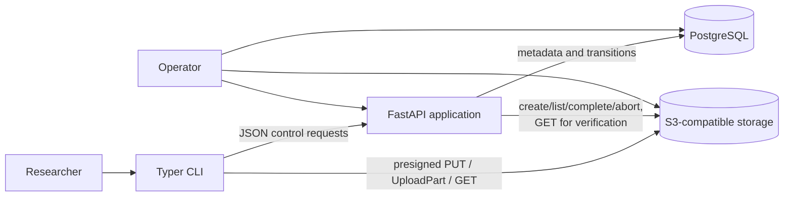
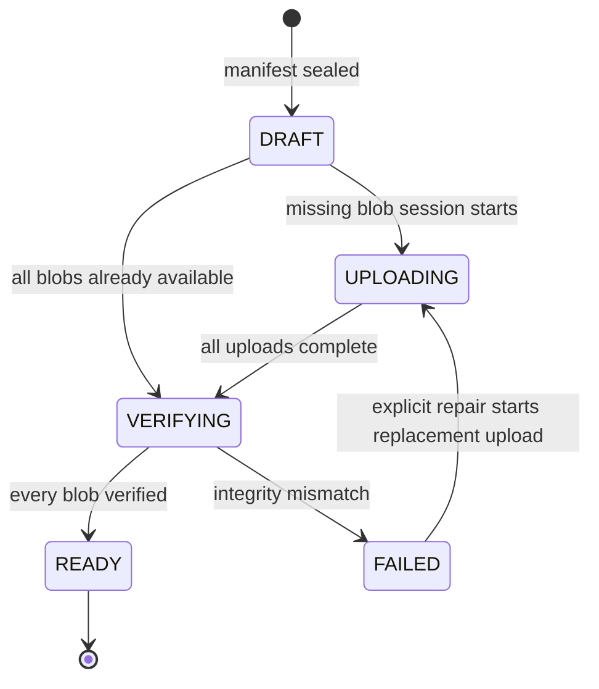
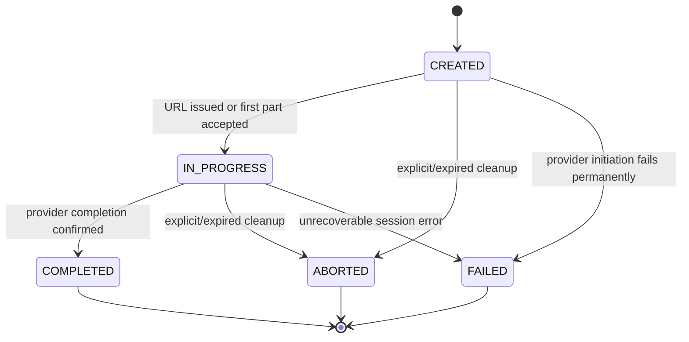
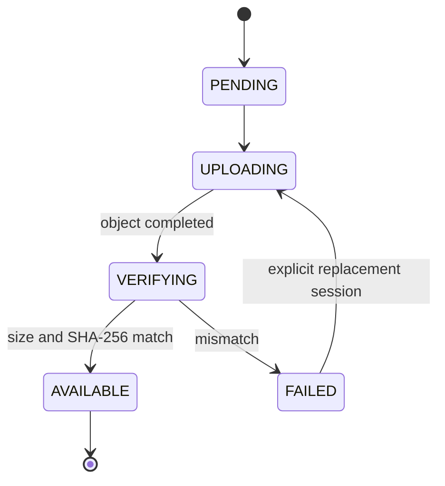

# RoboLake v0.1 Architecture

- **Status:** Accepted
- **Date:** 2026-07-10
- **Scope:** Local directory transfer, immutable registry, S3-compatible storage, and reconstruction

## 1. Decision summary

RoboLake v0.1 is a modular monolith with two entry points: a Typer CLI and a FastAPI service. The API
owns metadata, lifecycle transitions, idempotency, and object-store control operations. The CLI reads
local files and transfers bytes directly to S3-compatible storage using short-lived presigned URLs.
PostgreSQL is the metadata and workflow source of truth; object storage is the source of file bytes.

Files remain opaque. The design deliberately excludes downstream processing and every non-goal in
[the product brief](PRODUCT_BRIEF.md).

## 2. Upload approach comparison

| Approach | Advantages | Costs and failure modes | Decision |
| --- | --- | --- | --- |
| **A. API proxies all bytes** | Few client/storage concepts; credentials stay server-side | Doubles network traffic through API; long requests consume API capacity; restart and horizontal scaling complicate resume; API becomes the bottleneck | Reject |
| **B. CLI uses permanent storage credentials** | Simple high-throughput data path; native SDK resume | Long-lived credentials must be distributed, stored, scoped, rotated, and revoked on research machines; CLI can address more keys than one transfer | Reject |
| **C. API creates uploads and presigns part operations** | Bytes bypass API; URLs are limited to one method/key/part and expire; server retains lifecycle control; multipart resume fits large files | More control-plane endpoints; URL renewal, part reconciliation, and ambiguous completion require explicit handling | **Choose** |

Approach C is the smallest credible design for multi-gigabyte MCAP, video, and sensor files. A file
smaller than 64 MiB uses a presigned `PutObject`; a file at or above that threshold uses multipart.
The default multipart part size is 64 MiB and increases when necessary to remain below 10,000 parts.
S3 permits at most 10,000 parts, with 5 MiB–5 GiB parts except that the final part has no minimum
([AWS multipart limits](https://docs.aws.amazon.com/AmazonS3/latest/userguide/qfacts.html)).

Presigned URLs are time-limited bearer capabilities, not identities. They permit direct transfer
without giving the CLI storage credentials, but they must be protected and narrowly scoped
([AWS presigned URL guidance](https://docs.aws.amazon.com/AmazonS3/latest/userguide/using-presigned-url.html)).

## 3. System context and component boundaries



The recommended physical package layout keeps one deployable codebase:

```text
apps/
  api/                   # FastAPI schemas, routes, exception mapping, composition
  cli/                   # Typer commands, progress, local filesystem adapter
robolake/
  domain/                # entities, value objects, invariants, state machines
  application/           # use cases and ports expressed as Protocols
  infrastructure/        # SQLAlchemy, S3 client, HTTP adapters, settings
tests/
  unit/
  integration/
docs/adr/
examples/
```

Dependency rules:

- `domain` imports only the standard library and other domain modules.
- `application` imports `domain` and defines repository, object-store, clock, and hashing ports. It
  does not import FastAPI, Typer, SQLAlchemy, or an S3 SDK.
- `infrastructure` implements application ports using SQLAlchemy/PostgreSQL and an S3-compatible
  client.
- `apps/api` and `apps/cli` translate transport input into application commands and map domain
  exceptions to HTTP responses or stable CLI exit codes.
- Neither entry point calls another entry point. Both use application services.

## 4. Primary data flows

### 4.1 Scan and registration

1. CLI resolves the selected root and walks it without following symlinks.
2. For each regular file it validates the relative path, records stable metadata, streams SHA-256,
   and checks that file identity/size/timestamps did not change during the read.
3. CLI sorts entries, writes canonical manifest bytes, and computes the manifest SHA-256.
4. CLI creates or finds the dataset, then registers the complete manifest with an idempotency key.
5. API validates canonical rules, inserts the version, entries, and missing `Blob` rows in one
   transaction, seals the manifest, and reports which blobs are already `AVAILABLE`.

### 4.2 Upload and resume

1. Before upload or resume, CLI rescans the source and requires the registered manifest hash.
2. For each missing blob, CLI asks API for an upload session. One active session per blob is allowed.
3. For each requested multipart part, CLI computes its SHA-256 and sends part number, byte range,
   size, and digest to API. API validates/persists that expectation and returns a bounded batch of
   URLs with the checksum header included in the signature where the provider supports it. For a
   single PUT, the registered full-file digest serves the same purpose.
4. CLI uploads directly to object storage, never logs URLs, and acknowledges successful parts to API.
5. On resume, API paginates `ListParts` and reconciles provider parts with persisted part number,
   size, ETag, and SHA-256. A part is skipped only when these records agree; otherwise it is safely
   re-uploaded under the same part number.
6. API completes the provider upload from an ordered, consecutive part list and marks the session
   `COMPLETED`. ETags are opaque transfer receipts, not full-file hashes.

### 4.3 Verification and publication

1. Finalization locks the version row and verifies that every entry resolves to a completed or
   already `AVAILABLE` blob.
2. The version moves to `VERIFYING`.
3. For every new blob, API streams `GetObject`, counts bytes, and computes full-file SHA-256. It does
   not buffer the object or return it to the caller.
4. Matching blobs become `AVAILABLE`; a mismatch becomes `FAILED` and the version becomes `FAILED`.
5. When all blobs are available, the transaction moves the version to `READY` and records
   `ready_at`. A retry returns the same `READY` representation.

This second read is intentional. Multipart ETags are not whole-object MD5 digests, and multipart
SHA-256 may be a composite checksum rather than the SHA-256 of all file bytes
([AWS integrity documentation](https://docs.aws.amazon.com/AmazonS3/latest/userguide/checking-object-integrity-upload.html)).

### 4.4 Download

1. CLI fetches the sealed manifest and a bounded page of presigned GET URLs for a `READY` version.
2. It revalidates every logical path against the selected destination.
3. It streams each object into a newly created temporary sibling file, computing byte count and
   SHA-256.
4. Only a match is atomically renamed to the final path. Existing files, symlinks, and normalized
   path collisions fail closed.
5. Directories implied by file paths are recreated. Empty source directories are not represented in
   v0.1 manifests and therefore are not reconstructed.

## 5. Domain model

| Model | Responsibility and invariants |
| --- | --- |
| `Dataset` | Stable registry identity and unique human-readable name. Owns ordered version numbers. |
| `DatasetVersion` | Sealed manifest identity, lifecycle state, totals, and failure reason. Entries never change after registration; `READY` never transitions. |
| `DatasetEntry` | One normalized logical file path mapped to `(sha256, size_bytes)` and optional media type. Unique within a version. |
| `Blob` | Content-addressed physical object. Hash is identity; size must agree everywhere. Only `AVAILABLE` blobs satisfy a version. |
| `UploadSession` | One attempt to materialize a blob with single PUT or multipart. Stores provider upload ID, sizing, expiry, and terminal result. |
| `UploadPart` | Expected byte range and its persisted transfer receipt. Part numbers are consecutive and bounded by provider limits. |
| `IdempotencyRecord` | Scope, key, request fingerprint, and stable response/resource for a mutating API call. |

Domain value objects include `Sha256Digest`, `RelativePath`, `ManifestHash`, `ObjectKey`,
`DatasetName`, `VersionNumber`, `ByteCount`, and `PartNumber`. Invalid values cannot construct these
objects. Exceptions describe domain outcomes such as `ManifestMismatch`, `IllegalTransition`,
`UnsafePath`, `ContentConflict`, and `UploadExpired`.

## 6. PostgreSQL schema proposal

All timestamps are `timestamptz`; all IDs are UUIDs generated by the application. States use text
columns with `CHECK` constraints so migrations can evolve them explicitly.

### `datasets`

- `id uuid primary key`
- `name text not null unique` with trimmed/non-empty/length checks
- `created_at timestamptz not null`

### `dataset_versions`

- `id uuid primary key`
- `dataset_id uuid not null references datasets(id)`
- `version_number bigint not null check (version_number > 0)`
- `manifest_schema_version integer not null check (= 1)`
- `manifest_sha256 char(64) not null` with lowercase-hex check
- `state text not null check (state in ('DRAFT','UPLOADING','VERIFYING','READY','FAILED'))`
- `file_count bigint not null check (file_count >= 0)`
- `total_bytes bigint not null check (total_bytes >= 0)`
- `sealed_at`, `created_at`, `ready_at`, `failure_code`, `failure_detail`
- `unique (dataset_id, version_number)`, `unique (dataset_id, manifest_sha256)`, and an index on
  `(dataset_id, created_at)`

### `blobs`

- `sha256 char(64) primary key`
- `size_bytes bigint not null check (size_bytes >= 0)`
- `object_key text not null unique`
- `state text not null check (state in ('PENDING','UPLOADING','VERIFYING','AVAILABLE','FAILED'))`
- `verified_at`, `created_at`, `failure_code`
- `unique (sha256, size_bytes)` to support a composite reference and make size disagreement explicit

### `dataset_entries`

- `dataset_version_id uuid not null references dataset_versions(id)`
- `relative_path text not null` with non-empty and length checks
- `size_bytes bigint not null check (size_bytes >= 0)`
- `sha256 char(64) not null`
- `media_type text null`
- primary key `(dataset_version_id, relative_path)`
- composite foreign key `(sha256, size_bytes) references blobs(sha256, size_bytes)`
- indexes on `sha256` and `(dataset_version_id, sha256)`

### `upload_sessions`

- `id uuid primary key`
- `dataset_version_id uuid not null references dataset_versions(id)`
- `blob_sha256 char(64) not null references blobs(sha256)`
- `strategy text not null check (strategy in ('SINGLE_PUT','MULTIPART'))`
- `state text not null check (state in ('CREATED','IN_PROGRESS','COMPLETED','ABORTED','FAILED'))`
- `object_key text not null`, `provider_upload_id text null`
- `part_size_bytes bigint null`, `expected_part_count integer not null`
- `expires_at`, `last_activity_at`, `created_at`, `completed_at`, `failure_code`
- partial unique index on `blob_sha256` while state is `CREATED` or `IN_PROGRESS`

### `upload_parts`

- `upload_session_id uuid not null references upload_sessions(id) on delete cascade`
- `part_number integer not null check (part_number between 1 and 10000)`
- `offset_bytes bigint not null check (offset_bytes >= 0)`
- `size_bytes bigint not null check (size_bytes > 0)`
- `sha256 char(64) not null`, `etag text null`
- `state text not null check (state in ('PENDING','UPLOADED'))`
- `uploaded_at timestamptz null`
- primary key `(upload_session_id, part_number)`

### `idempotency_records`

- `scope text not null`, `key text not null`, `request_sha256 char(64) not null`
- `resource_type text`, `resource_id uuid`, `http_status integer`, `response_json jsonb`
- `created_at`, `expires_at null`
- primary key `(scope, key)`

Resource-creation records are retained for the resource lifetime in v0.1. Short-lived capability
responses may expire because requesting a fresh URL does not create a new domain resource.

Migrations add triggers that reject entry insert/update/delete after `sealed_at`, changes to manifest
identity after sealing, illegal lifecycle transitions, and any update to a `READY` version except
non-semantic audit fields. Application checks provide clear errors; database enforcement is the
last line of defense.

## 7. Object key layout

One unversioned bucket, configurable but called `robolake-blobs` locally, stores only content blobs:

```text
blobs/sha256/<first-2-hex>/<next-2-hex>/<64-char-lowercase-sha256>
```

Example shape:

```text
blobs/sha256/ab/cd/abcdef...<64 hex total>
```

Logical filenames, dataset names, version numbers, and source paths never enter an object key. A
multipart upload targets its final content key but is invisible as an object until completion.
RoboLake never issues a write URL for an `AVAILABLE` blob. Object metadata may repeat the digest and
size for diagnostics, but PostgreSQL plus byte verification remains authoritative.

## 8. Manifest schema and canonical hash

Version 1 has one JSON object:

```json
{
  "schema_version": 1,
  "entries": [
    {
      "relative_path": "camera/front.mp4",
      "size_bytes": 123456,
      "sha256": "0123456789abcdef0123456789abcdef0123456789abcdef0123456789abcdef",
      "media_type": "video/mp4"
    }
  ]
}
```

Canonicalization rules are part of the versioned contract:

1. Normalize each path to Unicode NFC and `/` separators.
2. Reject absolute, drive-qualified, UNC, empty, NUL-containing, `.`/`..`-segment, symlink, and
   non-regular-file paths. Reject exact and Unicode/case-folded collisions.
3. Sort entries by the UTF-8 bytes of `relative_path`.
4. Use the field order shown above; omit `media_type` when unknown. Media types come from a fixed,
   versioned extension map, not host configuration.
5. Serialize UTF-8 without BOM, indentation, insignificant whitespace, ASCII escaping, or trailing
   newline. Integers are base-10 JSON numbers.
6. Hash exactly those bytes with SHA-256.

No hostname, absolute root, owner, permissions, timestamps, or traversal order enters the manifest.
The API rejects a supplied hash that does not match re-canonicalized content.

## 9. State machines

### Dataset version



Transient upload or object-read failures do not fail the version. They leave it `UPLOADING` or
`VERIFYING` for retry. `FAILED` means the registered content cannot currently be published. An
explicit repair command may create a replacement upload for the same expected hash and return the
version to `UPLOADING`; the sealed manifest and entries never change. `READY` is terminal.

### Upload session



A terminal failed or missing provider session is replaced by a new session for the same blob; the
sealed dataset version is not changed.

### Blob



## 10. Idempotency and concurrency

- Mutating create/register calls require `Idempotency-Key`. The server hashes the canonical request,
  inserts `(scope, key)` under a uniqueness constraint, and stores the stable response in the same
  transaction as the resource. Same key/same hash replays; same key/different hash conflicts.
- Version numbers are allocated while locking the dataset row. The unique database constraint is
  authoritative under concurrency.
- Upload-session creation locks the blob row and uses the partial unique index to return an existing
  active session rather than create a competitor.
- Part expectation and acknowledgement are PUT operations keyed by `(session, part_number)`. The
  request binds part number/range/size/checksum before signing; the same receipt is a no-op;
  disagreement triggers provider reconciliation.
- `CompleteMultipartUpload` is preceded by a fresh `ListParts`. If completion succeeds but its
  response is lost, retry checks `HeadObject` at the deterministic key. `NoSuchUpload` plus a matching
  object enters verification; it never accepts the object on ETag alone.
- Finalization locks the version. `READY` returns immediately; `FAILED` returns its stable failure;
  `VERIFYING` safely continues unresolved checks.

An unavoidable orphan window exists if the process crashes after provider multipart creation but
before persisting its upload ID. Storage stale-upload cleanup is the compensating control.

## 11. Retry, URL renewal, and resume semantics

- Presigned URLs default to 15 minutes and are generated only for requested missing parts. The CLI
  requests bounded batches so a slow transfer does not receive thousands of soon-expiring URLs.
- Upload sessions expire after 72 hours without acknowledged activity. Each valid acknowledgement
  refreshes activity, not the already issued URL.
- CLI retries connection failures, HTTP 408/429, and 5xx responses with capped exponential backoff
  and full jitter. Other 4xx responses fail, except an expired signature requests a replacement URL.
- Before every resume, CLI verifies the local source against the sealed manifest. API paginates
  `ListParts` (the API can return at most 1,000 per call) and reconciles all pages.
- Uploading the same multipart part number replaces that part, which makes a mismatched or uncertain
  receipt safe to resend. Completion uses consecutive part numbers in ascending order.
- `NoSuchUpload` during resume means either cleanup or ambiguous completion. API first checks the
  deterministic final key; a matching size proceeds to full verification, otherwise it creates a
  replacement session.
- Single PUT ambiguity follows the same final-key check and full verification path.

## 12. Checksum policy

- SHA-256 of each full local file is the blob identity recorded in the manifest.
- CLI computes per-part SHA-256 and includes a signed `x-amz-checksum-sha256` header when validated
  against the configured provider. A provider-confirmed part checksum is defense in depth.
- Multipart ETags and composite checksums are never compared with the manifest full-file digest.
- API verification streams the completed object and independently calculates full SHA-256 and size.
- Download repeats full SHA-256 and size verification before atomic placement.
- Hash equality with a size mismatch is a hard integrity conflict, not deduplication.

## 13. Path traversal and filesystem defense

Scanning rejects symlinks rather than resolving them, which avoids cycles and reading outside the
selected root. The scanner uses non-following directory traversal and compares pre/post `fstat`
metadata while hashing. A detected source mutation invalidates the entire manifest.

On download, validation is repeated even for a server-provided sealed manifest:

- parse paths as logical POSIX paths and reject roots, drives, UNC prefixes, backslashes, NUL, empty
  components, `.` and `..`;
- normalize Unicode and reject normalized/case-fold collisions before any write;
- resolve the destination root once and prove every candidate parent remains beneath it;
- create parents and temporary files without following symlinks, then recheck before atomic rename;
- refuse an existing final path by default and never write through a symlink.

These controls address both relative and absolute path traversal described by
[CWE-22](https://cwe.mitre.org/data/definitions/22).

## 14. Abandoned multipart cleanup

Cleanup has two layers:

1. `robolake admin uploads cleanup --idle 72h` (or the equivalent application service) locks expired
   sessions, calls `AbortMultipartUpload`, and marks them `ABORTED`. `NoSuchUpload` is reconciled with
   the final object key before becoming a successful abort or verification candidate.
2. Object storage expires untracked stale multipart uploads after seven days. AWS recommends the
   `AbortIncompleteMultipartUpload` lifecycle action
   ([AWS lifecycle guidance](https://docs.aws.amazon.com/AmazonS3/latest/userguide/mpu-abort-incomplete-mpu-lifecycle-config.html));
   MinIO exposes stale-upload expiry and cleanup settings
   ([MinIO server configuration](https://github.com/minio/minio/blob/master/docs/config/README.md)).

Cleanup never deletes a completed object. Metrics report active/expired sessions and provider abort
failures. The seven-day storage backstop is longer than the 72-hour application idle window.

## 15. Expected CLI workflow

```bash
robolake dataset scan ./demo-dataset --output manifest.json
robolake dataset create demo-dataset
robolake version register demo-dataset --manifest manifest.json
robolake version upload <version-id> --source ./demo-dataset
robolake version status <version-id>
robolake version finalize <version-id>
robolake version download <version-id> --output ./restored-dataset
```

Each mutating CLI command creates and reuses an idempotency key for the attempted operation. Upload
requires both the registered version ID and source root; no absolute source path is sent to API.
Progress is written for humans on a TTY and as stable structured records with `--json`. Presigned
URLs and credentials are always redacted.

## 16. API endpoint proposal

All endpoints are under `/v1`; error bodies use stable machine codes plus safe human detail.

| Method and path | Purpose | Idempotency |
| --- | --- | --- |
| `POST /datasets` | Create a named dataset | Required key |
| `GET /datasets` | List/filter datasets with pagination | Read-only |
| `GET /datasets/{dataset_id}` | Read dataset metadata | Read-only |
| `POST /datasets/{dataset_id}/versions` | Validate and seal a manifest | Required key |
| `GET /versions/{version_id}` | State, totals, failure, upload progress | Read-only |
| `GET /versions/{version_id}/manifest` | Return canonical sealed manifest | Read-only |
| `POST /versions/{version_id}/upload-sessions` | Get/create a session for one blob | Required key |
| `GET /upload-sessions/{session_id}` | Reconciled session and part state | Read-only |
| `POST /upload-sessions/{session_id}/urls` | Presign selected missing parts or PUT | Naturally scoped; request key recommended |
| `PUT /upload-sessions/{session_id}/parts/{part_number}` | Persist a part receipt | Resource-idempotent |
| `POST /upload-sessions/{session_id}/complete` | Reconcile and complete object | Resource-idempotent |
| `DELETE /upload-sessions/{session_id}` | Abort an incomplete session | Resource-idempotent |
| `POST /versions/{version_id}/finalize` | Verify blobs and publish version | Resource-idempotent |
| `POST /versions/{version_id}/download-plan` | Return a bounded page of presigned GETs | Short-lived read capability |

The API rejects dataset file bodies and enforces conservative JSON/body-size and page-size limits.
Large manifests may be accepted as a streamed request later within v0.1 only if observed file counts
require it; the initial contract remains the same.

## 17. Local Docker Compose environment

Compose defines:

- `postgres`: persistent volume, health check, non-root application database/user;
- `minio`: persistent volume, S3 port and console port for local diagnostics, health check, and stale
  multipart expiry configured longer than the application idle window;
- `minio-init`: one-shot creation of the unversioned blob bucket and least-privilege API service
  credentials;
- `api`: Alembic migration check/startup, health endpoint, PostgreSQL and MinIO configuration;
- optional `cli` profile for reproducible commands, while normal development runs CLI on the host.

Only `.env.example` is committed. Local defaults are synthetic development values; real credentials
are supplied outside Git. The CLI receives API and public object endpoint URLs, never service
credentials. No Kafka, worker, frontend, or orchestration service is present.

## 18. Test strategy

### Unit tests

- Manifest canonicalization golden vectors and shuffled traversal order
- Value-object validation, state-transition tables, idempotency fingerprints, and part sizing
- Source mutation/symlink/special-file rejection and download path containment
- Retry classification, URL redaction, and stable CLI exit/error mapping
- Domain/application import-boundary tests

### PostgreSQL integration tests

- Real Alembic upgrade/downgrade from an empty database
- Constraints and immutability triggers, concurrent version allocation, duplicate idempotency keys,
  row locking, and terminal-state behavior
- Transaction rollback around manifest registration and finalization

### MinIO integration tests

- Presigned PUT, multipart create/upload/list/complete/abort, expired URL renewal, and pagination
- Process interruption after selected parts and resume without confirmed-part retransmission
- Lost completion response, `NoSuchUpload`, wrong ETag, wrong checksum, truncated object, and cleanup
- Full SHA-256 verification and content-addressed reuse across versions

### API/CLI and end-to-end tests

- FastAPI tests use the real application service with fake ports for exhaustive error mapping and
  Compose services for contract tests.
- CLI tests use Typer's runner for help, exit codes, JSON output, and progress redaction.
- Release test executes scan → register → interrupted upload → resume → finalize → download → tree
  comparison using synthetic data, including one file larger than 5 GiB.

Tests may lower the multipart threshold to exercise part behavior with small fixtures; the release
test validates production defaults. Integration tests are explicitly marked and never silently
fall back to SQLite or an in-memory object-store substitute.

## 19. Operational signals

Structured logs and metrics include request ID, dataset/version ID, upload-session ID, state
transition, part counts, byte counts, retry class, verification duration, and a short hash prefix.
They exclude absolute local paths, complete digests where unnecessary, request bodies, credentials,
and presigned query strings. Health checks distinguish process liveness from PostgreSQL/MinIO
readiness.

## 20. Known limitations and review triggers

- Synchronous verification may need replacement if measured infrastructure timeouts prevent reliable
  multi-gigabyte checks. That change requires an issue and ADR; no queue is preselected.
- Empty directories and filesystem metadata such as mode, ownership, timestamps, hard links, and
  extended attributes are not preserved.
- Case-fold collision rejection favors portable reconstruction over preserving case-distinct files
  from case-sensitive source filesystems.
- Authentication, authorization, tenant isolation, and untrusted-network deployment are unsupported.
- Provider compatibility is proven against local MinIO first. Any additional S3-compatible product
  needs the same contract suite before support is claimed.
