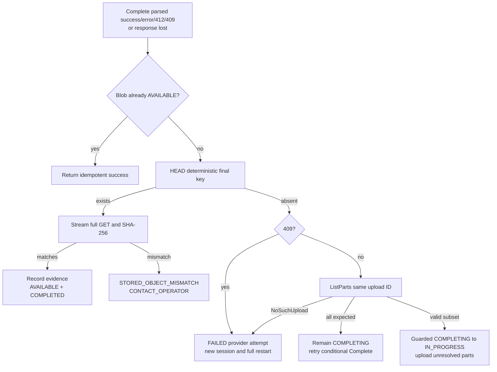

# M2 Failure and Reconciliation Matrix

## Rules applied to every row

Reconciliation validates the current admission lease for mutations, locks the session, reads the
deterministic final key before interpreting `NoSuchUpload`, paginates all provider parts, and
compares provider facts with the frozen database plan. The API never trusts a client ETag, provider
error body, or user metadata as integrity proof. Idempotency scope is
`(operation, session_id, caller_key)`; reuse with a different canonical request digest returns
`IDEMPOTENCY_CONFLICT`.

Automatic replacement/deletion is allowed only for a numbered part inside the same incomplete
provider upload. No path overwrites or automatically deletes a completed final object, and an
`AVAILABLE` Blob is never mutated. Part ETags/checksums are per-part observations and need not be
unique.

Invocation metrics classify a matching part exactly once:

- `reused_provider_part_*`: present during initial reconciliation before this invocation attempts it;
- `newly_transferred_part_*`: this invocation receives unambiguous UploadPart success and later
  provider verification; or
- `reconciled_part_*`: discovered after a lost/ambiguous response, concurrent write, or otherwise
  unprovable transfer ownership.

These are payload-accounting categories, not exact wire bytes.

## Matrix

| # | Observed disagreement | Resulting state and deterministic action | Retry/action | Automatic mutation and idempotency |
| ---: | --- | --- | --- | --- |
| 1 | DB part `PENDING`; provider has no part | Keep `PENDING`; issue an exact capability inside the rolling window. | `RETRY_PUSH`. | No deletion. Repeated reconcile is unchanged. |
| 2 | Initial reconciliation: DB `PENDING`; provider has a matching part | Store opaque receipt and mark `VERIFIED`; classify as reused. | Continue automatically. | Safe adoption only. Duplicate ETag/checksum across other part numbers is valid. |
| 3 | DB `UPLOADED` or `VERIFIED`; provider has no part | Reset to `PENDING`; DB receipt contributes no progress. | `RETRY_PUSH`. | Replace only by a later exact UploadPart in the same MPU. |
| 4 | Provider part size/checksum differs | Record size/checksum error and reset that part to `PENDING`. | `RETRY_PUSH`; repeated mismatch stops scheduling for this invocation. | Same-number replacement with frozen bytes only. |
| 5 | API committed completion; client lost API response | Session/Blob already show `COMPLETED`/`AVAILABLE`; replay returns the same safe result. | Success. | Idempotency record returns the original response. |
| 6 | Provider completed; API lost provider response | DB remains `COMPLETING`; HEAD finds final and full-stream SHA-256 decides completion or mismatch. | Match succeeds; mismatch `CONTACT_OPERATOR`. | No repeated write or final deletion. |
| 7 | Complete retried; final absent; same MPU lists every matching part | Remain `COMPLETING` and retry conditional Complete with provider-reconciled receipts. | Safe retry; 412 is reconciliation. | No state regression or part rewrite. |
| 8 | Complete ambiguous/non-409; final absent; same MPU has a valid subset | Record final absence and full ListParts result, take guarded `COMPLETING -> IN_PROGRESS`, keep matches `VERIFIED`, reset unresolved parts `PENDING`. | Re-upload unresolved parts only. | Same upload ID and frozen plan only; transition is idempotent. |
| 9 | Complete returns 409; final absent | Mark attempt `FAILED` with provider-attempt invalidation, release lease, and create/resolve a new session/MPU. | `FINAL_BLOB_PUBLICATION_CONFLICT`/`RETRY_PUSH`. | No old upload ID, row, ETag, checksum, or part may count in the new session; upload every part again. |
| 10 | Provider says `NoSuchUpload`; final absent | Cause is unknowable. Mark attempt `FAILED`, release lease, and create/resolve a new session/MPU. | `MULTIPART_SESSION_NOT_FOUND`/`RETRY_PUSH`. | Same full restart rule as row 9; no `EXPIRED` claim. |
| 11 | Final Blob exists and matches | Reuse existing AVAILABLE attestation, or stream full bytes and record application verification evidence before AVAILABLE. | Success/reuse. | Adoption only. A losing incomplete MPU may be explicitly aborted. |
| 12 | Final Blob exists and mismatches | Session `FAILED`; Blob remains non-AVAILABLE. | `STORED_OBJECT_MISMATCH`/`CONTACT_OPERATOR`, exit 5. | Never overwrite/delete; runbook only. |
| 13 | Complete returns 412 | Another publisher likely won. Apply row 11 or 12; 412 alone is not success. | Match succeeds; mismatch operator. | Losing MPU may be aborted; final untouched. |
| 14 | Two provider MPUs target the same missing Blob | DB normally converges callers on one active session; out-of-band duplicates may continue. Conditional completion allows one final winner. | Loser reconciles final and reports reused Blob. | No cross-session part adoption. |
| 15 | One session publishes while another has in-flight parts | Publisher verifies final and marks Blob AVAILABLE. Other invocation stops scheduling and reconciles. | Loser succeeds by final reuse when matching. | Late same-MPU part writes never change the completed final; losing incomplete MPU is aborted if present. |
| 16 | UploadPart response is unambiguously successful | Mark `UPLOADED`; ListParts match advances to `VERIFIED`. | Continue. | Classify as newly transferred only after provider verification. |
| 17 | UploadPart response is lost or ambiguous | Reconcile part number. Matching becomes `VERIFIED`; absent remains `PENDING`. | Retry only if absent/mismatch. | Matching part is `reconciled_part_*`, not newly transferred or reused. |
| 18 | Concurrent/late capability writes a matching part after initial reconciliation | Current lease owner later discovers it through ListParts. | Continue. | Classify as reconciled because transfer ownership is not provable. |
| 19 | CreateMultipartUpload response is lost before DB stores upload ID | DB remains `CREATED`; provider may retain an unaddressable MPU. Record initiation failure and safely initiate again. | `RETRY_PUSH`. | Never guess upload IDs; provider lifecycle bounds unknown residue. |
| 20 | Abort succeeds; DB update fails | DB remains `ABORTING`/earlier; replay finds `NoSuchUpload` and records `ABORTED`. | Safe retry. | Reconciliation, not response, establishes absence. |
| 21 | DB records abort intent; provider abort fails | Keep `ABORTING`; retry after in-flight requests settle. If final appears, verify it instead. | `RETRY_PUSH`. | Never claim ABORTED before absence. |
| 22 | Complete HTTP 200 contains embedded `<Error>` | Adapter surfaces failure; remain `COMPLETING`, then apply rows 6–10. | Fact-dependent retry. | HTTP status alone never changes Blob/session. |
| 23 | 64 sessions are abandoned and all leases expire | Sessions and provider MPUs remain resumable; active lease count becomes zero. A new invocation may acquire capacity. | Continue automatically. | No session/part deletion, abort, or GC. |
| 24 | Two invocations race to reacquire one session's expired lease | Advisory-lock transaction updates one lease owner and increments epoch once; loser receives `ADMISSION_LEASE_HELD`. | Loser `RETRY_PUSH`. | One current owner/epoch; provider MPU unchanged. |
| 25 | Old invocation mutates after lease takeover | Repository rejects owner/epoch or expiry mismatch before DB mutation/provider control call. | `ADMISSION_LEASE_LOST`/`RETRY_PUSH`. | Stale invocation cannot confirm, complete, abort, or change state. |
| 26 | Old invocation's previously issued UploadPart URL completes after lease loss | Provider may accept the exact signed part. Stale caller still cannot confirm. Current owner reconciles it. | Continue under current owner. | Treat as reconciled; no stale DB authority. |
| 27 | Lease expires while an API-owned provider control call is already in flight | Provider outcome may settle, but post-call DB write is fenced. Current owner resolves final key/ListParts. | `RETRY_PUSH` by current owner. | Fencing cannot cancel an already dispatched network request; deterministic reconciliation preserves safety. |
| 28 | Completed temporary object exists | **Not representable in Option A.** Unexpected temp namespace content is operator-owned residue. | N/A. | No adoption or automatic deletion. |

## Complete-response decision tree

## Deletion boundary

- Safe automatic action: replace an incomplete part at the same number with the frozen bytes;
  abort the current workflow's incomplete MPU after explicit request or losing publication.
- Deferred to provider lifecycle: unknown/untracked incomplete multipart uploads.
- Never automatic: delete any completed final key, any `AVAILABLE` Blob, or content referenced by a
  `READY` Version.
- Operator-only: inspect and, outside RoboLake, remove a proven poisoned non-`AVAILABLE` final key.
