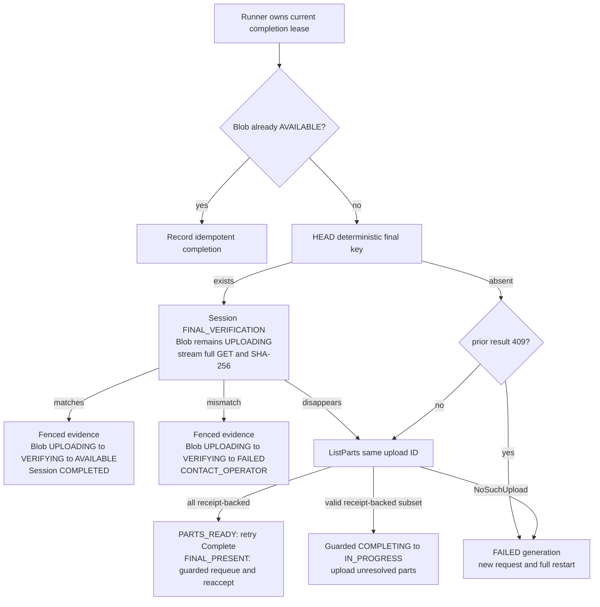

# M2 Failure and Reconciliation Matrix

## Rules applied to every row

Request identity, CLI invocation identity, and session generation are separate. One immutable
`request_id` record maps to one canonical request/result and is never rebound. A new invocation
resumes the one active Blob generation; a terminal provider attempt requires a new request UUID and
the next generation. Concurrent resolve holds a Blob lock and converges through
`UNIQUE(blob_id, session_generation)` plus the one-active-generation partial index.

Upload-phase mutations validate the current upload admission lease through atomic repository SQL.
Completion first replays an existing immutable idempotency record before any fence check; only first
execution validates the upload lease. First acceptance atomically stores durable `COMPLETING` work,
releases the upload lease, and stores its exact 202 response. A server runner performs completion
under a distinct completion lease. Reconciliation reads the deterministic final key
before interpreting `NoSuchUpload`, paginates every provider part, and compares provider facts with
the frozen database plan and stored UploadPart response receipts. No provider call is made inside a
long database transaction.

The API never trusts a client receipt, provider error body, ETag, checksum metadata, or user metadata
as whole-object integrity proof. A stored UploadPart response receipt becomes usable only after
ListParts currently matches its part number, size, expected checksum, response checksum, and ETag.
ListParts-only ETags/checksums are never adopted as completion receipts. RoboLake's complete receipt
contains part number plus the successful UploadPart response ETag and Base64 `ChecksumSHA256`;
conditional Complete sends all three in part-number order.

Automatic replacement/deletion is allowed only for a numbered part inside the same incomplete MPU.
No path overwrites or automatically deletes a completed final object, and an `AVAILABLE` Blob is
never mutated. Part receipts/checksums may repeat across part numbers.

Invocation metrics classify a resolved part exactly once:

- `reused_provider_part_*`: receipt-backed and matching during initial reconciliation before this
  invocation attempts it;
- `newly_transferred_part_*`: this invocation receives an unambiguous UploadPart response receipt
  and the provider observation later matches; or
- `reconciled_part_*`: discovered after a lost/ambiguous response, concurrent write, or otherwise
  unprovable transfer ownership. A missing response receipt still forces an exact re-upload.

These are payload-attribution categories, not exact wire bytes.

## Matrix

| # | Observed disagreement | Resulting state and deterministic action | Retry/action | Automatic mutation and idempotency |
| ---: | --- | --- | --- | --- |
| 1 | DB part `PENDING`; provider has no part | Keep `PENDING`; issue exact capability inside rolling window. | `RETRY_PUSH`. | No deletion. Replay unchanged. |
| 2 | Initial reconcile: DB retains a response receipt and provider has matching part | Store listing observation, mark `VERIFIED`, classify reused. | Continue. | Duplicate ETag/checksum on other numbers is valid. |
| 3 | Provider has matching part but DB has no complete UploadPart response receipt | Keep/reset `PENDING`; classify ambiguous observation as reconciled; re-upload exact part to obtain response ETag/checksum, then ListParts-verify. | Continue with safe retransmission. | Never copy ListParts observations into response-receipt fields. |
| 4 | DB `UPLOADED`/`VERIFIED`; provider has no part | Reset `PENDING`; receipt contributes no progress. | `RETRY_PUSH`. | Replace later with exact frozen bytes in same MPU. |
| 5 | Provider part size/checksum or listed ETag differs from stored receipt | Record diagnostic mismatch and reset `PENDING`; exact re-upload captures a fresh response receipt. | `RETRY_PUSH`; repeated mismatch stops this invocation. | Same-number replacement only. |
| 6 | Completion request commits `COMPLETING`, pending work, lease release, and stored 202, but the response is lost or API dies | Lookup the immutable idempotency record before fence/session checks; a matching request hash replays the exact 202 despite lease release, expiry, API restart, or runner takeover. | Poll/retry safely. | No duplicate job/provider call. A changed hash returns `IDEMPOTENCY_CONFLICT` without session inspection. |
| 7 | CLI disconnects or times out after 202 | Runner continues independently; CLI rerun/status observes current state. | No transfer restart solely due disconnect. | Client does not own/cancel completion. |
| 8 | Provider completed; runner lost Complete response | Session stays `COMPLETING`; current or takeover runner HEADs final and full-stream SHA-256 decides. | Match succeeds; mismatch `CONTACT_OPERATOR`. | No repeated write or final deletion. |
| 9 | Complete reconciliation: final absent; same MPU lists every receipt-backed matching part | Remain `COMPLETING`/`ASSEMBLING`; retry conditional Complete using each stored response ETag and `ChecksumSHA256`. Blob remains `UPLOADING`. | Safe retry; 412 triggers final reconciliation. | ListParts is verification, not receipt source. |
| 10 | Ambiguous non-409 Complete; final absent; same MPU has valid receipt-backed subset | Guarded `COMPLETING -> IN_PROGRESS`; keep Blob `UPLOADING`, retain matches `VERIFIED`, reset missing/mismatching/receipt-less parts `PENDING`, release completion lease. | CLI reacquires upload lease and uploads unresolved parts. | Same upload ID/frozen plan only; no reverse Blob transition. |
| 11 | Complete returns 409; final absent | Generation becomes terminal `FAILED` with provider-attempt invalidation; release completion lease; best-effort abort old MPU. | `FINAL_BLOB_PUBLICATION_CONFLICT`/`RETRY_PUSH`. | New request allocates generation+1; every part starts PENDING; no old ID/receipt adopted. |
| 12 | Provider says `NoSuchUpload`; final absent | Cause unknowable; same terminal/new-generation rule as row 11. | `MULTIPART_SESSION_NOT_FOUND`/`RETRY_PUSH`. | Never call it EXPIRED or reuse the generation. |
| 13 | Final object exists, including before this session resolves every part, and full bytes match | Keep Blob `UPLOADING`; use `FINAL_PRESENT -> FINAL_VERIFICATION`, stream all bytes, then atomically record evidence and transition Blob `UPLOADING -> VERIFYING -> AVAILABLE` plus session `COMPLETED`. Incomplete parts stay unresolved. | Success/reuse. | Adoption only; known losing MPU is best-effort aborted, with provider lifecycle fallback. |
| 14 | Final object exists and full-byte evidence mismatches | Keep Blob `UPLOADING` during the read, then atomically record mismatch evidence and transition `UPLOADING -> VERIFYING -> FAILED` plus terminal session failure. | `STORED_OBJECT_MISMATCH`/`CONTACT_OPERATOR`, exit 5. | Never overwrite/delete; runbook only. |
| 15 | Complete returns 412 | Another publisher likely won. Apply row 13 or 14; 412 alone is not success. | Match succeeds; mismatch operator. | Final untouched. |
| 16 | Two callers resolve same missing Blob concurrently | Blob lock/active unique index yields one active generation; both new request IDs bind to it. | Both may resume; only lease owner mutates. | No duplicate generation or request rebinding. |
| 17 | Out-of-band second MPU targets same final key | Conditional completion permits one final winner; loser reconciles final. | Matching loser succeeds by reuse. | No cross-session part adoption. |
| 18 | UploadPart response succeeds unambiguously | Store the complete receipt: part number, opaque response ETag, and Base64 response `ChecksumSHA256` as `UPLOADED`; ListParts match advances to `VERIFIED`. | Continue. | Classify newly transferred only after verification. |
| 19 | UploadPart response is lost/ambiguous but ListParts finds matching bytes | No durable completion receipt exists. Reissue capability and re-upload exact part; store new response receipt and verify again. | Safe retransmission. | Classify reconciled; do not call exact wire bytes. |
| 20 | Late stale capability replaces a part after lease loss | Current owner compares ListParts with retained receipt. Match may remain; receipt mismatch resets and re-uploads. | Continue under current owner. | Stale caller has provider write capability, never DB authority. |
| 21 | `CREATED` session is cancelled | Transition directly to terminal `CANCELLED`; no provider request or cleanup. | Future push uses new request/generation. | Never enter `ABORTING`. |
| 22 | Abort requested while `INITIATING` | No durable provider ID can be addressed; remain `INITIATING` until outcome resolves. | `MULTIPART_INITIATION_IN_PROGRESS`/`RETRY_PUSH`. | No guessed abort. |
| 23 | Create response/DB commit is ambiguous, or initiating process dies with no durable ID | Current or later owner atomically fences generation `FAILED`/`INITIATION_AMBIGUOUS` and releases admission; best-effort abort only if the process still knows ID. Never repeat Create in that generation. | CLI uses a fresh request UUID for the next generation. | Immediate fenced release returns capacity; if death precedes the transaction, TTL is the fallback. Unknown provider outcome remains lifecycle-owned. |
| 24 | Abort succeeds; DB update fails | DB remains `ABORTING`; replay proves `NoSuchUpload` then records `ABORTED`. | Safe retry. | Reconciliation establishes absence. |
| 25 | DB records abort intent; provider abort fails | Keep `ABORTING`; retry after in-flight writes settle. If final appears, enqueue `COMPLETING` and release upload lease for runner verification. | `RETRY_PUSH`/poll. | Never claim ABORTED early or run long verification under upload admission. |
| 26 | Complete HTTP 200 embeds `<Error>` | Adapter surfaces failure; remain `COMPLETING`, then apply rows 8–12. | Fact-dependent retry. | HTTP status alone changes nothing. |
| 27 | 64 upload invocations disappear and leases expire | Sessions/MPUs remain resumable; active upload lease count becomes zero. | New invocation may acquire capacity. | No session deletion, abort, or GC. |
| 28 | Two invocations race to reacquire one expired upload lease | Atomic acquisition updates one owner and increments epoch; loser receives `ADMISSION_LEASE_HELD`. | Loser `RETRY_PUSH`. | One current owner/epoch. |
| 29 | Stale upload owner mutates after takeover | Atomic repository predicate affects zero rows. | `ADMISSION_LEASE_LOST`/`RETRY_PUSH`. | Cannot confirm, initiate, accept completion, abort, or change state. |
| 30 | Upload lease expires while provider initiation/abort call is in flight | Provider outcome may settle; stale post-call DB write is fenced. Current/new invocation applies initiation or abort reconciliation rules. | Fact-dependent retry. | Fencing cannot cancel dispatched network I/O. |
| 31 | Runner holds completion lease while full GET exceeds upload/API timeout | Session is `COMPLETING`/`FINAL_VERIFICATION`, Blob remains `UPLOADING`, and independent heartbeat transactions renew completion ownership; request/CLI timeouts are irrelevant. | Continue. | No upload lease is held and no long-lived Blob `VERIFYING` is exposed. |
| 32 | Completion runner dies during Complete or full GET | Heartbeats stop; session remains `COMPLETING` and Blob `UPLOADING`. After expiry, another runner claims next epoch and reconciles. | Automatic takeover. | Interrupted verification restarts at byte zero. |
| 33 | Stale completion runner tries to record evidence/AVAILABLE after takeover | Atomic completion fence affects zero rows; observation is discarded. | Current runner continues reconciliation. | No stale evidence or terminal transition. |
| 34 | Two runners race to claim one `COMPLETING` row | `SKIP LOCKED`/compare-and-set yields one current completion owner/epoch. | Other runner selects other work/backoff. | One active completion mutation owner. |
| 35 | Completion lease expires while provider call still runs | New runner may take over; both provider outcomes are reconciled through deterministic final key. Only current epoch may commit. | Automatic reconciliation. | Conditional completion and fence preserve convergence. |
| 36 | Completed temporary object exists | **Not representable in Option A.** Unexpected temp namespace content is operator-owned residue. | N/A. | No adoption or automatic deletion. |
| 37 | `FINAL_PRESENT` object disappears before full verification | Blob remains `UPLOADING`. Reconcile the same provider MPU. If it exists with a structurally valid set, guarded requeue to `IN_PROGRESS`; keep matching receipt-backed parts, reset others, and require a new `PARTS_READY` acceptance before Complete. If the MPU is absent, terminalize this generation. | `RETRY_PUSH` or `MULTIPART_SESSION_NOT_FOUND`, based on provider facts. | Never manufacture receipts or call Complete from the stale adoption reason. |
| 38 | Full GET fails transiently before complete evidence | Keep session `COMPLETING`, preserve the safe phase/facts, and keep Blob `UPLOADING`; current or replacement runner restarts from byte zero. | Automatic retry/takeover. | No verification evidence or Blob transition is committed from a partial read. |
| 39 | Two first completion requests race with the same request ID/hash | One transaction wins the unique idempotency key and atomically stores `COMPLETING`, pending work, lease release, and 202. The loser rolls back and reads that record. | Both receive the exact stored 202. | One accepted operation; no lease check on replay. |
| 40 | Same completion request ID is reused with changed semantic payload | Return `IDEMPOTENCY_CONFLICT` before inspecting lease or session. | Correct the client; do not retry with conflicting content. | No state read-for-action or mutation. |
| 41 | 64 `INITIATING` generations are terminalized as ambiguous by their current owners | Each fenced terminal transaction releases its lease immediately; active admission count becomes zero. | New work is admitted immediately. | A stale owner affects zero rows; process death before terminalization falls back to TTL. |

## Complete-response decision tree

## Deletion boundary

- Safe automatic action: replace an incomplete part at the same number with frozen bytes; abort the
  current workflow's known incomplete MPU after explicit request or losing publication.
- Deferred to provider lifecycle: unknown/untracked incomplete MPUs, including initiation ambiguity.
- Never automatic: delete any completed final key, any `AVAILABLE` Blob, or content referenced by a
  `READY` Version.
- Operator-only: inspect and, outside normal RoboLake workflow, remove a proven poisoned
  non-`AVAILABLE` final key.
