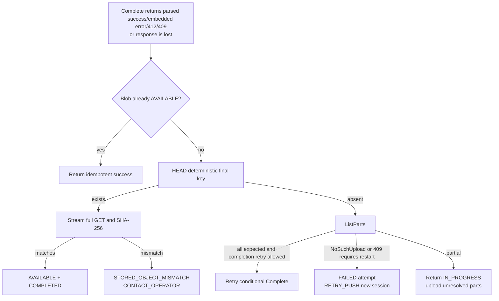

# M2 Failure and Reconciliation Matrix

## Rules applied to every row

Reconciliation locks the session, reads the deterministic final key before interpreting
`NoSuchUpload`, paginates all provider parts, and compares provider facts with the frozen database
plan. The API never trusts a client ETag, provider error body, or user metadata as integrity proof.
Idempotency scope is `(operation, session_id, caller_key)` and reuse with a different canonical
request digest returns the existing `IDEMPOTENCY_CONFLICT`.

Automatic replacement/deletion is allowed only for a numbered part inside the same incomplete
provider upload. No path overwrites or automatically deletes a completed final object, and an
`AVAILABLE` Blob is never mutated.

## Matrix

| # | Observed disagreement | Resulting state and deterministic action | Retry/action | Automatic mutation and idempotency |
| ---: | --- | --- | --- | --- |
| 1 | DB part `PENDING`; provider has no part | Keep `PENDING`; issue an exact capability when inside the rolling window. | Retryable, `RETRY_PUSH`. | No deletion. Repeated reconcile is unchanged. |
| 2 | DB part `PENDING`; provider has a matching part | Store provider receipt and mark `VERIFIED`; count it as reused for this invocation. | Continue automatically. | Safe adoption only. Same reconcile returns the same result. |
| 3 | DB part `UPLOADED` or `VERIFIED`; provider has no part | Reset to `PENDING`; do not count DB receipt as progress. | Retryable, `RETRY_PUSH`. | Replace only by a later exact UploadPart. |
| 4 | DB part `UPLOADED`; provider size/checksum differs | Record `PART_SIZE_MISMATCH` or checksum mismatch, reset to `PENDING`, and issue the original frozen part again. | Retryable, `RETRY_PUSH`; repeated mismatch stops scheduling for that invocation. | Same-number replacement is allowed because the MPU is incomplete. No object deletion. |
| 5 | API committed completion; client lost API response | Session and Blob already show `COMPLETED`/`AVAILABLE`; replay returns the same preparation/result. | Success, no transfer. | Idempotency record returns the original safe response. |
| 6 | Provider completed; API lost provider response | DB remains `COMPLETING`. HEAD finds final object; streamed SHA-256 decides `COMPLETED` or mismatch. | Matching: success. Mismatch: `CONTACT_OPERATOR`. | No repeated write is needed; no final deletion. |
| 7 | API calls Complete again | If Blob is AVAILABLE, return success. Otherwise HEAD final first; if absent and ListParts still has all expected parts, retry conditional Complete. | Safe replay; 412 is reconciliation, not transfer failure. | Same idempotency key/request converges; ETag is not required from client. |
| 8 | Provider says `NoSuchUpload` | First inspect final key. Matching final completes. Absent final marks this attempt `FAILED`; rerun creates a new session. Mismatching final stops. | `MULTIPART_SESSION_NOT_FOUND`/`EXPIRED` -> `RETRY_PUSH`; mismatch -> `CONTACT_OPERATOR`. | No provider object deleted. Old terminal attempt is retained. |
| 9 | Completed temporary object exists but DB session is incomplete | **Not representable in selected Option A.** M2 creates no temporary object. An object at the Blob key is reconciled as final. | N/A; an unexpected `multipart-temp/` key is operator-owned residue, not adopted. | No automatic deletion. Adding temp publication requires a new ADR. |
| 10 | Final Blob exists and matches | If Blob is already AVAILABLE, reuse its attestation. Otherwise stream full bytes and mark Blob AVAILABLE. If this upload ID is now `NoSuchUpload`, mark the session COMPLETED; if its MPU still exists, it lost the race and moves through ABORTING -> ABORTED while the invocation still succeeds by reuse. | Success/reuse. | Adoption only; losing incomplete MPU may be explicitly aborted. |
| 11 | Final Blob exists and mismatches | Session `FAILED`; Blob remains non-AVAILABLE; set `STORED_OBJECT_MISMATCH`. | Terminal for automatic workflow; `CONTACT_OPERATOR`, CLI exit 5. | Never overwrite/delete. Idempotent retries return the same stop until external operator action changes storage. |
| 12 | Two sessions upload the same missing Blob | DB unique index normally resolves callers to one active session. If duplicate provider MPUs exist, both may upload but only conditional completion can publish. | Both may continue; one final winner. | No cross-session part adoption. Final loser reconciles row 10 and aborts its incomplete MPU. |
| 13 | One session publishes while another is uploading | Publisher verifies final and marks Blob AVAILABLE. Other workers stop scheduling; their next completion gets 412 or status sees AVAILABLE. | Loser reports reused Blob, not created Blob. | Abort only the loser's incomplete MPU; final object untouched. |
| 14 | Session is abandoned for a long time | Provider stale-upload policy eventually removes incomplete parts. DB remains observable until a rerun sees `NoSuchUpload`, marks attempt failed, and creates a new one. | `RETRY_PUSH`; M2 has no background sweeper. | Provider lifecycle is a storage backstop. No final-object cleanup or Blob GC. |
| 15 | Abort succeeds; DB update fails | DB remains `ABORTING`/earlier state. Replay ListParts returns `NoSuchUpload`; API records `ABORTED`. | Safe retry of abort/status. | Abort is idempotent by reconciliation, not by trusting the lost response. |
| 16 | DB records abort intent; provider abort fails | Keep `ABORTING`. If ListParts still succeeds, retry Abort after in-flight requests settle. If final key appears, verify it and complete rather than claiming abort. | Retryable; provider unavailable -> `RETRY_PUSH`. | Never mark `ABORTED` until provider absence is proven. |
| 17 | Complete returns 412 | Existing final won the create-only race. Run row 10/11 verification; the losing MPU remains listable on pinned MinIO until aborted. | Matching success; mismatch operator. | 412 is not success by itself and never permits overwrite. |
| 18 | Complete returns 409 | Final state is ambiguous. Reconcile final once. Matching succeeds; absent final terminates this provider attempt because AWS requires re-initiation after conditional-complete 409. The old upload ID and all its part receipts are ineligible for resume. | `MULTIPART_COMPLETION_AMBIGUOUS` -> `RETRY_PUSH`. | Abort/invalidate the old MPU where possible, create a new MPU only after the old attempt is terminal, and upload every part again. |
| 19 | UploadPart response is lost | Reconcile that part number. Matching provider part becomes `VERIFIED`; absent part remains `PENDING`. | Retry only if absent/mismatch. | Exact capability replay can only replace with the same digest/length. |
| 20 | CreateMultipartUpload response is lost before DB stores upload ID | DB remains `CREATED`; provider may retain an unaddressable MPU. The API records the failed initiation attempt and safely initiates another; lifecycle expires the unknown provider upload. | `RETRY_PUSH`. | No unsafe attempt to guess provider IDs. This is bounded operational leakage, not final-object GC. |
| 21 | Complete transport returns HTTP 200 with an embedded `<Error>` body | Adapter/SDK surfaces failure rather than a success outcome. Session remains `COMPLETING`; reconcile final key and provider state using rows 6–8/18. Blob cannot become AVAILABLE from status alone. | Matching final succeeds; otherwise `RETRY_PUSH` according to parsed error/reconciliation. | No final deletion or overwrite. Test with a fake embedded-error body even when the SDK normally parses it. |

## Complete-response decision tree

## Deletion boundary

- Safe automatic action: replace an incomplete part at the same number with the frozen bytes;
  abort the current workflow's incomplete MPU after explicit request or losing publication.
- Deferred to provider lifecycle: unknown/untracked incomplete multipart uploads.
- Never automatic: delete any completed final key, any `AVAILABLE` Blob, or any content referenced by
  a `READY` Version.
- Operator-only: inspect and, outside RoboLake, remove a proven poisoned non-`AVAILABLE` final key.
