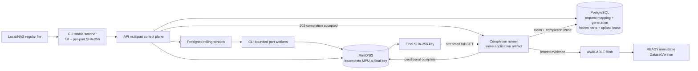
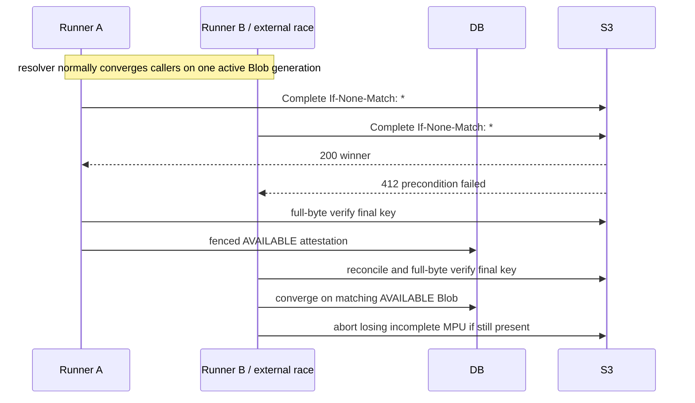

# RoboLake M2 Multipart Architecture

## 1. Decision summary

M2 uses **direct multipart upload to the deterministic final Blob key**. The RoboLake server control
plane owns provider initiation, reconciliation, completion, and abort. The CLI sends part bytes
directly with a small rolling window of presigned UploadPart capabilities. Final publication is the
provider's
`CompleteMultipartUpload` request with `If-None-Match: *`.

A persistent multipart session is separate from a short-lived upload admission lease. Session and
provider progress survive interruption; only an unexpired upload lease consumes one upload slot and
authorizes CLI-driven DB/control-plane mutation. Completion is accepted as durable PostgreSQL work
and executed by a server runner under a separate completion lease, so a slow full-object verification
does not inherit a CLI request timeout or upload lease.

The pinned MinIO image accepted this conditional completion, preserved an existing object with
HTTP 412, and allowed exactly one winner in a concurrent completion race. In contrast, it ignored
destination `If-None-Match` on `CopyObject` and overwrote different existing bytes. A temporary-key
architecture would also need multipart copy for files above 5 GB, extra persisted lifecycle, twice
the object writes, and two full reads on this provider. See [provider probes](M2_PROVIDER_PROBES.md).

Multipart SHA-256 reported by MinIO is `COMPOSITE`, not the canonical whole-file SHA-256. Therefore
every newly completed, non-`AVAILABLE` multipart object must pass at least one complete streamed GET
and SHA-256 comparison before `Blob -> AVAILABLE`. This deliberate read cost prevents composite
checksums or ETags from being mistaken for Blob identity. A mismatch is detected and stopped; no
application workflow overwrites or deletes the final key.

## 2. Architecture alternatives

| Option | Concrete failure addressed | Decision, cost, and M1 effect |
| --- | --- | --- |
| A. Multipart directly to final key | Two sessions complete the same SHA key; an unguarded second completion overwrites the first. | **Selected.** Conditional completion converged as 200/412 on pinned MinIO and is documented by AWS. Costs one upload plus one verification read. A bad newly completed object can occupy a non-`AVAILABLE` key and require the existing M1 operator path; no M1 meaning changes. |
| B. Complete at a temporary key, then publish | Client-supplied part plan is inconsistent with the full manifest hash and would otherwise reach the final key before verification. | Rejected for M2. Small `CopyObject` ignored destination create-only on pinned MinIO. Large objects require a second multipart copy; MinIO copy parts exposed no SHA-256 and still required final full GET. It adds temporary storage, copy I/O, copy-resume state, deletion policy, and a second upload lifecycle. Reconsider only if the threat model stops trusting callers or a provider offers enforceable full-object SHA-256 publication. |
| C. API proxies all bytes | A provider lacks safe direct capabilities. | Rejected. It makes FastAPI the bandwidth, memory, timeout, and restart path and doubles network transit. No probe demonstrated a need. M1's control/data-plane separation remains intact. |
| D. Verify temp, then proxy or client re-upload to final | Prevent any client-plan defect from ever occupying the final key. | Rejected. It transfers every large Blob twice and still needs conditional final completion. The integrity benefit does not justify this cost inside M2's trusted-network boundary; post-completion full-byte verification still prevents false `AVAILABLE`. |

## 3. Component boundaries



- `domain` owns part planning, state machines, error types, and immutable records.
- `application` owns prepare/reconcile/issue/confirm/accept-completion/runner/abort orchestration
  through ports.
- `infrastructure` implements PostgreSQL, S3 control calls, presigning, streaming verification, and
  stable local reads.
- FastAPI validates requests, accepts durable completion work, and renders stable errors; it never
  accepts file bytes or performs the long verification inside the request lifetime.
- Typer selects single PUT versus multipart, runs bounded workers, and never receives permanent S3
  credentials. A same-artifact runner claims PostgreSQL work; M2 adds no external queue or network
  service boundary.

## 4. Object and session identity

The final key remains unchanged:

```text
blobs/sha256/<first-2>/<next-2>/<full-lowercase-sha256>
```

`Blob.sha256` is content identity. Multipart workflow identity has three distinct layers:

- `request_id` is a client-generated UUID for one create/resolve request and all of its replays. Its
  immutable idempotency record is never rebound to another session.
- `invocation_id` is one CLI run and scopes admission acquisition and invocation metrics.
- `(blob_id, session_generation)` identifies one provider attempt. Generation is a positive,
  monotonically increasing integer per Blob; terminal generations never reactivate.

The resolver first replays an existing request record. Otherwise it locks the Blob, binds the new
request to the one active generation if present, or creates the next generation if every prior one
is terminal. A concurrent partial-unique conflict resolves the winner. A new CLI invocation resumes
the active generation; recovery after 409, `NoSuchUpload`, or ambiguous initiation uses a new
request UUID and the next generation.

Upload and completion lease owner UUIDs/epochs identify only the worker currently allowed to mutate
an attempt; they are neither session identity nor authorization. The provider upload ID is opaque,
stored server-side, and not exposed as an independent stable RoboLake API field. It necessarily
appears with `partNumber` inside a presigned UploadPart query; the complete URL/query is a bearer
capability, never logged or placed in errors/telemetry, and the client must not parse it. There is no
M2 temporary object key. Provider multipart parts are invisible as objects until completion.

PostgreSQL is authoritative for intended Blob, request mapping, attempt generation, deterministic
part boundaries, expected part SHA-256 values, legal workflow state, UploadPart response receipts,
and current fences. The provider is authoritative for whether an upload ID exists and which parts it
currently holds. Only RoboLake can attest `AVAILABLE` after final-key verification.

## 5. Deterministic part-size protocol

Constants are schema/session protocol, not deployment settings:

```text
BASE_PART_BYTES = 64 * 1024 * 1024
MAX_PART_BYTES = 5 * 1024 * 1024 * 1024
MAX_PARTS = 10_000
MAX_MULTIPART_BLOB_BYTES = 5_000_000_000_000
```

For Blob size `S > 5_000_000_000`:

```text
P = BASE_PART_BYTES
while ceil(S / P) > MAX_PARTS and P < MAX_PART_BYTES:
    P = min(2 * P, MAX_PART_BYTES)
reject if ceil(S / P) > MAX_PARTS
N = ceil(S / P)
offset(i) = (i - 1) * P
size(i) = min(P, S - offset(i)), for i in 1..N
```

`P`, `N`, offsets, sizes, and hashes are frozen in the committed `CREATED` registration, before
provider initiation. The final part may be
smaller; an exact multiple has a full-sized final part, not a zero-byte extra part.

| Blob size | Part size | Parts | Final part |
| ---: | ---: | ---: | ---: |
| 5,000,000,001 B | 67,108,864 B | 75 | 33,944,065 B |
| 10 GiB | 67,108,864 B | 160 | 67,108,864 B |
| 100 GiB | 67,108,864 B | 1,600 | 67,108,864 B |
| 1 TiB | 134,217,728 B | 8,192 | 134,217,728 B |
| 5,000,000,000,000 B protocol maximum | 536,870,912 B | 9,314 | 121,196,544 B |

For any supported `S = kP + 1`, the last part is one byte. AWS documents a 5 TB object maximum,
10,000 parts, and 5 MiB–5 GiB parts. The exact source commit behind RoboLake's pinned MinIO image
sets a 5 TiB maximum. The lower 5,000,000,000,000-byte protocol maximum is therefore portable across
both. A future limit change requires a protocol revision and ADR.

### Canonical part-plan bytes

`part_plan_sha256` is the lowercase hexadecimal SHA-256 of an exact schema-v1 JSON byte sequence.
The top-level field order is `schema_version`, `blob_size_bytes`, `part_size_bytes`, `part_count`,
`parts`. Every part uses field order `part_number`, `offset_bytes`, `size_bytes`, `sha256` and appears
in ascending part-number order. Encoding is UTF-8, compact (`,` and `:` separators), contains no
insignificant whitespace or trailing newline, uses JSON integers only for numeric values, and uses
exactly 64 lowercase hexadecimal characters for each digest. Duplicate keys, floats, booleans,
unknown fields, alternate order, uppercase digests, or a non-canonical re-encoding are rejected.

The canonical shape is:

```json
{"schema_version":1,"blob_size_bytes":12582912,"part_size_bytes":6291456,"part_count":2,"parts":[{"part_number":1,"offset_bytes":0,"size_bytes":6291456,"sha256":"1111111111111111111111111111111111111111111111111111111111111111"},{"part_number":2,"offset_bytes":6291456,"size_bytes":6291456,"sha256":"2222222222222222222222222222222222222222222222222222222222222222"}]}
```

This example is a provider-valid compact test plan, not the production selection threshold. The
server recomputes the canonical bytes from validated typed fields and compares the digest; it never
hashes caller formatting. The Blob digest remains the content identity. The part-plan hash freezes
resume interpretation for one session generation and is not a second Blob identity.

Operational settings do not alter this plan: default concurrency is 4, hard maximum 16, and
capability TTL is 900 seconds. Each worker streams 1 MiB chunks, so memory is approximately
`concurrency * stream_chunk_bytes`, not `concurrency * part_size`.

## 6. Local source identity and resume

The server never persists a local absolute path, device, inode, or mtime. On each `push` invocation,
the official CLI:

1. opens the regular file beneath the already validated root without following symlinks;
2. captures device, inode, size, and `mtime_ns` around one sequential pass;
3. computes the canonical whole-file SHA-256 and every deterministic part SHA-256 in that pass;
4. requires the before/after identity to match and the whole digest to match the manifest;
5. compares the resulting frozen plan to the server session before issuing any missing part;
6. uses positional reads, rehashes every outgoing part, and requires its expected digest; and
7. after all parts resolve, performs a final stable whole-file rehash before asking the API to
   complete.

On every new invocation, full rehash happens before any additional part upload. Device/inode/mtime
are in-memory stability signals within that invocation, not persisted resume identity. A new inode
or source path containing exactly the same bytes is safe because RoboLake identity is logical path
plus bytes, not inode. A truncated or byte-changed file returns `LOCAL_FILE_CHANGED`; unchanged
metadata is never accepted as byte proof. If bytes change invisibly during a run, outgoing part
hashes prevent wrong payload and the final stable rehash blocks completion. Earlier valid provider
parts remain usable after a later safe rerun.

## 7. Part capability and concurrency contract

Provider initiation has an explicit durable boundary. A new generation begins `CREATED`, where no
provider call has occurred and cancellation is local. The API commits `INITIATING` before
CreateMultipartUpload and moves to `IN_PROGRESS` only after the returned upload ID is durable. If
the response or DB commit is ambiguous, that generation becomes terminal with
`MULTIPART_INITIATION_AMBIGUOUS`; a new request creates the next generation. If the process still
knows the returned ID it may best-effort abort it, but unknown residue is never guessed/adopted and
remains bounded by provider lifecycle policy. Abort during `INITIATING` returns retryable
`MULTIPART_INITIATION_IN_PROGRESS` because `ABORTING` requires a durable upload ID.

If the initiating API process disappears, upload-lease expiry permits a new fenced owner to mark the
generation `MULTIPART_INITIATION_AMBIGUOUS`; it must not repeat Create inside that generation. The
CLI then uses a fresh create/resolve request UUID for the next generation.

The API issues a rolling window no larger than the configured concurrency (default 4, maximum 16).
Issuing all missing parts is rejected because thousands of bearer URLs could expire unused or leak.
One-at-a-time issuance is safe but needlessly serializes high-latency links.

Each URL is bound by SigV4 to bucket, final key, provider upload ID, part number, HTTP method,
expected `Content-Length`, and `x-amz-checksum-sha256`; TTL is 900 seconds. The client prepares the
range reader before requesting the URL and begins immediately. Replay can only replace that part
with the same length and digest, which is safe while the MPU is incomplete. Provider error bodies
are not parsed by the CLI; it reports the part number to the API and requests reconciliation.

When UploadPart succeeds unambiguously, the CLI returns its opaque response ETag and provider
SHA-256 response checksum to the API. The adapter normalizes the provider's checksum encoding to a
lowercase hexadecimal digest. The API stores both receipt fields but advances to `VERIFIED` only
after paginated ListParts matches part number, size, expected checksum, receipt checksum, and receipt
ETag. A missing response checksum fails the M2 provider contract. AWS explicitly instructs multipart
clients to retain UploadPart response ETags and not use a listing as the Complete request source.
Therefore a matching provider part with no durable response receipt is safely re-uploaded to obtain
one; ListParts alone never manufactures a completion receipt.

When one worker fails, the CLI stops scheduling new parts, lets already-started requests settle,
then reconciles the complete window. Progress advances only for receipt-backed, provider-verified
parts. One shared file descriptor with positional reads, at most 16 HTTP connections, and bounded
chunk buffers constrain descriptors and memory.

Before any upload-phase mutation, the invocation acquires or renews a PostgreSQL admission lease.
The acquire request carries an idempotent `request_id` and the CLI's `invocation_id`; the server
returns its generated owner UUID, fencing epoch, and expiry. The default lease lasts 120 seconds and
is renewed every 30 seconds. The global default cap of 64 counts only unexpired upload leases. An
expired lease can be atomically taken over for the same session with a higher epoch, leaving the
provider upload and parts untouched.

Capability issuance, reconcile writes, receipt confirmation, initiation, abort, completion
acceptance, and their post-provider DB commits require the current `(owner_id, epoch)` and an
unexpired lease. Repository mutations use one atomic SQL predicate over session, owner, epoch, and
database-time expiry; zero affected rows maps to `ADMISSION_LEASE_LOST`. Constraints protect
structural facts but do not independently prove caller ownership. A part URL issued earlier may
still write only its signed bytes; the current owner later reconciles that provider fact.

## 8. Integrity and final publication

The completion endpoint is short and idempotent:

1. validate the current upload admission fence;
2. check the deterministic final key first;
3. if final is present, accept reason `FINAL_PRESENT`; otherwise reconcile every paginated provider
   part and require receipt-backed matches `1..N` for reason `PARTS_READY`;
4. atomically set `COMPLETING`, freeze the reason for that accepted work item, record pending work,
   release the upload lease, and
   return HTTP 202; and
5. let repeated calls/status return the same durable state rather than start duplicate work.

A bounded server runner built from the same RoboLake application artifact claims `COMPLETING` rows
from PostgreSQL (`FOR UPDATE SKIP LOCKED` or equivalent). No Kafka, Celery, or external queue is
introduced. The runner owns provider Complete and whole-object verification under a separate
completion lease. Recommended defaults are completion concurrency 2 (hard maximum 8), TTL 120
seconds, and heartbeat 30 seconds. Heartbeat transactions remain independent and short while the
potentially long provider call or full stream is in progress.

The claimed runner performs this sequence:

1. reconcile the deterministic final key first;
2. only for `PARTS_READY` with no final object, construct ordered Complete input from stored
   UploadPart **response** ETags, not ListParts-only ETags; `FINAL_PRESENT` never assembles an
   incomplete receipt set;
3. call `CompleteMultipartUpload` with `If-None-Match: *`;
4. require the SDK/adapter to parse the entire response and surface an embedded error even when HTTP
   status is 200;
5. reconcile parsed success, embedded error, 412, 409, timeout, connection loss, and
   `NoSuchUpload` through final-key/provider facts;
6. require final size and stream all final bytes through SHA-256;
7. record immutable application evidence (`FULL_STREAM_SHA256`, observed digest/size/read bytes,
   completion time, verifier implementation), then atomically fence Blob `AVAILABLE` and session
   `COMPLETED`; and
8. allow normal Version finalization only after every referenced Blob is `AVAILABLE`.

Every heartbeat and result write uses the current completion owner/epoch and database-time expiry.
A stale runner cannot commit evidence or terminal state. On takeover, a new runner reconciles the
final key and MPU before any provider write. If a prior full verification was interrupted it restarts
at byte zero; M2 deliberately has no Range-based verification resume. CLI disconnect or Ctrl-C stops
only status polling, never accepted completion work.

ETag is an opaque provider completion receipt only. Different part numbers with identical bytes may
legitimately have identical ETags and provider checksums; no receipt or digest has a uniqueness
constraint. The stored response ETag/checksum and latest listing ETag/checksum must agree before
Complete, but only the response ETag is sent in the completion manifest. A lost response receipt forces exact-part
re-upload even when ListParts shows matching bytes. This deliberately pays transfer cost for the
portable AWS contract.

MinIO's observed composite checksum was
`base64(SHA256(raw-part-digests))-part_count`; it proves provider part composition but does not
replace canonical whole-file SHA-256. HEAD is a diagnostic fast path. Full bytes are the M2
publication truth for every previously non-`AVAILABLE` multipart object.

PostgreSQL enforces structural consistency: observed digest equals `Blob.sha256`, observed size and
read bytes equal `Blob.size_bytes`, and required evidence is immutable. It cannot independently
prove that external provider I/O occurred. Provider integration tests establish the actual streamed
read; direct-SQL tests establish only the evidence/transition gate.

If a final object already belongs to an `AVAILABLE` Blob, the attestation is reused without reread.
If the key exists but the Blob is not `AVAILABLE`, M2 performs the same full-byte verification. A
matching object is adopted. A mismatch returns `STORED_OBJECT_MISMATCH`/`CONTACT_OPERATOR`; neither
the final object nor an `AVAILABLE` Blob is overwritten or automatically deleted. Any manual
inspection/removal follows the evidence-preserving
[poisoned final-key runbook](M2_POISONED_FINAL_KEY_RUNBOOK.md), never an application repair path.

A conditional-completion 409 has a stricter restart rule. Reconcile the final key once; a matching
object is reused, but if no final object exists the old provider upload ID and session generation are
terminal for resume. RoboLake releases any lease, best-effort aborts/invalidate the old MPU, and a
new create/resolve request allocates the next generation with every part `PENDING`. No earlier request
record, provider ID, receipt, or part observation is adopted. `NoSuchUpload` with no final uses the
same full-restart rule and maps to `MULTIPART_SESSION_NOT_FOUND`, never to inferred expiry. This
matches the AWS CompleteMultipartUpload contract and is distinct from ordinary pre-completion
network retry.

## 9. Sequences

### Normal multipart upload

```mermaid
sequenceDiagram
    participant CLI
    participant API
    participant DB
    participant Runner
    participant S3
    CLI->>CLI: stable scan with full and part SHA-256
    CLI->>API: create/resolve(request_id, plan)
    API->>DB: bind request to generation; persist CREATED
    CLI->>API: acquire(request_id, invocation_id)
    API->>DB: owner, epoch, and expiry
    CLI->>API: initiate with owner/epoch
    API->>DB: CREATED -> INITIATING
    API->>S3: CreateMultipartUpload(final key, SHA256)
    S3-->>API: opaque upload ID
    API->>DB: persist ID; INITIATING -> IN_PROGRESS
    loop rolling window
        CLI->>API: renew lease / request capabilities with epoch
        API-->>CLI: <= concurrency exact URLs
        CLI->>S3: UploadPart with length and checksum
        S3-->>CLI: response ETag/checksum
        CLI->>API: confirm response receipt with epoch
        API->>S3: ListParts
        API->>DB: receipt-backed VERIFIED
    end
    CLI->>API: complete
    API->>DB: COMPLETING + pending work; release upload lease
    API-->>CLI: 202 Accepted
    Runner->>DB: claim completion lease
    Runner->>S3: Complete using stored response ETags + If-None-Match: *
    S3-->>Runner: parsed success result (not status alone)
    Runner->>S3: GET final object
    loop during long I/O
        Runner->>DB: heartbeat in short transaction
    end
    Runner->>Runner: stream SHA-256 == Blob identity
    Runner->>DB: fenced evidence + Blob AVAILABLE + session COMPLETED
    CLI->>API: poll status
    API-->>CLI: COMPLETED
```

### Interrupted upload and resume

```mermaid
sequenceDiagram
    participant CLI1 as CLI before crash
    participant CLI2 as CLI after restart
    participant API
    participant DB
    participant S3
    CLI1->>S3: Upload parts 1..k
    S3-->>CLI1: response receipts for confirmed subset
    CLI1--xAPI: process exits / one response may be lost
    DB->>DB: CLI1 lease expires while session and MPU remain
    CLI2->>CLI2: rescan full bytes and rebuild same plan
    CLI2->>API: new request/invocation resolves active generation
    API->>DB: reacquire lease with incremented epoch
    API->>S3: paginated ListParts
    S3-->>API: matching provider parts 1..k
    API->>DB: retain only receipt-backed matches as VERIFIED
    API-->>CLI2: missing, mismatching, or receipt-less parts
    Note over CLI2,S3: a matching part with lost response receipt is re-uploaded
    CLI2->>S3: upload unresolved parts
    CLI2->>API: complete
    API-->>CLI2: 202; poll durable completion status
```

### Ambiguous provider initiation

```mermaid
sequenceDiagram
    participant CLI
    participant API
    participant DB
    participant S3
    API->>DB: CREATED -> INITIATING
    API->>S3: CreateMultipartUpload
    S3->>S3: provider may create an MPU
    S3--xAPI: response or DB commit outcome lost
    API->>DB: generation FAILED / INITIATION_AMBIGUOUS when process can record it
    API-->>CLI: RETRY_PUSH
    CLI->>API: retry with new request UUID
    API->>DB: allocate next generation
    Note over API,S3: unknown upload ID is never guessed; lifecycle cleanup is the backstop
```

### Ambiguous Complete with partial same-MPU recovery

```mermaid
sequenceDiagram
    participant CLI
    participant API
    participant DB
    participant Runner
    participant S3
    API->>DB: accept COMPLETING; release upload lease
    Runner->>DB: claim completion lease
    Runner->>S3: conditional Complete
    S3--xRunner: non-409 result/response ambiguous
    Runner->>S3: HEAD final key
    S3-->>Runner: absent
    Runner->>S3: ListParts same upload ID
    S3-->>Runner: structurally valid subset
    Runner->>DB: guarded COMPLETING -> IN_PROGRESS
    Runner->>DB: receipt-backed matches VERIFIED; others PENDING; release completion lease
    CLI->>API: poll sees IN_PROGRESS; acquire upload lease
    API-->>CLI: upload only unresolved parts
```

### 409 or missing provider upload with no final

```mermaid
sequenceDiagram
    participant CLI
    participant API
    participant DB
    participant Runner
    participant S3
    S3-->>Runner: 409 or NoSuchUpload
    Runner->>S3: HEAD deterministic final key
    S3-->>Runner: absent
    Runner->>DB: generation n FAILED; release completion lease
    Runner->>S3: best-effort abort old MPU where addressable
    CLI->>API: retry push with new request/invocation IDs
    API->>DB: bind request to generation n+1; every part PENDING
    CLI->>API: acquire upload lease and initiate
    API->>DB: CREATED -> INITIATING
    API->>S3: new MPU / new upload ID
    API->>DB: durable ID; IN_PROGRESS
    Note over API,S3: no old request mapping, provider receipt, or part observation is reused
```

### Lost CompleteMultipartUpload response

```mermaid
sequenceDiagram
    participant CLI
    participant API
    participant DB
    participant R1 as Runner 1
    participant R2 as Runner 2
    participant S3
    API->>DB: COMPLETING + pending work
    API-->>CLI: 202 Accepted
    R1->>DB: claim completion lease epoch 1
    R1->>S3: conditional CompleteMultipartUpload
    S3->>S3: object becomes visible
    S3--xR1: response lost; runner stops heartbeating
    CLI->>API: poll status (still COMPLETING)
    R2->>DB: claim after expiry with epoch 2
    R2->>S3: HEAD deterministic final key
    S3-->>R2: object exists
    R2->>S3: streamed GET
    R2->>R2: full SHA-256 matches from byte zero
    R2->>DB: fenced AVAILABLE and COMPLETED
    CLI->>API: poll status
    API-->>CLI: idempotent success
```

### Concurrent same-Blob upload



### Matching final object reuse

```mermaid
sequenceDiagram
    participant CLI
    participant API
    participant DB
    participant Runner
    participant S3
    CLI->>API: resume/complete
    API->>DB: Blob already AVAILABLE?
    alt AVAILABLE attestation exists
        API-->>CLI: reuse without new write or read
    else key exists but not attested
        API->>S3: HEAD final key
        API->>DB: COMPLETING / FINAL_PRESENT; release upload lease
        API-->>CLI: 202 Accepted
        Runner->>DB: claim completion lease
        Runner->>S3: streamed GET
        Runner->>Runner: size and full SHA-256 match
        Runner->>DB: fenced Blob AVAILABLE + session COMPLETED
        CLI->>API: poll status
        API-->>CLI: safely adopted
    end
```

### Mismatching final object

```mermaid
sequenceDiagram
    participant CLI
    participant API
    participant DB
    participant Runner
    participant S3
    API->>S3: HEAD final key
    API->>DB: COMPLETING / FINAL_PRESENT
    Runner->>DB: claim completion lease
    Runner->>S3: streamed GET final key
    Runner->>Runner: SHA-256 or size mismatch
    Runner->>DB: fenced session FAILED; Blob remains non-AVAILABLE
    CLI->>API: poll status
    API-->>CLI: STORED_OBJECT_MISMATCH / CONTACT_OPERATOR
    Note over Runner,S3: no overwrite and no automatic delete
```

No temporary-object publication sequence exists because Option B is rejected. Its tested
multipart-copy sequence and costs are recorded in the provider-probe document rather than implied
as an M2 workflow.

## 10. Metrics

M1 logical, unique-content, and invocation outcome metrics keep their names. Multipart adds:

- `planned_part_count` and `planned_part_bytes`: immutable plan totals;
- `provider_present_part_count` and `provider_present_part_bytes`: current provider listing,
  including mismatches for diagnosis;
- `resolved_part_count` and `resolved_part_bytes`: expected parts with a retained response receipt
  and a matching current provider observation;
- `newly_transferred_part_count` and `newly_transferred_part_bytes`: expected parts whose successful
  UploadPart response was unambiguous in this invocation and was later provider-verified;
- `reused_provider_part_count` and `reused_provider_part_bytes`: receipt-backed matching parts present
  during this invocation's initial reconciliation, before it attempted UploadPart for them;
- `reconciled_part_count` and `reconciled_part_bytes`: matching parts discovered after a lost or
  ambiguous response, concurrent/late write, or any case where transfer ownership is unprovable;
- `completed_object_bytes`: final object size observed after parsed completion/reconciliation;
- `verification_read_bytes`: bytes consumed by the successful evidence-producing full read (exactly
  Blob size); and
- `whole_object_verification_duration`: wall-clock time for that successful full read and hash.

For a fully resolved invocation, the categories are disjoint and satisfy:

```text
newly_transferred_part_count + reused_provider_part_count + reconciled_part_count
    = resolved_part_count
newly_transferred_part_bytes + reused_provider_part_bytes + reconciled_part_bytes
    = resolved_part_bytes
```

Part byte metrics are planned payload sizes, not exact wire traffic. Failed or replayed requests may
transmit additional bytes. Exact `wire_bytes_sent` requires separate transport telemetry. Upload
duration/throughput and whole-object verification duration/bytes remain separate. Partial reads from
failed or fenced verification attempts are optional process telemetry, not persisted progress or part
of immutable successful evidence.

- Fresh upload: normally all provider-verified parts are newly transferred.
- Interrupted resume: receipt-backed parts found in initial ListParts are reused; later unambiguous
  uploads are new.
- Lost UploadPart response: the provider observation is reconciled, but the part is re-uploaded to
  obtain a completion receipt; its invocation attribution remains reconciled, not new or reused.
- Concurrent/late same-session write: ownership is unprovable, so the matching part is reconciled.
- Already `AVAILABLE` Blob: no part outcome; the M1 invocation result reports one reused Blob.
- Concurrent completion loser: part metrics reflect its own observations, but final Blob outcome is
  reused after final-key verification/attestation.
- Completed but unverified object: has no created/reused final Blob outcome yet.

## 11. API and CLI proposal

| Operation | Endpoint / CLI behavior |
| --- | --- |
| Create or resolve | Existing `POST /versions/{version_id}/upload-sessions`; request carries UUID `request_id`, canonical Blob digest, and ordered part hashes. Server recomputes canonical plan bytes/hash. A replay returns its immutable binding; a new request binds the active generation or creates the next one under a Blob lock. |
| Acquire/renew upload lease | `POST /upload-sessions/{id}/admission-lease`; request carries acquire `request_id` and CLI `invocation_id`; server atomically returns non-secret owner UUID, epoch, and expiry. Same request replays forever; reacquisition after expiry uses a new request UUID. Renewal/mutations carry owner+epoch. |
| Initiate provider MPU | `POST /upload-sessions/{id}/initiate` with current upload fence; commits `INITIATING` before CreateMultipartUpload and `IN_PROGRESS` only after durable upload ID. Replays reconcile state and never issue a second Create in one generation. |
| Status | Existing `GET /upload-sessions/{id}` adds generation, safe state, completion reason/phase, and derived part totals; no provider upload ID or completion lease secret is exposed. `COMPLETING` status is polled without an upload lease. |
| Reconcile | `POST /upload-sessions/{id}/reconcile`; current lease owner/epoch required for resulting writes. API paginates `ListParts` and returns safe states. |
| Issue capabilities | `POST /upload-sessions/{id}/part-capabilities` with current lease fence and requested missing part numbers; response is bounded by the rolling window. |
| Confirm part | `POST /upload-sessions/{id}/parts/{number}/confirm` carries the current fence plus UploadPart response ETag/checksum. API treats them as untrusted input until ListParts matches, then retains the response receipt for Complete. |
| Complete/publish | Existing `POST /upload-sessions/{id}/complete` validates upload fence, accepts durable work, releases the upload lease, and returns 202. A same-artifact runner owns conditional Complete/full verification; CLI polls status. |
| Abort | `POST /upload-sessions/{id}/abort` with current upload fence; `CREATED` cancels locally, `INITIATING` returns retryable initiation-in-progress, and provider abort requires a durable upload ID. Never implicit on Ctrl-C. |
| Resume | Existing `robolake push SOURCE --dataset NAME` rescans, resolves the same Version/Blob/session, and transfers unresolved parts. Optional `--part-concurrency` is bounded 1..16. |

Stable M2 errors extend, but do not rename, M1 codes:

| Code | Meaning | Next action | CLI exit |
| --- | --- | --- | ---: |
| `LOCAL_FILE_CHANGED` | Resume source no longer proves the sealed Blob/plan. | Rescan and rerun; changed content registers another Version. | 2 |
| `INVALID_PART_NUMBER` | Part is outside the frozen plan. | Correct client/request. | 2 |
| `PART_SIZE_MISMATCH` | Provider part differs from the plan and is reset for safe replacement. | `RETRY_PUSH` | 4 |
| `PART_CHECKSUM_REJECTED` | Provider rejected the exact expected part checksum. | `RETRY_PUSH` after local revalidation | 4 |
| `MULTIPART_INITIATION_IN_PROGRESS` | Initiation may be in flight and no durable upload ID exists for abort/control. | `RETRY_PUSH` after status/backoff | 4 |
| `MULTIPART_INITIATION_AMBIGUOUS` | Provider creation may have occurred, but its upload ID was not durably recorded. | `RETRY_PUSH` with a new request/generation | 4 |
| `MULTIPART_SESSION_NOT_FOUND` | Provider upload ID is absent and no final object resolves it. | `RETRY_PUSH` uses a new request/generation | 4 |
| `ADMISSION_LEASE_HELD` | Another unexpired invocation owns this session. | `RETRY_PUSH` after status/backoff | 4 |
| `ADMISSION_CAPACITY_EXHAUSTED` | All configured upload-admission lease slots are currently active. | `RETRY_PUSH` after bounded backoff | 4 |
| `ADMISSION_LEASE_LOST` | Invocation no longer owns the current unexpired fencing epoch. | `RETRY_PUSH` reacquires/resolves | 4 |
| `MULTIPART_COMPLETION_AMBIGUOUS` | Completion has no provable final outcome yet. | `RETRY_PUSH` | 4 |
| `FINAL_BLOB_PUBLICATION_CONFLICT` | 409/412 requires deterministic-key reconciliation. | `RETRY_PUSH` unless a matching final is adopted | 4 |
| `STORED_OBJECT_MISMATCH` | Final bytes do not equal the immutable content address. | `CONTACT_OPERATOR` | 5 |

`RETRY_PUSH` and `CONTACT_OPERATOR` remain derived actions, not database columns. Provider bodies,
independent upload-ID fields, local absolute paths, and presigned query strings never enter public
messages. The client receives the opaque upload ID only as an inseparable part of a redacted
capability URL and never interprets it.

## 12. Deployment boundary

The modular monolith runs as two supervised processes from the same versioned package/image: the
FastAPI process and `robolake-completion-runner`. They share the application/domain/infrastructure
modules, PostgreSQL, and object-storage configuration; the runner exposes no public network API.
Local Docker Compose starts at least one runner process. Production process supervision must restart
it after failure; PostgreSQL claims/leases make restart and multiple identical runner processes safe.
An end-to-end smoke test submits one small provider-valid completion and polls it to terminal state,
rather than treating process liveness alone as proof.

The first M2 release uses an offline rollout: disable admission, drain M1 transfers, stop every
v0.1.0 server, back up and migrate PostgreSQL, deploy only matching M2 API/runner processes, run smoke tests, then
enable multipart admission. Mixed v0.1.0/M2 serving is unsupported because the old transfer service
does not understand M2 strategy/state values. Rollback is blocked until all non-terminal M2
sessions are reconciled and terminal workflow history is archived/removed under the guarded
procedure in [migration and rollback](M2_MIGRATION_AND_ROLLBACK.md). READY Versions, AVAILABLE
Blobs, and final objects are preserved.

## 13. AWS and MinIO portability

AWS documents conditional `CompleteMultipartUpload`, 412/409 concurrency outcomes, part replacement,
and multipart limits:

- [Conditional writes](https://docs.aws.amazon.com/AmazonS3/latest/userguide/conditional-writes.html)
- [Multipart overview](https://docs.aws.amazon.com/AmazonS3/latest/userguide/mpuoverview.html)
- [Multipart limits](https://docs.aws.amazon.com/AmazonS3/latest/userguide/qfacts.html)
- [UploadPart](https://docs.aws.amazon.com/AmazonS3/latest/API/API_UploadPart.html)
- [ListParts](https://docs.aws.amazon.com/AmazonS3/latest/API/API_ListParts.html)
- [Object integrity](https://docs.aws.amazon.com/AmazonS3/latest/userguide/checking-object-integrity-upload.html)

Provider adapters must pass the same integration contract. MinIO-specific composite formatting,
error strings, and ETags are not protocol. A provider that cannot enforce conditional completion,
part checksum validation, or safe reconciliation is unsupported for M2.
