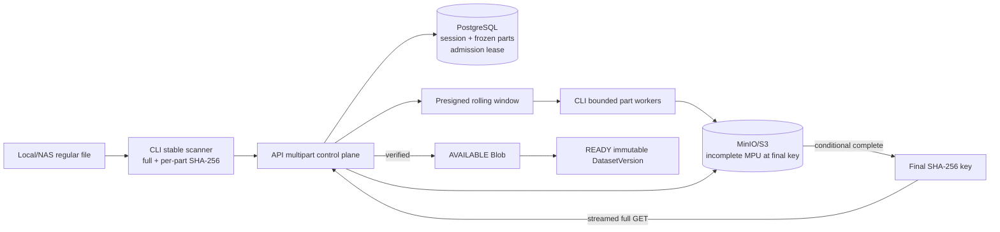
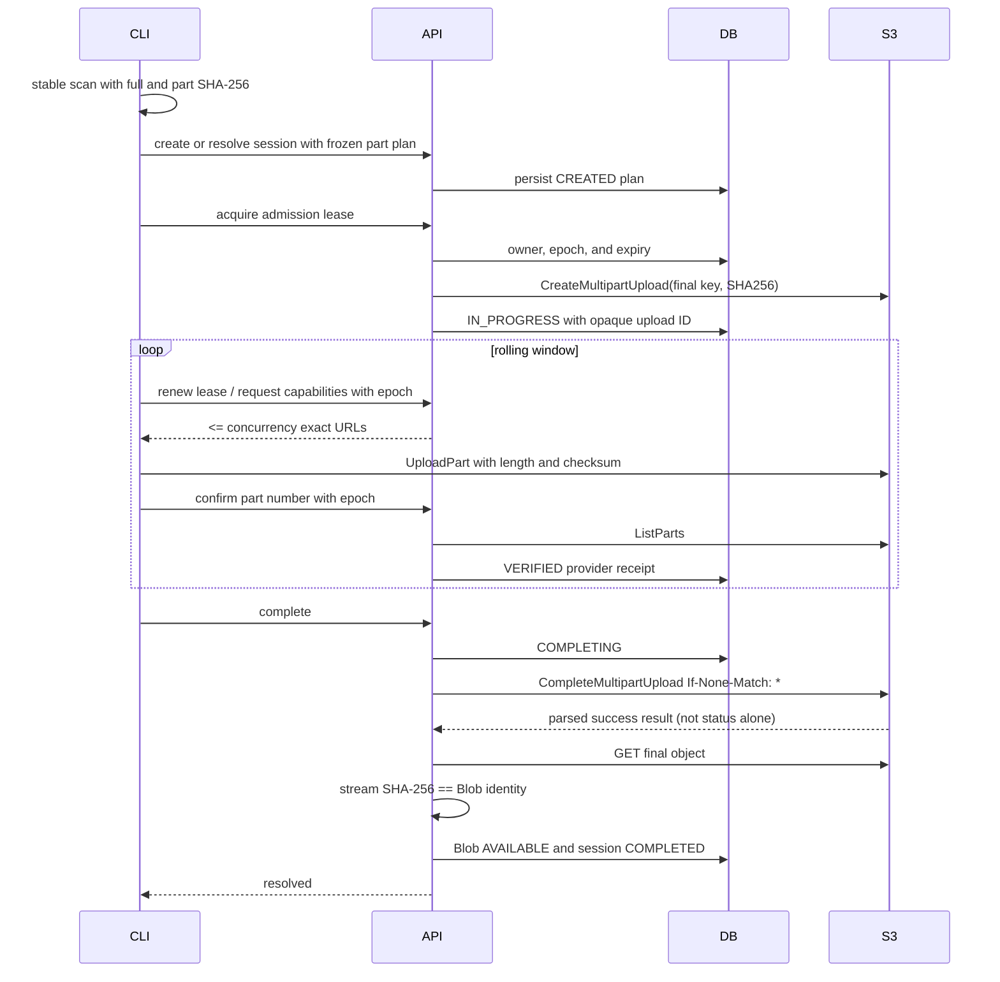
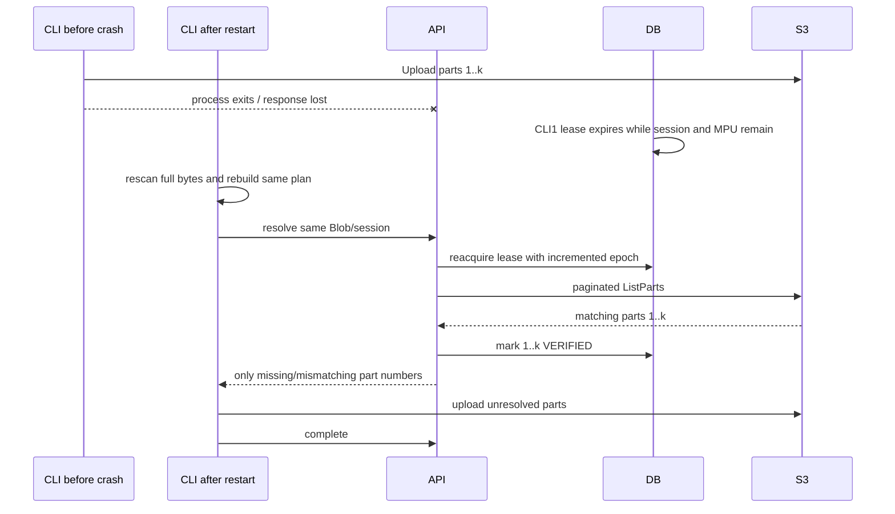
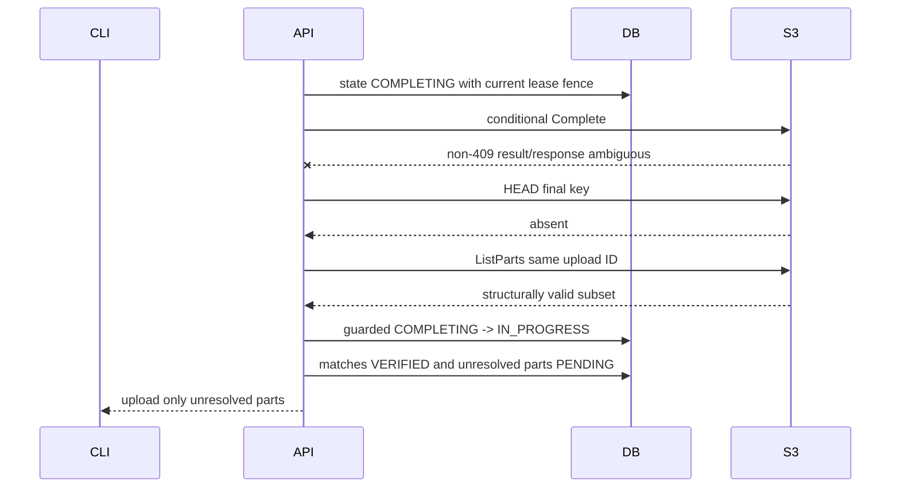
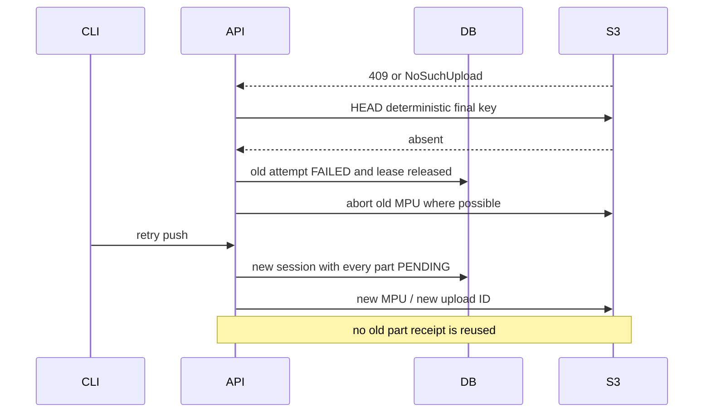
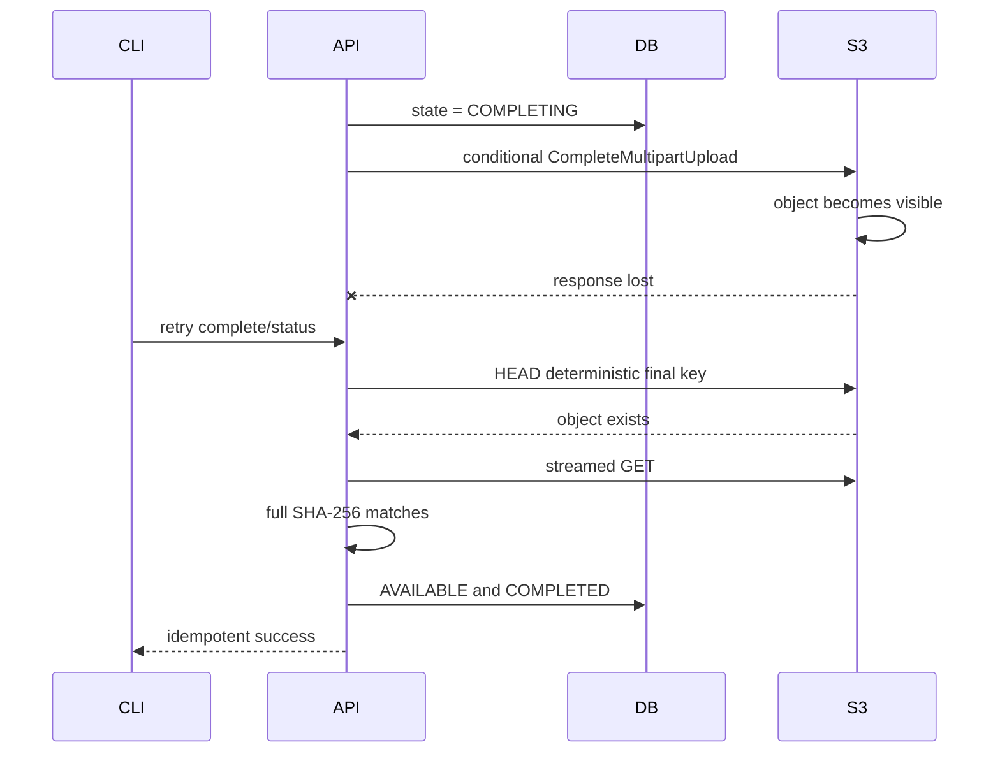
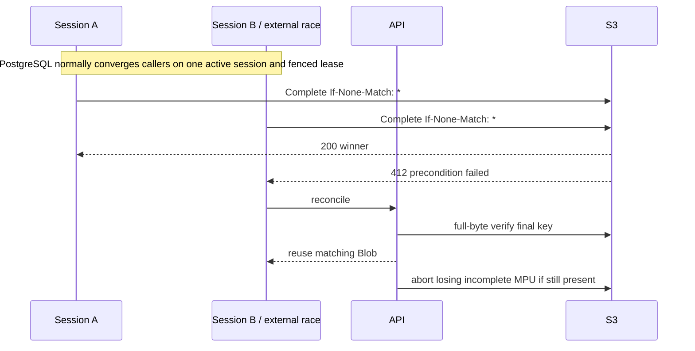
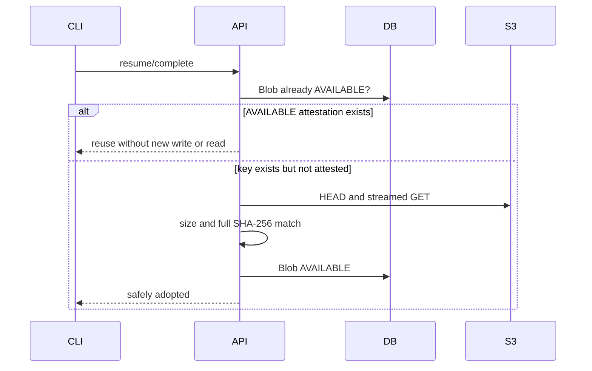
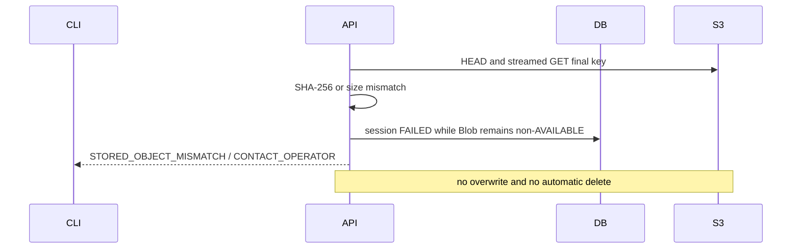

# RoboLake M2 Multipart Architecture

## 1. Decision summary

M2 uses **direct multipart upload to the deterministic final Blob key**. The API owns provider
initiation, reconciliation, completion, and abort. The CLI sends part bytes directly with a small
rolling window of presigned UploadPart capabilities. Final publication is the provider's
`CompleteMultipartUpload` request with `If-None-Match: *`.

A persistent multipart session is separate from a short-lived admission lease. Session/provider
progress survives interruption; only an unexpired lease consumes one global execution slot and
authorizes DB/control-plane mutation. Lease takeover increments a fencing epoch without aborting or
replacing the existing provider MPU.

The pinned MinIO image accepted this conditional completion, preserved an existing object with
HTTP 412, and allowed exactly one winner in a concurrent completion race. In contrast, it ignored
destination `If-None-Match` on `CopyObject` and overwrote different existing bytes. A temporary-key
architecture would also need multipart copy for files above 5 GB, extra persisted lifecycle, twice
the object writes, and two full reads on this provider. See [provider probes](M2_PROVIDER_PROBES.md).

Multipart SHA-256 reported by MinIO is `COMPOSITE`, not the canonical whole-file SHA-256. Therefore
every newly completed, non-`AVAILABLE` multipart object receives one streamed full-object GET and
SHA-256 comparison before `Blob -> AVAILABLE`. This deliberate read cost prevents composite
checksums or ETags from being mistaken for Blob identity. A mismatch is detected and stopped; no
application workflow overwrites or deletes the final key.

## 2. Architecture alternatives

| Option | Concrete failure addressed | Decision, cost, and M1 effect |
| --- | --- | --- |
| A. Multipart directly to final key | Two sessions complete the same SHA key; an unguarded second completion overwrites the first. | **Selected.** Conditional completion converged as 200/412 on pinned MinIO and is documented by AWS. Costs one upload plus one verification read. A bad newly completed object can occupy a non-`AVAILABLE` key and require the existing M1 operator path; no M1 meaning changes. |
| B. Complete at a temporary key, then publish | Client-supplied part plan is inconsistent with the full manifest hash and would otherwise reach the final key before verification. | Rejected for M2. Small `CopyObject` ignored destination create-only on pinned MinIO. Large objects require a second multipart copy; MinIO copy parts exposed no SHA-256 and still required final full GET. It adds temporary storage, copy I/O, copy-resume state, deletion policy, and a second upload lifecycle. Reconsider only if the threat model stops trusting callers or a provider offers enforceable full-object SHA-256 publication. |
| C. API proxies all bytes | A provider lacks safe direct capabilities. | Rejected. It makes FastAPI the bandwidth, memory, timeout, and restart path and doubles network transit. No probe demonstrated a need. M1's control/data-plane separation remains intact. |
| D. Verify temp, then proxy or client re-upload to final | Prevent any client-plan defect from ever occupying the final key. | Rejected. It transfers every large Blob twice and still needs conditional final completion. The integrity benefit does not justify this cost inside M2's trusted-network boundary; post-completion full-byte verification still prevents false `AVAILABLE`. |

## 3. Component boundaries



- `domain` owns part planning, state machines, error types, and immutable records.
- `application` owns prepare/reconcile/issue/confirm/complete/abort orchestration through ports.
- `infrastructure` implements PostgreSQL, S3 control calls, presigning, streaming verification, and
  stable local reads.
- FastAPI validates requests and renders stable errors; it never accepts file bytes.
- Typer selects single PUT versus multipart, runs bounded workers, and never receives permanent S3
  credentials.

## 4. Object and session identity

The final key remains unchanged:

```text
blobs/sha256/<first-2>/<next-2>/<full-lowercase-sha256>
```

`Blob.sha256` is content identity. `UploadSession.id` is workflow-attempt identity. An admission
lease owner UUID and monotonically increasing epoch identify only the invocation currently allowed
to mutate that attempt; they are neither session identity nor authorization. The provider
upload ID is an opaque provider receipt stored server-side and is not exposed as an independent,
stable RoboLake API field. It necessarily appears with `partNumber` inside a presigned UploadPart
capability query; that entire URL/query is secret-bearing, never logged or placed in errors or
telemetry, and the client must not parse or depend on either value. There is no M2 temporary object
key. Provider multipart parts are invisible as objects until completion.

PostgreSQL is authoritative for the intended Blob, deterministic part boundaries, expected part
SHA-256 values, legal workflow state, and the current admission fence. The provider is authoritative
for whether an upload ID exists and which completed parts it currently holds. Only RoboLake can
attest `AVAILABLE` after final-key verification.

## 5. Deterministic part-size protocol

Constants are schema/session protocol, not deployment settings:

```text
BASE_PART_BYTES = 64 * 1024 * 1024
MAX_PART_BYTES = 5 * 1024 * 1024 * 1024
MAX_PARTS = 10_000
MAX_MULTIPART_BLOB_BYTES = 50_000_000_000_000
```

For Blob size `S > 5_000_000_000`:

```text
P = BASE_PART_BYTES
while ceil(S / P) > MAX_PARTS and P < MAX_PART_BYTES:
    P = min(2 * P, MAX_PART_BYTES)
reject if ceil(S / P) > MAX_PARTS
N = ceil(S / P)
offset(i) = (i - 1) * P
size(i) = min(P, S - offset(i)), for i in 1..N
```

`P`, `N`, offsets, sizes, and hashes are frozen before provider initiation. The final part may be
smaller; an exact multiple has a full-sized final part, not a zero-byte extra part.

| Blob size | Part size | Parts | Final part |
| ---: | ---: | ---: | ---: |
| 5,000,000,001 B | 67,108,864 B | 75 | 33,944,065 B |
| 10 GiB | 67,108,864 B | 160 | 67,108,864 B |
| 100 GiB | 67,108,864 B | 1,600 | 67,108,864 B |
| 1 TiB | 134,217,728 B | 8,192 | 134,217,728 B |
| 5 TiB | 1,073,741,824 B | 5,120 | 1,073,741,824 B |
| 50,000,000,000,000 B protocol maximum | 5,368,709,120 B | 9,314 | 1,211,965,440 B |

For any supported `S = kP + 1`, the last part is one byte. Provider documentation currently lists
10,000 parts, 5 MiB–5 GiB parts, and an approximately 50 TB maximum for AWS; MinIO documents 50 TiB.
The lower 50,000,000,000,000-byte protocol maximum remains portable across both. A future limit
change requires a protocol revision and ADR.

Operational settings do not alter this plan: default concurrency is 4, hard maximum 16, and
capability TTL is 900 seconds. Each worker streams 1 MiB chunks, so memory is approximately
`concurrency * stream_chunk_bytes`, not `concurrency * part_size`.

## 6. Local source identity and resume

The server never persists a local absolute path, device, inode, or mtime. On each `push` invocation,
the official CLI:

1. opens the regular file beneath the already validated root without following symlinks;
2. captures device, inode, size, and `mtime_ns` around one sequential pass;
3. computes the canonical whole-file SHA-256 and every deterministic part SHA-256 in that pass;
4. requires the before/after identity to match and the whole digest to match the manifest;
5. compares the resulting frozen plan to the server session before issuing any missing part;
6. uses positional reads, rehashes every outgoing part, and requires its expected digest; and
7. after all parts resolve, performs a final stable whole-file rehash before asking the API to
   complete.

On every new invocation, full rehash happens before any additional part upload. Device/inode/mtime
are in-memory stability signals within that invocation, not persisted resume identity. A new inode
or source path containing exactly the same bytes is safe because RoboLake identity is logical path
plus bytes, not inode. A truncated or byte-changed file returns `LOCAL_FILE_CHANGED`; unchanged
metadata is never accepted as byte proof. If bytes change invisibly during a run, outgoing part
hashes prevent wrong payload and the final stable rehash blocks completion. Earlier valid provider
parts remain usable after a later safe rerun.

## 7. Part capability and concurrency contract

The API issues a rolling window no larger than the configured concurrency (default 4, maximum 16).
Issuing all missing parts is rejected because thousands of bearer URLs could expire unused or leak.
One-at-a-time issuance is safe but needlessly serializes high-latency links.

Each URL is bound by SigV4 to bucket, final key, provider upload ID, part number, HTTP method,
expected `Content-Length`, and `x-amz-checksum-sha256`; TTL is 900 seconds. The client prepares the
range reader before requesting the URL and begins immediately. Replay can only replace that part
with the same length and digest, which is safe while the MPU is incomplete. Provider error bodies
are not parsed by the CLI; it reports the part number to the API and requests reconciliation.

When one worker fails, the CLI stops scheduling new parts, lets already-started requests settle,
then reconciles the complete window. Progress advances only when provider `ListParts` proves an
expected part. One shared file descriptor with positional reads, at most 16 HTTP connections, and
bounded chunk buffers constrain descriptors and memory.

Before any mutating multipart operation, the invocation acquires or renews a PostgreSQL admission
lease. The default lease lasts 120 seconds and is renewed every 30 seconds; both values are bounded
operational settings and do not change session interpretation. The global default cap of 64 counts
only unexpired leases. An expired lease can be atomically taken over for the same session with a
higher epoch, leaving the provider upload and parts untouched.

Capability issuance, reconcile writes, confirm, Complete initiation, abort, and post-provider DB
commits require the current `(owner_id, epoch)` and an unexpired lease. A stale invocation receives
`ADMISSION_LEASE_LOST`. A part URL issued earlier may still write only its signed bytes; the current
owner later reconciles that provider fact. An API provider request already dispatched when the lease
is lost may settle, but its result cannot bypass the post-call fence.

## 8. Integrity and final publication

The completion endpoint performs this idempotent sequence:

1. reconcile every paginated provider part;
2. require parts `1..N`, expected sizes, and provider SHA-256 equal to the frozen plan;
3. commit session `COMPLETING` before the provider request;
4. call `CompleteMultipartUpload` with the API-owned ETags/checksums and `If-None-Match: *`;
5. require the SDK/adapter to parse the complete response body and surface an embedded error even
   when HTTP status is 200; status 200 alone is never completion proof;
6. reconcile parsed success, embedded error, 412, 409, timeout, connection loss, and
   `NoSuchUpload` through the final key;
7. require final size and stream all final bytes through SHA-256;
8. record immutable application evidence (`FULL_STREAM_SHA256`, observed digest/size/read bytes,
   completion time, and verifier implementation), compare it to Blob identity, then atomically mark
   Blob `AVAILABLE` and session `COMPLETED`; and
9. allow normal Version finalization only after every referenced Blob is `AVAILABLE`.

ETag is needed as an opaque provider completion receipt only. Different part numbers with identical
bytes may legitimately have identical ETags and provider checksums; no receipt or digest has a
uniqueness constraint. MinIO's observed composite checksum
was `base64(SHA256(raw-part-digests))-part_count`; it proves provider part composition but does not
replace canonical whole-file SHA-256. HEAD is a diagnostic fast path. Full bytes are the M2
publication truth for every previously non-`AVAILABLE` multipart object.

PostgreSQL enforces structural consistency: observed digest equals `Blob.sha256`, observed size and
read bytes equal `Blob.size_bytes`, and required evidence is immutable. It cannot independently
prove that external provider I/O occurred. Provider integration tests establish the actual streamed
read; direct-SQL tests establish only the evidence/transition gate.

If a final object already belongs to an `AVAILABLE` Blob, the attestation is reused without reread.
If the key exists but the Blob is not `AVAILABLE`, M2 performs the same full-byte verification. A
matching object is adopted. A mismatch returns `STORED_OBJECT_MISMATCH`/`CONTACT_OPERATOR`; neither
the final object nor an `AVAILABLE` Blob is overwritten or automatically deleted. Any manual
inspection/removal follows the evidence-preserving
[poisoned final-key runbook](M2_POISONED_FINAL_KEY_RUNBOOK.md), never an application repair path.

A conditional-completion 409 has a stricter restart rule. Reconcile the final key once; a matching
object is reused, but if no final object exists the old provider upload ID is terminal for resume.
RoboLake marks the attempt terminal, releases its lease, attempts to abort/invalidate that MPU,
creates a new session/MPU, and uploads every part again under the new ID. It must not issue more
capabilities or reuse ListParts receipts from the old MPU. `NoSuchUpload` with no final uses the same
full-restart rule and maps to `MULTIPART_SESSION_NOT_FOUND`, never to an inferred expiry. This
matches the AWS CompleteMultipartUpload contract and is distinct from ordinary pre-completion
network retry.

## 9. Sequences

### Normal multipart upload



### Interrupted upload and resume



### Ambiguous Complete with partial same-MPU recovery



### 409 or missing provider upload with no final



### Lost CompleteMultipartUpload response



### Concurrent same-Blob upload



### Matching final object reuse



### Mismatching final object



No temporary-object publication sequence exists because Option B is rejected. Its tested
multipart-copy sequence and costs are recorded in the provider-probe document rather than implied
as an M2 workflow.

## 10. Metrics

M1 logical, unique-content, and invocation outcome metrics keep their names. Multipart adds:

- `planned_part_count` and `planned_part_bytes`: immutable plan totals;
- `provider_present_part_count` and `provider_present_part_bytes`: current provider listing,
  including mismatches for diagnosis;
- `resolved_part_count` and `resolved_part_bytes`: expected parts proven by the provider;
- `newly_transferred_part_count` and `newly_transferred_part_bytes`: expected parts whose successful
  UploadPart response was unambiguous in this invocation and was later provider-verified;
- `reused_provider_part_count` and `reused_provider_part_bytes`: matching parts present during this
  invocation's initial reconciliation, before it attempted any UploadPart for them;
- `reconciled_part_count` and `reconciled_part_bytes`: matching parts discovered after a lost or
  ambiguous response, concurrent/late write, or any case where transfer ownership is unprovable;
- `completed_object_bytes`: final object size observed after parsed completion/reconciliation;
- `verification_read_bytes`: actual final bytes consumed by whole-object verification; and
- `whole_object_verification_duration`: wall-clock time spent streaming and hashing the final object.

For a fully resolved invocation, the categories are disjoint and satisfy:

```text
newly_transferred_part_count + reused_provider_part_count + reconciled_part_count
    = resolved_part_count
newly_transferred_part_bytes + reused_provider_part_bytes + reconciled_part_bytes
    = resolved_part_bytes
```

Part byte metrics are planned payload sizes, not exact wire traffic. Failed or replayed requests may
transmit additional bytes. Exact `wire_bytes_sent` requires separate transport telemetry. Upload
duration/throughput and whole-object verification duration/bytes remain separate.

- Fresh upload: normally all provider-verified parts are newly transferred.
- Interrupted resume: parts found in initial ListParts are reused; later successful requests are new.
- Lost UploadPart response: a later matching discovery is reconciled, not new or reused.
- Concurrent/late same-session write: ownership is unprovable, so the matching part is reconciled.
- Already `AVAILABLE` Blob: no part outcome; the M1 invocation result reports one reused Blob.
- Concurrent completion loser: part metrics reflect its own observations, but final Blob outcome is
  reused after final-key verification/attestation.
- Completed but unverified object: has no created/reused final Blob outcome yet.

## 11. API and CLI proposal

| Operation | Endpoint / CLI behavior |
| --- | --- |
| Create or resolve | Existing `POST /versions/{version_id}/upload-sessions`; multipart request carries the canonical Blob digest and ordered part hashes. Server recomputes size/part boundaries. Idempotency-Key binds the request digest. |
| Acquire/renew lease | `POST /upload-sessions/{id}/admission-lease`; atomically returns non-secret owner UUID, fencing epoch, and expiry. Expired takeover preserves the session/MPU. |
| Status | Existing `GET /upload-sessions/{id}` adds strategy, safe state, and derived part totals; provider upload ID is omitted as an independent field. `robolake status` may show multipart progress beneath existing snapshot/content totals. |
| Reconcile | `POST /upload-sessions/{id}/reconcile`; current lease owner/epoch required for resulting writes. API paginates `ListParts` and returns safe states. |
| Issue capabilities | `POST /upload-sessions/{id}/part-capabilities` with current lease fence and requested missing part numbers; response is bounded by the rolling window. |
| Confirm part | `POST /upload-sessions/{id}/parts/{number}/confirm` with current lease fence; no client ETag is trusted. |
| Complete/publish | Existing `POST /upload-sessions/{id}/complete` with current lease fence; API-owned conditional completion plus full-byte verification. |
| Abort | `POST /upload-sessions/{id}/abort` with current lease fence; allowed only before a final object is proven and never implicit on Ctrl-C. |
| Resume | Existing `robolake push SOURCE --dataset NAME` rescans, resolves the same Version/Blob/session, and transfers unresolved parts. Optional `--part-concurrency` is bounded 1..16. |

Stable M2 errors extend, but do not rename, M1 codes:

| Code | Meaning | Next action | CLI exit |
| --- | --- | --- | ---: |
| `LOCAL_FILE_CHANGED` | Resume source no longer proves the sealed Blob/plan. | Rescan and rerun; changed content registers another Version. | 2 |
| `INVALID_PART_NUMBER` | Part is outside the frozen plan. | Correct client/request. | 2 |
| `PART_SIZE_MISMATCH` | Provider part differs from the plan and is reset for safe replacement. | `RETRY_PUSH` | 4 |
| `PART_CHECKSUM_REJECTED` | Provider rejected the exact expected part checksum. | `RETRY_PUSH` after local revalidation | 4 |
| `MULTIPART_SESSION_NOT_FOUND` | Provider upload ID is absent and no final object resolves it. | `RETRY_PUSH` creates a new session | 4 |
| `ADMISSION_LEASE_HELD` | Another unexpired invocation owns this session. | `RETRY_PUSH` after status/backoff | 4 |
| `ADMISSION_CAPACITY_EXHAUSTED` | All configured global lease slots are currently active. | `RETRY_PUSH` after bounded backoff | 4 |
| `ADMISSION_LEASE_LOST` | Invocation no longer owns the current unexpired fencing epoch. | `RETRY_PUSH` reacquires/resolves | 4 |
| `MULTIPART_COMPLETION_AMBIGUOUS` | Completion has no provable final outcome yet. | `RETRY_PUSH` | 4 |
| `FINAL_BLOB_PUBLICATION_CONFLICT` | 409/412 requires deterministic-key reconciliation. | `RETRY_PUSH` unless a matching final is adopted | 4 |
| `STORED_OBJECT_MISMATCH` | Final bytes do not equal the immutable content address. | `CONTACT_OPERATOR` | 5 |

`RETRY_PUSH` and `CONTACT_OPERATOR` remain derived actions, not database columns. Provider bodies,
independent upload-ID fields, local absolute paths, and presigned query strings never enter public
messages. The client receives the opaque upload ID only as an inseparable part of a redacted
capability URL and never interprets it.

## 12. Deployment boundary

The first M2 release uses an offline rollout: disable admission, drain M1 transfers, stop every
v0.1.0 server, back up and migrate PostgreSQL, deploy only M2-capable servers, run smoke tests, then
enable multipart admission. Mixed v0.1.0/M2 serving is unsupported because the old transfer service
does not understand M2 strategy/state values. Rollback is blocked until all non-terminal M2
sessions are reconciled and terminal workflow history is archived/removed under the guarded
procedure in [migration and rollback](M2_MIGRATION_AND_ROLLBACK.md). READY Versions, AVAILABLE
Blobs, and final objects are preserved.

## 13. AWS and MinIO portability

AWS documents conditional `CompleteMultipartUpload`, 412/409 concurrency outcomes, part replacement,
and multipart limits:

- [Conditional writes](https://docs.aws.amazon.com/AmazonS3/latest/userguide/conditional-writes.html)
- [Multipart overview](https://docs.aws.amazon.com/AmazonS3/latest/userguide/mpuoverview.html)
- [Multipart limits](https://docs.aws.amazon.com/AmazonS3/latest/userguide/qfacts.html)
- [UploadPart](https://docs.aws.amazon.com/AmazonS3/latest/API/API_UploadPart.html)
- [Object integrity](https://docs.aws.amazon.com/AmazonS3/latest/userguide/checking-object-integrity-upload.html)

Provider adapters must pass the same integration contract. MinIO-specific composite formatting,
error strings, and ETags are not protocol. A provider that cannot enforce conditional completion,
part checksum validation, or safe reconciliation is unsupported for M2.
