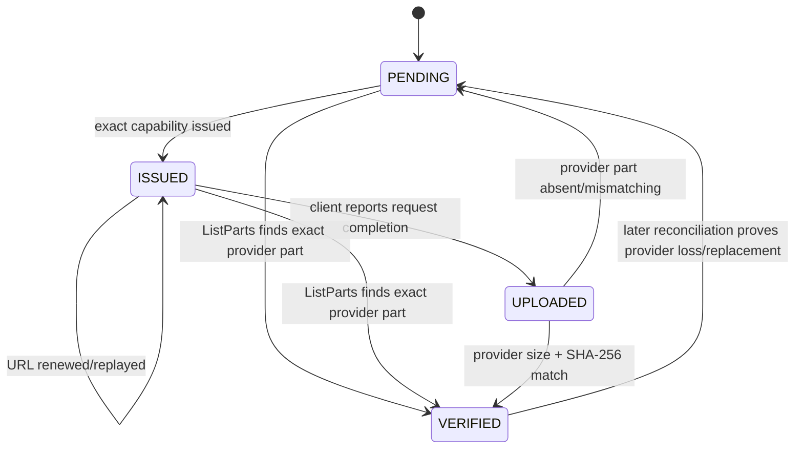

# RoboLake M2 State Machines

## Authority model

| Fact | Authority | Reconciliation rule |
| --- | --- | --- |
| Blob size, final key, full SHA-256 | PostgreSQL sealed Blob/manifest | Never changed by provider state. |
| Part size, count, offsets, expected SHA-256 | PostgreSQL frozen session plan | Provider parts must conform; provider never rewrites intent. |
| Capability issuance | PostgreSQL records latest issuance for diagnosis; URL is ephemeral | `ISSUED` is audit state, never progress. Replay is safe only because exact headers are signed. |
| Provider upload existence | Object provider | `NoSuchUpload` overrides stale DB progress after final-key reconciliation. |
| Provider-present parts, ETags, checksums | Object provider `ListParts` | Paginate all results; DB receipts are caches, not current truth. |
| Final completion | Final object plus provider upload state | HEAD final key first, then ListParts; never infer from a lost response alone. |
| Blob `AVAILABLE` | RoboLake verification transaction | Requires exact final size and streamed whole-file SHA-256, or an existing immutable attestation. |

## UploadSession

M2 extends the existing `UploadSession`; it does not introduce a second aggregate. Existing
`SINGLE_PUT` rows keep their M1 transitions. Multipart uses:

```mermaid
stateDiagram-v2
    [*] --> CREATED
    CREATED --> IN_PROGRESS: provider upload ID persisted
    CREATED --> ABORTING: explicit abort before provider creation settles
    CREATED --> FAILED: unrecoverable invariant/provider initiation failure
    IN_PROGRESS --> COMPLETING: every part VERIFIED
    IN_PROGRESS --> ABORTING: explicit safe abort
    IN_PROGRESS --> FAILED: provider upload lost or fatal mismatch
    COMPLETING --> COMPLETED: final full SHA-256 verified; Blob AVAILABLE
    COMPLETING --> ABORTING: matching competing final adopted; losing MPU cleanup
    COMPLETING --> FAILED: final key mismatch / completion cannot be recovered
    ABORTING --> ABORTED: provider absence proven
    ABORTING --> COMPLETED: completion won; matching final verified
    ABORTING --> FAILED: mismatching final / unrecoverable invariant
    COMPLETED --> [*]
    ABORTED --> [*]
    FAILED --> [*]
```



| State | Owner and entry condition | Terminal | Retry/reconciliation |
| --- | --- | --- | --- |
| `CREATED` | API transaction stores Blob link and complete frozen plan; provider initiation may not yet have an acknowledged ID. | No | Same idempotency key returns the row. If create response is lost, an untracked provider MPU is left to lifecycle cleanup; API initiates once more after the DB attempt is resolved. |
| `IN_PROGRESS` | API has atomically stored one provider upload ID. | No | Reconcile ListParts at every resume and after a transfer error. |
| `COMPLETING` | API proved every expected part and commits this state before calling Complete. | No | HEAD final key first. Matching bytes complete; absent key plus existing MPU retries Complete; absent key plus `NoSuchUpload` fails this attempt and permits a new session. |
| `COMPLETED` | Final object passed the full SHA-256 contract and Blob became `AVAILABLE` in the same DB transaction. | Yes | Replays return success. No session field mutates. |
| `ABORTING` | API accepted an explicit abort or must clean a losing MPU. | No | Retry Abort and ListParts. Never report ABORTED from a request response alone. If this session's completion won and its MPU disappeared, a matching final completes; a still-present losing MPU remains ABORTING until absent. |
| `ABORTED` | Provider returns `NoSuchUpload`/empty listing after abort and no unverified final outcome remains. | Yes | A future push may create a new session for a non-`AVAILABLE` Blob. |
| `FAILED` | Attempt cannot continue: provider upload vanished with no final, final mismatch, or frozen-plan invariant failed. | Yes for the attempt | Blob/Version are not necessarily terminal. A retryable failure creates a new attempt; a final mismatch derives `CONTACT_OPERATOR`. |

`EXPIRED` and `ORPHANED` are rejected as states. The API cannot prove why a provider upload vanished;
`FAILED` plus `MULTIPART_SESSION_EXPIRED` or `MULTIPART_SESSION_NOT_FOUND` records the observable
cause. Unknown provider uploads are operational orphans handled by provider lifecycle, not rows the
application can safely identify.

`ABORTING` is necessary: abort can succeed while the DB update fails, or the DB can record intent
while the provider call fails. Marking `ABORTED` before provider absence would lose resumable parts.

## UploadPart



| State | Meaning | Terminal | Retry behavior |
| --- | --- | --- | --- |
| `PENDING` | Provider has no proven matching part. | No | Eligible for capability issuance. |
| `ISSUED` | At least one unexpired/recent exact capability was issued. This records capability issuance only. | No | Renewal and exact replay are safe. Expiry returns to effective PENDING without requiring a state transition. |
| `UPLOADED` | Client reports an HTTP success, but API has not yet proved provider state. | No | Must call ListParts; client ETag/checksum is never authoritative. |
| `VERIFIED` | Current ListParts result matches part number, size, and expected provider SHA-256. | No across provider disappearance; final for normal part scheduling | If later absent or mismatching before completion, reset to PENDING and replace within the incomplete MPU. |

`FAILED` is rejected as a stored part state. A network failure, checksum rejection, or mismatching
incomplete part is safely retryable and belongs in `last_error_code`; a fatal plan/session failure
terminates the parent session. A terminal part would make valid provider reconciliation harder and
would duplicate session failure meaning.

`ISSUED` and client-reported `UPLOADED` never advance push progress. Only a provider-reconciled
`VERIFIED` part contributes to resolved part count/bytes. Reissuing a capability is permitted and
does not double-count progress. PostgreSQL remains authoritative for immutable intended boundaries
and hashes; ListParts remains authoritative for whether expected bytes are currently present.

Provider replacement of the same part number is allowed only before completion. It is automatic
repair of incomplete workflow state, not repair/deletion of a final Blob. The newly issued URL has
the same frozen length and checksum.

## Blob and DatasetVersion interaction

M2 does not add Blob or DatasetVersion states. Existing transitions remain:

```text
Blob: PENDING -> UPLOADING -> VERIFYING -> AVAILABLE | FAILED
Version: DRAFT -> UPLOADING -> VERIFYING -> READY | FAILED
```

- `Blob -> VERIFYING` occurs before final full GET.
- `Blob -> AVAILABLE` and `UploadSession -> COMPLETED` occur atomically after the digest matches.
- A retryable session `FAILED` does not require Blob or Version to become terminal `FAILED`; another
  attempt can continue the same immutable content.
- A poisoned final key uses the existing Blob/Version failure semantics and operator boundary.
- `READY` and `AVAILABLE` triggers remain terminal and immutable.

## Transition ownership and concurrency

All API transitions lock the session row. Part confirmation also locks the part row. The one-active-
session-per-Blob partial unique index covers `CREATED`, `IN_PROGRESS`, `COMPLETING`, and `ABORTING`.
Concurrent callers that race to create resolve the winning row after the uniqueness conflict.

Provider calls never occur inside a long-held database transaction. The API records an intent state,
commits, performs the provider call, and reconciles in a new transaction. This makes every crash
window observable. Direct SQL triggers reject identity/plan mutation, illegal transitions, terminal
session changes, and completion without all required facts.
