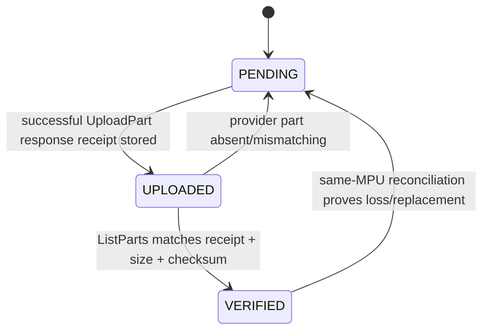

# RoboLake M2 State Machines

## Authority model

| Fact | Authority | Reconciliation rule |
| --- | --- | --- |
| Blob size, final key, full SHA-256 | PostgreSQL sealed Blob/manifest | Never changed by provider state. |
| Request replay | Immutable PostgreSQL idempotency record | One `request_id` maps forever to one canonical request digest and one response/session; it is never rebound. |
| Multipart attempt identity | PostgreSQL `(blob_id, session_generation)` | Generation is positive and monotonic per Blob. A terminal generation is never reactivated. |
| Part size, count, offsets, expected SHA-256 | PostgreSQL frozen session plan | Provider parts must conform; provider never rewrites intent. |
| Capability issuance | Optional PostgreSQL diagnostic metadata | It is neither part state nor progress. URL replay is safe only because exact headers are signed. |
| Upload mutation owner | PostgreSQL admission lease owner, epoch, and expiry | Upload-phase API mutations use atomic repository SQL fenced by the current unexpired lease. |
| Completion mutation owner | PostgreSQL completion lease owner, epoch, and expiry | A server runner, not the CLI, owns provider Complete and whole-object verification. |
| UploadPart completion receipt | Stored response from the successful UploadPart request | Its opaque ETag and normalized SHA-256 checksum are retained; client input alone is not trusted. |
| Provider upload existence and current parts | Object provider | Paginate `ListParts`; provider presence/size/checksum and listed ETag are observations, not completion receipts. |
| Final completion | Final object plus provider upload state | HEAD final key first, then ListParts; never infer from a lost response alone. |
| Blob `AVAILABLE` | RoboLake verification transaction | Requires exact final size and streamed whole-file SHA-256, or an existing immutable attestation. |

PostgreSQL is the durable work registry. It can enforce the structural consistency of recorded
evidence and fencing predicates, but it cannot independently prove that provider I/O occurred.

## Identity layers and resolver

M2 deliberately separates three identifiers:

- `request_id`: one create/resolve API request and its retries. The immutable idempotency record
  stores the canonical request digest and resulting session/response.
- `invocation_id`: one CLI process run. It owns invocation metrics and requests an upload admission
  lease, but it is neither session identity nor authorization.
- `session_generation`: one provider attempt for one Blob. It is unique as
  `(blob_id, session_generation)` and starts at 1.

Create/resolve first replays an existing `request_id`. Otherwise it locks the Blob, returns and binds
the current active multipart session when one exists, or creates `max(session_generation) + 1` when
all prior sessions are terminal. A concurrent uniqueness race resolves and binds the winner. A new
CLI invocation may resume the active generation; a 409, `NoSuchUpload`, or initiation-ambiguous
terminal attempt requires a new request UUID and a new generation. No request record or terminal
session is ever rebound or reopened.

## UploadSession

M2 extends the existing `UploadSession`; it does not introduce a second aggregate. Existing
`SINGLE_PUT` rows keep their M1 transitions. Multipart uses:

```mermaid
stateDiagram-v2
    [*] --> CREATED
    CREATED --> INITIATING: initiation intent committed
    CREATED --> CANCELLED: cancel before provider request
    CREATED --> FAILED: unrecoverable plan invariant
    INITIATING --> IN_PROGRESS: provider upload ID durably stored
    INITIATING --> FAILED: initiation response/commit ambiguous
    IN_PROGRESS --> COMPLETING: all parts VERIFIED or final object observed
    IN_PROGRESS --> ABORTING: explicit safe abort
    IN_PROGRESS --> FAILED: provider upload lost or fatal mismatch
    COMPLETING --> IN_PROGRESS: guarded partial same-MPU recovery
    COMPLETING --> COMPLETED: final full SHA-256 verified; Blob AVAILABLE
    COMPLETING --> FAILED: 409/NoSuchUpload without final, final mismatch, or unrecoverable attempt
    ABORTING --> ABORTED: provider absence proven
    ABORTING --> COMPLETING: final appeared; enqueue server verification
    ABORTING --> FAILED: mismatching final / unrecoverable invariant
    COMPLETED --> [*]
    ABORTED --> [*]
    CANCELLED --> [*]
    FAILED --> [*]
```



| State | Owner and entry condition | Terminal | Retry/reconciliation |
| --- | --- | --- | --- |
| `CREATED` | API transaction stores Blob link, generation, and complete frozen plan. No provider initiation request has been sent. | No | Same request ID replays the row. Cancel is local and becomes `CANCELLED`; initiation first commits `INITIATING`. |
| `INITIATING` | API committed provider-initiation intent but has not durably stored an upload ID. | No, but abort is not permitted | A successful response becomes `IN_PROGRESS` only after the opaque ID commits. Abort returns `MULTIPART_INITIATION_IN_PROGRESS`. Lost response or process/DB failure becomes terminal `FAILED` with `INITIATION_AMBIGUOUS`; any unaddressable MPU is left to provider lifecycle cleanup. |
| `IN_PROGRESS` | API has durably stored one provider upload ID. | No | Reconcile ListParts at every resume and after a transfer error. Upload admission lease owns mutations. |
| `COMPLETING` | API accepted durable completion work with reason `PARTS_READY` or `FINAL_PRESENT`, released the upload lease, and returned HTTP 202. | No | A server runner claims it and HEADs final first. Matching bytes complete. Only `PARTS_READY` may call Complete from stored response receipts. Structurally valid same-MPU facts may take the guarded recovery edge below. |
| `COMPLETED` | Final object passed full SHA-256 and Blob became `AVAILABLE` in the same DB transaction. | Yes | Replays and status return success. No session field mutates. |
| `ABORTING` | API accepted explicit abort from a state with a durable provider ID. | No | Retry Abort and ListParts. Never report ABORTED from a request response alone. If a final object appears, transition to `COMPLETING`, release upload admission, and let the server runner verify it. |
| `ABORTED` | Provider absence is proven after abort and no unverified final outcome remains. | Yes | A future push may create a new generation for a non-`AVAILABLE` Blob. |
| `CANCELLED` | A `CREATED` session was cancelled before any provider request. | Yes | No provider cleanup exists or is claimed. A future push uses a new request and generation. |
| `FAILED` | This provider attempt cannot continue: initiation ambiguity, 409/`NoSuchUpload` with no final, final mismatch, or frozen-plan invariant failure. | Yes for the attempt | Blob/Version are not necessarily terminal. Retryable cases create a new generation with no old part receipt. Final mismatch derives `CONTACT_OPERATOR`. |

### Provider initiation crash boundary

`CREATED` proves that no provider request has been issued. The API commits `INITIATING` before calling
CreateMultipartUpload. If the response and opaque upload ID are committed, the session becomes
`IN_PROGRESS`. If the response is lost, the process dies, or the DB write fails after the provider
may have created an MPU, the exact provider outcome is unknowable and the generation becomes
terminal `FAILED` with `INITIATION_AMBIGUOUS`. If the process still knows the in-memory upload ID, it
may attempt best-effort abort, but it must not claim success without provider evidence. RoboLake does
not guess, adopt, or expose an unknown ID; provider lifecycle cleanup bounds possible residue.

If the initiating process disappears, its upload lease eventually expires. A later owner that finds
`INITIATING` with no durable upload ID cannot repeat initiation in that generation; it atomically
records `INITIATION_AMBIGUOUS`/`FAILED`. The bound request returns that terminal result, and the CLI
uses a fresh create/resolve request UUID to allocate the next generation.

An abort request in `INITIATING` returns retryable `MULTIPART_INITIATION_IN_PROGRESS`; it never enters
`ABORTING` because no durable provider ID exists. This is a bounded ambiguity, not an `EXPIRED` state.

### Guarded `COMPLETING -> IN_PROGRESS`

This recovery edge is legal only when all of these application-recorded observations are committed
atomically with the transition:

1. the deterministic final key is absent;
2. the same immutable provider upload ID still exists;
3. the completion outcome was not 409;
4. paginated `ListParts` is structurally valid for the frozen plan; and
5. for ordinary completion ambiguity, at least one but not all planned parts currently has both a
   matching provider observation and a retained UploadPart response ETag/checksum receipt; for a
   vanished `FINAL_PRESENT` observation, any structurally valid same-MPU set (including empty or
   complete) may be requeued.

Matching receipt-backed parts remain `VERIFIED`; missing, mismatching, or receipt-less parts return
to `PENDING`. A receipt-less matching ListParts entry must be re-uploaded to capture a new successful
UploadPart response ETag/checksum. If every part is receipt-backed and matches, the session remains
`COMPLETING` and the runner retries Complete. A 409 or `NoSuchUpload` with no matching final never
takes this edge: the current generation becomes terminal and the next request creates a generation
with every part `PENDING` under a new provider upload ID.

`FINAL_PRESENT` is the adoption path when an object appears before this session resolves every part,
including during explicit abort. It does not mark those parts VERIFIED. The runner must stream and
verify the final object. If it disappears before verification, the runner reconciles the same MPU:
a valid subset takes the guarded edge above, while a fully receipt-backed set is requeued through
`IN_PROGRESS` and accepted again as `PARTS_READY`. It never calls Complete from an incomplete receipt
set. A missing MPU follows the terminal new-generation rule.

`EXPIRED` and `ORPHANED` are rejected as session states. Provider `NoSuchUpload` maps to
`MULTIPART_SESSION_NOT_FOUND`; it does not reveal whether the upload was completed, aborted,
expired by provider policy, or addressed with an invalid ID. Lease expiry is a separate operational
fact and never changes persistent session state.

## Upload admission lease

An upload admission lease fences one active CLI invocation without shortening the resumable session
lifetime. Acquisition carries `request_id` and `invocation_id`; the server generates `owner_id`, a
monotonically increasing `epoch`, and `expires_at`.

- the same acquire request ID replays the same result;
- if that replayed result has expired, reacquisition uses a new acquire request UUID; an old request
  is never rebound to a newer owner/epoch;
- acquiring, renewing, or taking over an expired lease is atomic under the global admission lock;
- the global upload capacity counts only leases whose `expires_at` is later than database time;
- the same owner may renew without changing its epoch; takeover after expiry increments the epoch;
- a different unexpired owner receives `ADMISSION_LEASE_HELD`; a full pool returns
  `ADMISSION_CAPACITY_EXHAUSTED`, both with `RETRY_PUSH`;
- capability issuance, reconcile/confirm, initiation, completion acceptance, abort, and their DB writes carry current
  owner/epoch and use one atomic repository `UPDATE ... WHERE` fence;
- a zero-row fenced mutation returns `ADMISSION_LEASE_LOST`/`RETRY_PUSH`;
- PostgreSQL constraints protect structural facts, while repository SQL enforces caller concurrency;
  privileged operator SQL is outside this application boundary; and
- a previously issued UploadPart URL may still write the exact signed bytes after lease loss. This is
  safe provider state for the new owner to reconcile, not authority for the stale invocation.

Sixty-four abandoned sessions with expired leases consume zero upload slots. Two invocations racing
to take over one expired lease converge on one owner/epoch. Accepting completion atomically changes
the session to `COMPLETING`, removes/releases its upload lease, records pending completion work, and
returns HTTP 202.

`completion_reason` is immutable for that accepted `COMPLETING` work item. If guarded recovery
returns the session to `IN_PROGRESS`, a later completion request is a new idempotent acceptance and
may select a new reason from current facts.

## Completion runner and lease

Completion is asynchronous and server-owned. A bounded runner built from the same RoboLake artifact
and modular-monolith code claims `COMPLETING` rows from PostgreSQL using `FOR UPDATE SKIP LOCKED` or
an equivalent atomic claim. PostgreSQL is the work registry; M2 adds no Kafka, Celery, or external
queue.

The runner uses a separate completion lease containing `owner_instance_id`, monotonic `epoch`, and
`expires_at`. Recommended operational defaults are concurrency 2 (hard maximum 8), lease TTL 120
seconds, and heartbeat every 30 seconds. Heartbeats run in independent short DB transactions at no
more than one third of the TTL while Complete or full-object GET/SHA-256 is in flight.

Every post-provider observation, verification-evidence write, Blob `AVAILABLE`, and terminal session
transition is atomically fenced by the current completion owner/epoch and unexpired DB time. A stale
runner cannot commit. A replacement first reconciles the deterministic final key and provider MPU;
for `PARTS_READY` it may safely retry Complete with stored UploadPart response ETags, and it restarts whole-object
verification from byte zero because M2 has no verification Range resume. Client disconnect or CLI
Ctrl-C stops only polling, never the accepted completion work. Status may expose a safe completion
phase (`PENDING_CLAIM`, `PROVIDER_COMPLETION`, `FINAL_VERIFICATION`, or `RECONCILING`) but does not
persist live verification byte progress.

## UploadPart



| State | Meaning | Terminal | Retry behavior |
| --- | --- | --- | --- |
| `PENDING` | No receipt-backed provider part is proven. | No | Eligible for capability issuance. A matching ListParts entry without a retained response receipt is re-uploaded. |
| `UPLOADED` | An unambiguous successful UploadPart response ETag and normalized SHA-256 response checksum are durably stored, but current provider presence is not yet proven. | No | Paginated ListParts must match number, size, expected checksum, response checksum, and response ETag. |
| `VERIFIED` | Current ListParts observation matches the frozen plan and retained UploadPart response receipt. | No across provider disappearance; final for normal scheduling | If later absent/mismatching within the same MPU, reset to PENDING and replace with frozen bytes. |

AWS instructs clients to retain the ETag returned by each UploadPart and not use a multipart listing
as the source of the Complete request. RoboLake requires supported providers to return both that
ETag and the requested SHA-256 checksum, and stores response and listing observations separately.
ListParts verifies current provider state but never manufactures a missing completion receipt.
Complete uses only stored UploadPart response ETags in part-number order.

Capability issuance is represented only by optional diagnostics (`last_capability_issued_at`,
`last_capability_expires_at`, `capability_issue_count`). These fields are not an append-only audit
trail and never advance progress. `FAILED` is also rejected as a part state: retryable part failures
belong in `last_error_code`, while fatal conditions terminate the parent generation.

Only receipt-backed `VERIFIED` parts contribute to resolved count/bytes. Different part numbers may
legitimately have identical bytes, expected SHA-256 values, provider checksums, and opaque ETags.
Uniqueness belongs to `(session_id, part_number)` and the frozen non-overlapping range plan, never to
a receipt or digest.

## Blob and DatasetVersion interaction

M2 does not add Blob or DatasetVersion states. Existing transitions remain:

```text
Blob: PENDING -> UPLOADING -> VERIFYING -> AVAILABLE | FAILED
Version: DRAFT -> UPLOADING -> VERIFYING -> READY | FAILED
```

- `Blob -> VERIFYING` occurs before final full GET.
- `Blob -> AVAILABLE` and `UploadSession -> COMPLETED` occur atomically after the digest matches.
- A retryable terminal session generation does not require Blob or Version to become terminal; a new
  generation can continue the same immutable content.
- A poisoned final key uses the existing Blob/Version failure semantics and operator boundary.
- `READY` and `AVAILABLE` triggers remain terminal and immutable.

## Transition ownership and concurrency

Upload-phase API mutations validate the upload admission lease and lock the affected rows through
atomic fenced repository statements. Completion mutations use only the completion lease. The
one-active-generation-per-Blob partial unique index covers `CREATED`, `INITIATING`, `IN_PROGRESS`,
`COMPLETING`, and `ABORTING`; an abandoned row is resumable and does not itself consume an execution
slot. Concurrent create/resolve callers converge through the Blob lock, request record, and partial
unique constraint.

Provider calls never occur inside a long-held database transaction. The application records intent,
commits, performs provider I/O, and conditionally records the result under the applicable fence.
Direct SQL triggers reject identity/plan mutation, illegal transitions, terminal changes, and
structurally inconsistent evidence; they do not prove which caller owned a lease or that external
provider I/O occurred.
