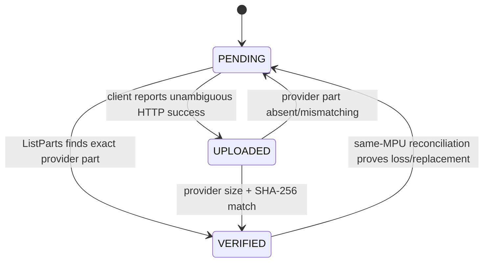

# RoboLake M2 State Machines

## Authority model

| Fact | Authority | Reconciliation rule |
| --- | --- | --- |
| Blob size, final key, full SHA-256 | PostgreSQL sealed Blob/manifest | Never changed by provider state. |
| Part size, count, offsets, expected SHA-256 | PostgreSQL frozen session plan | Provider parts must conform; provider never rewrites intent. |
| Capability issuance | Optional PostgreSQL diagnostic metadata | It is neither part state nor progress. URL replay is safe only because exact headers are signed. |
| Current mutation owner | PostgreSQL admission lease owner, epoch, and expiry | Every mutating command is fenced by the current unexpired lease. Lease expiry does not expire the session or provider MPU. |
| Provider upload existence | Object provider | `NoSuchUpload` overrides stale DB progress only after final-key reconciliation. Its cause cannot be inferred. |
| Provider-present parts, ETags, checksums | Provider `ListParts` | Paginate all results; DB receipts are caches, not current truth. ETags and checksums may repeat across different parts. |
| Final completion | Final object plus provider upload state | HEAD final key first, then ListParts; never infer from a lost response alone. |
| Blob `AVAILABLE` | RoboLake verification transaction | Requires exact final size and streamed whole-file SHA-256, or an existing immutable attestation. |

## UploadSession

M2 extends the existing `UploadSession`; it does not introduce a second aggregate. Existing
`SINGLE_PUT` rows keep their M1 transitions. Multipart uses:

```mermaid
stateDiagram-v2
    [*] --> CREATED
    CREATED --> IN_PROGRESS: provider upload ID persisted
    CREATED --> ABORTING: explicit abort before provider creation settles
    CREATED --> FAILED: unrecoverable invariant/provider initiation failure
    IN_PROGRESS --> COMPLETING: every part VERIFIED
    IN_PROGRESS --> ABORTING: explicit safe abort
    IN_PROGRESS --> FAILED: provider upload lost or fatal mismatch
    COMPLETING --> IN_PROGRESS: guarded partial same-MPU recovery
    COMPLETING --> COMPLETED: final full SHA-256 verified; Blob AVAILABLE
    COMPLETING --> ABORTING: matching competing final adopted; losing MPU cleanup
    COMPLETING --> FAILED: 409/NoSuchUpload without final, final mismatch, or unrecoverable attempt
    ABORTING --> ABORTED: provider absence proven
    ABORTING --> COMPLETED: completion won; matching final verified
    ABORTING --> FAILED: mismatching final / unrecoverable invariant
    COMPLETED --> [*]
    ABORTED --> [*]
    FAILED --> [*]
```



| State | Owner and entry condition | Terminal | Retry/reconciliation |
| --- | --- | --- | --- |
| `CREATED` | API transaction stores Blob link and complete frozen plan; provider initiation may not yet have an acknowledged ID. | No | Same idempotency key returns the row. If create response is lost, an untracked provider MPU is left to lifecycle cleanup; API initiates once more after the DB attempt is resolved. |
| `IN_PROGRESS` | API has atomically stored one provider upload ID. | No | Reconcile ListParts at every resume and after a transfer error. |
| `COMPLETING` | API proved every expected part and commits this state before calling Complete. | No | HEAD final key first. Matching bytes complete. If the same MPU exists with every part, retry Complete. A structurally valid partial listing may take the guarded recovery edge below. A 409 or `NoSuchUpload` with no final terminates this attempt. |
| `COMPLETED` | Final object passed the full SHA-256 contract and Blob became `AVAILABLE` in the same DB transaction. | Yes | Replays return success. No session field mutates. |
| `ABORTING` | API accepted an explicit abort or must clean a losing MPU. | No | Retry Abort and ListParts. Never report ABORTED from a request response alone. If this session's completion won and its MPU disappeared, a matching final completes; a still-present losing MPU remains ABORTING until absent. |
| `ABORTED` | Provider returns `NoSuchUpload`/empty listing after abort and no unverified final outcome remains. | Yes | A future push may create a new session for a non-`AVAILABLE` Blob. |
| `FAILED` | This provider attempt cannot continue: 409 or `NoSuchUpload` with no final, final mismatch, or frozen-plan invariant failure. | Yes for the attempt | Blob/Version are not necessarily terminal. A retryable failure creates a new session and provider upload ID; no old part receipt is adopted. A final mismatch derives `CONTACT_OPERATOR`. |

### Guarded `COMPLETING -> IN_PROGRESS`

This recovery edge is legal only when all of these application-recorded observations are committed
atomically with the transition:

1. the deterministic final key is absent;
2. the same immutable provider upload ID still exists;
3. the completion outcome was not 409;
4. paginated `ListParts` is structurally valid for the frozen plan; and
5. at least one, but not all, planned parts currently match.

Matching parts remain `VERIFIED`; missing or mismatching parts return to `PENDING`. Only those
unresolved parts may be re-uploaded. If every part matches, the session remains `COMPLETING` and
retries Complete. A 409 or `NoSuchUpload` with no matching final never takes this edge: the current
attempt becomes terminal, its lease is released, and a new session starts with every part
`PENDING` under a new provider upload ID.

`EXPIRED` and `ORPHANED` are rejected as session states. Provider `NoSuchUpload` maps to
`MULTIPART_SESSION_NOT_FOUND`; it does not reveal whether the upload was completed, aborted,
expired by provider policy, or addressed with an invalid ID. Admission-lease expiry is a separate
operational fact and never changes persistent session state.

`ABORTING` is necessary: abort can succeed while the DB update fails, or the DB can record intent
while the provider call fails. Marking `ABORTED` before provider absence would lose resumable parts.

## Admission lease

An admission lease fences one active invocation without shortening the resumable session lifetime.
It contains `owner_id`, a monotonically increasing `epoch`, and `expires_at` and has these rules:

- acquiring, renewing, or taking over an expired lease is atomic under the global admission lock;
- the global capacity count includes only leases whose `expires_at` is later than the database
  transaction time;
- the same owner may renew without changing its epoch; takeover after expiry increments the epoch;
- a different unexpired owner receives `ADMISSION_LEASE_HELD`; a full global pool returns
  `ADMISSION_CAPACITY_EXHAUSTED`, both with `RETRY_PUSH`;
- capability issuance, reconcile mutations, confirm, Complete initiation, abort, and all
  post-provider DB writes require the current owner/epoch and an unexpired lease;
- a stale invocation receives `ADMISSION_LEASE_LOST`/`RETRY_PUSH` and cannot mutate DB state;
- a provider request dispatched before lease loss may still settle. Its response cannot bypass the
  fence; the current owner reconciles the resulting provider facts; and
- a previously issued UploadPart URL may still write the same signed bytes after lease loss. This
  is safe provider state to reconcile, not authority for the stale invocation.

Leases are operational concurrency controls, not authorization tokens, progress, or provider-MPU
ownership. Sixty-four abandoned sessions with expired leases consume zero active slots. A new
invocation can acquire a slot, and two invocations racing to take over one session's expired lease
converge on one owner/epoch.

## UploadPart



| State | Meaning | Terminal | Retry behavior |
| --- | --- | --- | --- |
| `PENDING` | Provider has no proven matching part. | No | Eligible for capability issuance. |
| `UPLOADED` | The current client reports an unambiguous HTTP success, but API has not yet proved provider state. | No | Must call ListParts; client ETag/checksum is never authoritative. |
| `VERIFIED` | Current ListParts result matches part number, size, and expected provider SHA-256. | No across provider disappearance; final for normal scheduling | If later absent or mismatching within the same MPU before completion, reset to PENDING and replace with the frozen bytes. |

Capability issuance is represented only by optional diagnostic fields such as
`last_capability_issued_at`, `last_capability_expires_at`, and `capability_issue_count`. These fields
do not form an append-only audit trail and never advance progress. `FAILED` is also rejected as a
part state: retryable part failures belong in `last_error_code`, while fatal conditions terminate
the parent attempt.

Only provider-reconciled `VERIFIED` parts contribute to resolved part count/bytes. Different part
numbers may legitimately have identical bytes, expected SHA-256 values, provider checksums, and
opaque ETags. Uniqueness belongs to `(session_id, part_number)` and the frozen non-overlapping
offset/range plan, never to a receipt or digest.

Provider replacement of the same part number is allowed only before completion. It is automatic
repair of incomplete workflow state, not repair/deletion of a final Blob. The newly issued URL has
the same frozen length and checksum.

## Blob and DatasetVersion interaction

M2 does not add Blob or DatasetVersion states. Existing transitions remain:

```text
Blob: PENDING -> UPLOADING -> VERIFYING -> AVAILABLE | FAILED
Version: DRAFT -> UPLOADING -> VERIFYING -> READY | FAILED
```

- `Blob -> VERIFYING` occurs before final full GET.
- `Blob -> AVAILABLE` and `UploadSession -> COMPLETED` occur atomically after the digest matches.
- A retryable session `FAILED` does not require Blob or Version to become terminal `FAILED`; another
  attempt can continue the same immutable content.
- A poisoned final key uses the existing Blob/Version failure semantics and operator boundary.
- `READY` and `AVAILABLE` triggers remain terminal and immutable.

## Transition ownership and concurrency

All mutating API operations validate the admission lease and lock the session row. Part confirmation
also locks the part row. The one-active-session-per-Blob partial unique index covers `CREATED`,
`IN_PROGRESS`, `COMPLETING`, and `ABORTING`; an abandoned row is resumable and does not itself
consume the global invocation cap. Concurrent callers that race to create or reacquire resolve the
winning session and fenced lease after the uniqueness conflict.

Provider calls never occur inside a long-held database transaction. The API records an intent,
commits, performs the provider call, and revalidates the lease before recording the result. This
makes every crash window observable. Direct SQL triggers reject identity/plan mutation, illegal
transitions, terminal session changes, and structurally inconsistent completion evidence;
PostgreSQL cannot prove that external provider I/O actually occurred.
