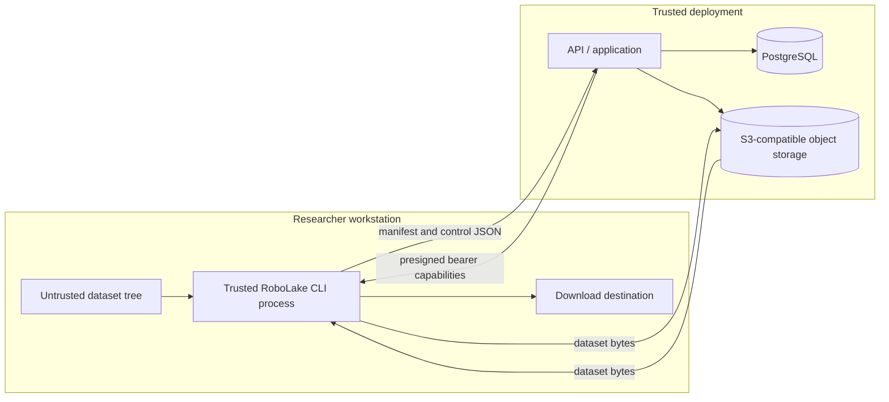

# RoboLake v0.1 Threat Model

- **Status:** Accepted
- **Date:** 2026-07-10
- **Architecture:** [ARCHITECTURE_V0_1.md](ARCHITECTURE_V0_1.md)

## 1. Scope and security objective

This model covers scanning an untrusted local directory, registering its manifest, transferring
opaque files through presigned S3 requests, verifying them, and reconstructing a `READY` version.
The primary objective is integrity: the bytes downloaded for every logical path must match the
sealed manifest, and no manifest path may cause access outside the selected source or destination.

Confidentiality objectives are limited but real: RoboLake must not leak dataset bytes, credentials,
presigned URLs, or absolute local paths through APIs, logs, errors, examples, or test fixtures.
Availability controls prevent abandoned uploads and hostile input from consuming unbounded storage
or application resources.

## 2. Assumptions and explicit boundary

- v0.1 has no authentication, authorization, or tenant isolation. API users and operators are
  assumed to share a trusted environment.
- TLS termination and network access controls are deployment responsibilities. Plaintext traffic is
  acceptable only inside the local development Compose network.
- The CLI host can legitimately read the selected source and write the selected destination.
- PostgreSQL and object-storage service credentials are available only to API/operator processes.
- Dataset files and manifests are untrusted input even inside the trusted deployment.
- Object storage provides its documented S3 operation semantics, but ETag is not trusted as a
  full-file digest.

This boundary makes an Internet-exposed deployment unsafe. Adding authentication later does not
retroactively make v0.1 multi-tenant; that requires a new threat model and ADR.

## 3. Assets

- Sealed manifest bytes, manifest SHA-256, and version identity
- Dataset file bytes and content-addressed blob identity
- Version, blob, upload-session, and idempotency state in PostgreSQL
- API object-storage credentials and database credentials
- Short-lived presigned upload/download URLs
- Local source files and download destination contents
- Availability and storage capacity of API, PostgreSQL, and object storage
- Audit evidence that explains state transitions without exposing sensitive values

## 4. Trust boundaries and data flows

Boundary crossings are: local filesystem→CLI, CLI↔API, CLI↔object storage through bearer URLs,
API↔PostgreSQL, and API↔object storage with service credentials.

## 5. Threat actors and failure sources

- An accidental researcher who selects the wrong tree, repeats a command, interrupts transfer, or
  downloads into a populated directory
- A local user who can construct malicious names, symlinks, special files, or mutate files during a
  scan/upload
- A holder of a leaked presigned URL who replays its one permitted operation before expiry
- A caller with network access to the unauthenticated API
- A compromised CLI or API host that can read process memory and credentials; this is largely beyond
  v0.1 mitigation
- Network, process, database, or object-storage failures at every request boundary
- Operator misconfiguration that broadens storage permissions, exposes ports, or disables cleanup

## 6. Threat register

| ID | Threat and impact | Required controls | Verification and residual risk |
| --- | --- | --- | --- |
| T01 | Manifest path uses `..`, absolute/drive/UNC form, NUL, separator tricks, or normalized collisions to read or write outside the root | Typed `RelativePath`; NFC and POSIX normalization; reject unsafe segments and case-fold collisions; validate again at API and download | Unit corpus plus property tests; path checks alone do not stop a compromised CLI |
| T02 | Symlink, special-file, or time-of-check/time-of-use race causes scanner to read unintended/changing bytes | Never follow symlinks; accept regular files only; open safely; pre/post `fstat`; detect mutation; revalidate source manifest before upload | Race windows remain on hostile local filesystems; v0.1 fails the whole operation when detected |
| T03 | Download writes through a symlink or overwrites an existing file | Preflight all paths; containment check; non-following parent/temp creation; temporary sibling plus atomic rename; no overwrite by default | Platform-specific filesystem behavior requires Linux/macOS contract tests |
| T04 | Manifest or object is modified in transit or at rest | TLS outside local Compose; sealed manifest SHA-256; per-part checksum when supported; server full-object SHA-256 and size before `READY`; download repeats verification | SHA-256 collision is accepted as negligible; compromised API can subvert verification |
| T05 | Multipart ETag is mistaken for the file digest, publishing corrupt data | Treat ETag as opaque receipt only; compare manifest only to independently streamed SHA-256 and size | Integration tests use altered/reordered/truncated objects |
| T06 | A presigned URL leaks through logs, shell history, proxy analytics, or error output and is replayed | Return only over protected API; 15-minute default; exact method/key/part and signed headers; redact query strings; never put URLs in command arguments; refresh on demand | URLs are bearer tokens and can be replayed until expiry; no per-user revocation exists in v0.1 |
| T07 | CLI receives permanent or overly broad object-store credentials | Only API holds least-privilege service credentials; CLI uses presigned URLs; bucket policy limits API principal to the blob prefix and required methods | API compromise exposes its full allowed prefix; key rotation is an operator action |
| T08 | Presigned PUT overwrites an existing verified content key | One active session per blob; never presign writes for `AVAILABLE`; deterministic key; verify every completed object; restrict delete; conflict on size mismatch | Object storage does not enforce RoboLake's DB state; API credential misuse remains possible |
| T09 | Duplicate or concurrent requests create duplicate versions/sessions or regress state | Idempotency records bound to request hash; row locks; unique/partial indexes; transition triggers; terminal `READY` | PostgreSQL availability is required for mutations; no offline registry mode |
| T10 | Crash after provider completion yields ambiguous database state | Deterministic object key; retry `HeadObject`; full verification before state repair; `NoSuchUpload` is not treated as proof of failure | Verification adds storage reads and latency |
| T11 | Crash after provider multipart creation leaves untracked billed parts | Persist session intent first; explicit abort; expired-session cleanup; seven-day storage stale-upload backstop | Orphans can consume storage until cleanup runs |
| T12 | Caller exhausts API/DB/storage with huge manifests, too many URL requests, parts, retries, or unfinished uploads | Configurable body/entry/page limits; streaming/pagination; 10,000-part cap; bounded URL batches; retry cap/jitter; one active session per blob; cleanup metrics | Exact production limits await observed dataset measurements |
| T13 | Malicious media type, name, or failure detail reaches SQL/logs/terminal as injection | Parameterized SQLAlchemy statements; Pydantic transport validation; structured logs; terminal-safe escaping; bounded fields | CLI rendering libraries and log sinks remain dependencies to audit |
| T14 | Secrets or proprietary details enter Git through examples/tests/config | Synthetic/public fixtures only; `.env.example`; secret scanning; review docs and fixtures; ignore runtime state and local env files | Cannot prevent a contributor from intentionally committing data; repository review remains required |
| T15 | Aborted cleanup deletes a completed object or active upload | Cleanup locks expired DB rows, calls multipart abort only, never object delete, reconciles `NoSuchUpload`, and records terminal state | Provider/operator out-of-band deletion remains possible |
| T16 | Download serves a blob for the wrong logical path/version | Download plan derives key only from sealed entry hash; URL is generated server-side; CLI verifies expected hash and size for each path | A compromised registry can lie; database backups and access controls are operational needs |
| T17 | Unauthenticated API caller reads manifests, creates transfers, or obtains bearer URLs | Bind v0.1 to a trusted network; document exposure prohibition; minimize URL TTL and service permissions | **Accepted high residual risk.** Internet or shared untrusted deployment is unsupported |

Path traversal includes both `../` sequences and absolute paths, as categorized by
[MITRE CWE-22](https://cwe.mitre.org/data/definitions/22). Presigned URLs must be treated as bearer
tokens according to
[AWS guidance](https://docs.aws.amazon.com/AmazonS3/latest/userguide/using-presigned-url.html).

## 7. Security requirements by component

### CLI and local filesystem

- Display the source root locally but never send or record it server-side.
- Refuse symlinks and non-regular files during scan; do not silently skip them.
- Read and hash in bounded chunks; never load a multi-gigabyte file into memory.
- Store any local resume hints under the user's state directory with user-only permissions. The API
  and provider remain authoritative; local state contains no presigned URL.
- Redact URL query strings and response headers before diagnostics.
- On download, validate the entire manifest path set before creating any final file.

### API and application

- Reject file-body content types and enforce request, manifest-entry, page, and URL-batch limits.
- Use domain-specific errors; generic internal failures expose a correlation ID, not exception or
  credential detail.
- Authorize object keys by deriving them from validated SHA-256; never accept a client-supplied key.
- Sign only the exact HTTP method, bucket, key, upload ID, part number, and required checksum headers.
- Persist state transitions transactionally and log old/new state plus identifiers.
- Keep verification reads bounded and cancellable; retry without changing content identity.

### PostgreSQL

- Use a non-superuser application role and TLS outside local Compose.
- Enforce unique, foreign-key, check, and immutability constraints in migrations.
- Parameterize all queries and bound free-text fields.
- Backups must cover registry state; object bytes alone cannot reconstruct dataset/version ownership.

### Object storage

- API credential permissions are restricted to the configured bucket and `blobs/sha256/` prefix:
  create/upload/list/complete/abort multipart, put, head/get, and list only as required.
- The application does not need object delete for normal v0.1 operation.
- Use TLS outside local Compose, disable public bucket access, and keep the bucket unversioned unless
  a later operational requirement changes the decision.
- Configure stale multipart cleanup and monitor incomplete bytes. AWS recommends completing or
  aborting multipart uploads because stored parts persist until then
  ([AWS multipart abort guidance](https://docs.aws.amazon.com/AmazonS3/latest/userguide/abort-mpu.html)).

## 8. Presigned capability policy

- Default validity is 15 minutes; callers request renewal for missing work.
- Generate URLs in bounded pages and as late as practical.
- Upload URLs target a single hash-derived key and, for multipart, one upload ID and part number.
- Download URLs are generated only for `READY` entries.
- URLs are returned in JSON bodies over protected transport and never included in logs, metrics,
  exceptions, analytics, or shell command arguments.
- Signed checksum/content-length headers must be repeated exactly by CLI.
- If supported by the deployment, bucket policy limits signature age and source network. AWS notes
  that `s3:signatureAge` can reduce effective lifetime
  ([AWS presigned guardrails](https://docs.aws.amazon.com/prescriptive-guidance/latest/presigned-url-best-practices/additional-guardrails.html)).

## 9. Abuse and resource limits

Defaults are configuration, not product semantics. Initial values must be documented and exercised:

- maximum manifest request bytes and entry count;
- maximum normalized path/media-type/dataset-name lengths;
- API page and URL-batch sizes;
- 64 MiB default multipart part size, provider minimum/maximum, and 10,000-part cap;
- 15-minute URL lifetime, capped retry count, and 72-hour idle session timeout;
- bounded concurrent uploads and verification reads per CLI/API process;
- seven-day provider stale multipart cleanup.

Reject over-limit work before initiating storage operations. Metrics must make limit rejection and
capacity pressure visible without recording sensitive payloads.

## 10. Security test plan

- Table-driven path corpus for relative/absolute traversal, encoded separators, NUL, Unicode
  normalization, case collisions, Windows drives/UNC paths, long names, and symlinked parents
- Source mutation tests during scan and upload; special files and symlink cycles
- Download tests against pre-existing files, symlink swaps, corrupt content, partial writes, and
  cross-device rename behavior
- API fuzz/property tests for state commands, manifest bounds, idempotency-key payload conflicts,
  and illegal transitions
- PostgreSQL integration tests for constraints, triggers, concurrent registration, and row locks
- MinIO tests for expired/replayed URLs, wrong signed headers, part replacement, missing parts,
  ambiguous completion, abort, and stale cleanup
- Log-capture assertions that secrets, query signatures, absolute source paths, and dataset bytes are
  absent
- End-to-end corruption test proving a version cannot become `READY`, followed by safe recovery

## 11. Incident and recovery expectations

- A leaked presigned URL: revoke/rotate the signing credential if immediate invalidation is required,
  inspect object/session state, abort the session, and reverify affected blobs. v0.1 has no user-level
  revocation.
- A checksum mismatch: mark blob/version failed, retain safe identifiers and expected/actual size,
  never expose bytes, and require explicit replacement upload.
- Database loss: restore database backup before serving registry operations; do not infer datasets
  solely from object keys.
- Object loss: affected blobs fail verification/download; versions remain immutable but unavailable
  until operator-led restoration. Automated repair is outside v0.1.
- Stale upload growth: stop new session creation if capacity is threatened, run application cleanup,
  then inspect storage-side stale cleanup configuration.

## 12. Accepted residual risks and non-goals

- Anyone who can reach the v0.1 API can operate it and request transfer capabilities.
- A compromised API process can read/write the configured blob prefix and change registry metadata.
- A compromised researcher account can read any dataset that account can access locally and any
  unexpired URL it holds.
- Traffic confidentiality depends on deployment TLS and network controls outside local Compose.
- No malware scanning, file-format parsing, content policy, legal retention, object lock, disaster
  recovery automation, authentication, or multi-tenancy is provided.
- Very large verification requests can be slow; a durable worker is not introduced without observed
  evidence and a new ADR.

These risks are acceptable only for the stated trusted-environment v0.1 evaluation.
