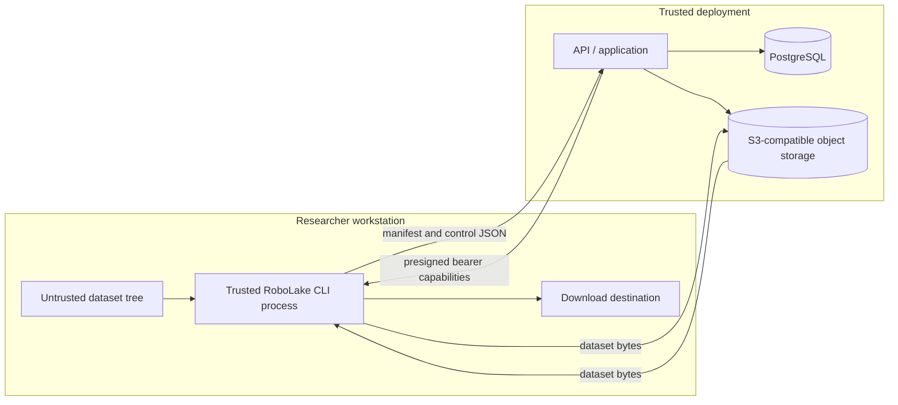

# RoboLake v0.1 Threat Model

- **Status:** Accepted
- **Date:** 2026-07-10
- **Architecture:** [ARCHITECTURE_V0_1.md](ARCHITECTURE_V0_1.md)

## 1. Scope and security objective

This model covers scanning an untrusted local directory, registering its manifest, transferring
opaque files through presigned S3 requests, verifying them, and reconstructing a `READY` version.
The primary objective is integrity: the bytes downloaded for every logical path must match the
sealed manifest, and no manifest path may cause access outside the selected source or destination.

Confidentiality objectives are limited but real: RoboLake must not leak dataset bytes, credentials,
presigned URLs, or absolute local paths through APIs, logs, errors, examples, or test fixtures.
Availability controls prevent abandoned uploads and hostile input from consuming unbounded storage
or application resources.

## 2. Assumptions and explicit boundary

- v0.1 has no authentication, authorization, or tenant isolation. API users and operators are
  assumed to share a trusted environment.
- TLS termination and network access controls are deployment responsibilities. Plaintext traffic is
  acceptable only inside the local development Compose network.
- The CLI host can legitimately read the selected source and write the selected destination.
- PostgreSQL and object-storage service credentials are available only to API/operator processes.
- Dataset files and manifests are untrusted input even inside the trusted deployment.
- Object storage provides its documented S3 operation semantics, but ETag is not trusted as a
  full-file digest.
- Provider system SHA-256/size is trusted only after exact signed-checksum upload semantics pass the
  pinned compatibility suite; an absent system SHA-256 triggers a full-GET fallback.
- M1 local filesystem guarantees are limited to contract-tested Linux/macOS behavior. Windows/SMB
  semantics and power-loss durability are outside the boundary.

This boundary makes an Internet-exposed deployment unsafe. Adding authentication later does not
retroactively make v0.1 multi-tenant; that requires a new threat model and ADR.

## 3. Assets

- Sealed manifest bytes, manifest SHA-256, and version identity
- Dataset file bytes and content-addressed blob identity
- Version, blob, upload-session, and idempotency state in PostgreSQL
- API object-storage credentials and database credentials
- Short-lived presigned upload/download URLs
- Local source files and download destination contents
- Availability and storage capacity of API, PostgreSQL, and object storage
- Audit evidence that explains state transitions without exposing sensitive values

## 4. Trust boundaries and data flows

Boundary crossings are: local filesystem→CLI, CLI↔API, CLI↔object storage through bearer URLs,
API↔PostgreSQL, and API↔object storage with service credentials.

## 5. Threat actors and failure sources

- An accidental researcher who selects the wrong tree, repeats a command, interrupts transfer, or
  downloads into a populated directory
- A local user who can construct malicious names, symlinks, special files, or mutate files during a
  scan/upload
- A holder of a leaked presigned URL who replays its one permitted operation before expiry
- A caller with network access to the unauthenticated API
- A compromised CLI or API host that can read process memory and credentials; this is largely beyond
  v0.1 mitigation
- Network, process, database, or object-storage failures at every request boundary
- Operator misconfiguration that broadens storage permissions, exposes ports, or disables cleanup

## 6. Threat register

| ID | Threat and impact | Required controls | Verification and residual risk |
| --- | --- | --- | --- |
| T01 | Manifest path uses traversal, controls, invalid Unicode, separator tricks, or normalized/ancestor collisions | Typed UTF-8/NFC POSIX `RelativePath`; fixed segment/path limits; reject exact/NFC/case-folded duplicate and ancestor collisions; validate at scan/API/pull | Linux/macOS corpus plus property tests; Windows/SMB is unsupported |
| T02 | Symlink, special-file, or time-of-check/time-of-use race causes scanner/uploader to read unintended or changing bytes | Accept regular files only; capture root/file identities; use dirfd-relative no-follow traversal and reopen; pre/post `fstat`; hash scan and created upload bytes | Linux/macOS race tests require fail-closed behavior; a compromised kernel/filesystem remains outside the model |
| T03 | Download writes through a symlink or overwrites a concurrently created destination | Private sibling staging; non-following temp creation; Linux `RENAME_NOREPLACE`/macOS `RENAME_EXCL`; fail closed if unsupported | Atomic visibility is tested; power-loss durability is not claimed |
| T04 | Manifest or object is modified in transit or at rest | TLS outside Compose; sealed manifest; signed provider SHA-256/length; HEAD system checksum/size with missing-checksum full-GET fallback; pull rehashes bytes | `READY` is not continuous scrubbing; compromised provider/API can subvert evidence |
| T05 | ETag, caller metadata, or multipart composite checksum is mistaken for full-file identity | Treat them as opaque/diagnostic only; M2 always streams the completed multipart object for canonical SHA-256 | Pinned-provider tests prove composite/full digest separation and permit identical ETags across different equal-byte parts |
| T06 | A presigned URL leaks through logs, shell history, proxy analytics, or error output and is replayed | Return only over protected API; 15-minute default; exact method/key/part and signed headers; redact query strings; never put URLs in command arguments; refresh on demand | URLs are bearer tokens and can be replayed until expiry; no per-user revocation exists in v0.1 |
| T07 | CLI receives permanent or overly broad object-store credentials | Only API holds least-privilege service credentials; CLI uses presigned URLs; bucket policy limits API principal to the blob prefix and required methods | API compromise exposes its full allowed prefix; key rotation is an operator action |
| T08 | Replayed/stale presigned PUT overwrites a content key | Sign `If-None-Match: *`, checksum, length, method, and key; reconcile 412/409; never issue writes for AVAILABLE; no normal object delete | Pinned MinIO proves stale URL cannot overwrite; API credential misuse remains possible |
| T09 | Duplicate or concurrent requests create duplicate versions/sessions or regress state | Idempotency records bound to request hash; row locks; unique/partial indexes; transition triggers; terminal `READY` | PostgreSQL availability is required for mutations; no offline registry mode |
| T10 | Crash after provider completion yields ambiguous database state | Deterministic key; idempotent completion; HEAD system checksum/size or fallback GET before state repair | Missing checksum adds one storage read; poisoned key stops for operator action |
| T11 | Crash after provider multipart creation leaves untracked billed parts | Persist session intent first; current-workflow explicit abort; seven-day storage stale-upload backstop | Orphans can consume storage until provider cleanup; lease expiry is not MPU cleanup |
| T12 | Caller exhausts API/DB/storage with huge manifests, capability requests, retries, or unfinished uploads | Fixed protocol limits; one active session per Blob; separate expiring admission leases with a global cap and fencing; M2 part/provider cleanup bounds | API remains unauthenticated and can still create persistent rows inside the trusted network |
| T13 | Malicious name/path/failure detail reaches SQL/logs/terminal as injection | Parameterized SQLAlchemy; strict transport/domain validation; structured logs; terminal-safe escaping; bounded fields; no canonical media input | CLI rendering libraries and log sinks remain dependencies to audit |
| T14 | Secrets or proprietary details enter Git through examples/tests/config | Synthetic/public fixtures only; `.env.example`; secret scanning; review docs and fixtures; ignore runtime state and local env files | Cannot prevent a contributor from intentionally committing data; repository review remains required |
| T15 | Aborted cleanup deletes a completed object or active upload | Only the current fenced workflow aborts its exact incomplete MPU; never object delete; reconcile final key before interpreting `NoSuchUpload` | Provider/operator out-of-band deletion remains possible |
| T16 | Download serves a blob for the wrong logical path/version or skips an entry after replay | Immutable manifest ordinal/path; Version-bound stateless cursor; exact ordinal lookup; URL derived server-side; CLI verifies every path/hash before tree publish | Unsigned cursor is not authorization; caller already reads all READY entries |
| T17 | Unauthenticated API caller reads manifests, creates transfers, or obtains bearer URLs | Bind v0.1 to a trusted network; document exposure prohibition; minimize URL TTL and service permissions | **Accepted high residual risk.** Internet or shared untrusted deployment is unsupported |

Path traversal includes both `../` sequences and absolute paths, as categorized by
[MITRE CWE-22](https://cwe.mitre.org/data/definitions/22). Presigned URLs must be treated as bearer
tokens according to
[AWS guidance](https://docs.aws.amazon.com/AmazonS3/latest/userguide/using-presigned-url.html).

## 7. Security requirements by component

### CLI and local filesystem

- Display the source root locally but never send or record it server-side.
- Refuse symlinks and non-regular files during scan; do not silently skip them.
- Read and hash in bounded chunks; never load a multi-gigabyte file into memory.
- Redact URL query strings and response headers before diagnostics.
- On download, validate the whole path set before staging, prepare a temp target before requesting
  one capability, and publish only the complete verified tree.

### API and application

- Reject file bodies and enforce fixed manifest/path limits plus one GET capability per response.
- Use domain-specific errors; generic internal failures expose a correlation ID, not exception or
  credential detail.
- Authorize object keys by deriving them from validated SHA-256; never accept a client-supplied key.
- Sign only exact method/bucket/key plus create-only, length, checksum, and later multipart fields.
- Persist state transitions transactionally and log old/new state plus identifiers.
- Use provider system checksum/size with bounded fallback reads; retry without changing identity.

### PostgreSQL

- Use a non-superuser application role and TLS outside local Compose.
- Enforce unique, foreign-key, check, and immutability constraints in migrations.
- Parameterize all queries and bound free-text fields.
- Backups must cover registry state; object bytes alone cannot reconstruct dataset/version ownership.

### Object storage

- API credential permissions are restricted to the configured bucket and `blobs/sha256/` prefix:
  create/upload/list/complete/abort multipart, put, head/get, and list only as required.
- The application does not need object delete for normal v0.1 operation.
- Use TLS outside local Compose, disable public bucket access, and keep the bucket unversioned unless
  a later operational requirement changes the decision.
- Configure stale multipart cleanup and monitor incomplete bytes. AWS recommends completing or
  aborting multipart uploads because stored parts persist until then
  ([AWS multipart abort guidance](https://docs.aws.amazon.com/AmazonS3/latest/userguide/abort-mpu.html)).

## 8. Presigned capability policy

- Default validity is 15 minutes; callers request renewal for missing work.
- Upload URLs target one hash-derived key and sign `If-None-Match: *`, expected length/checksum; M2
  part URLs additionally bind one upload ID and part number.
- Download URLs are generated only for READY entries, exactly one per response and immediately
  before use. A stateless Version-bound cursor is replayable but is not secret or authorization.
- URLs are returned in JSON bodies over protected transport and never included in logs, metrics,
  exceptions, analytics, or shell command arguments.
- Signed precondition/checksum/content-length headers must be repeated exactly by CLI.
- If supported by the deployment, bucket policy limits signature age and source network. AWS notes
  that `s3:signatureAge` can reduce effective lifetime
  ([AWS presigned guardrails](https://docs.aws.amazon.com/prescriptive-guidance/latest/presigned-url-best-practices/additional-guardrails.html)).

## 9. Abuse and resource limits

Manifest validity uses deployment-independent protocol constants; operational settings are bounded
configuration. Document and test:

- 64 MiB/100,000-entry manifest limits, 255-byte segment, 1,024-byte path, and dataset-name bounds;
- exactly one M1 GET capability per response;
- 64 MiB default multipart part size, provider minimum/maximum, and 10,000-part cap;
- 15-minute URL lifetime, one immediate 409 reconciliation attempt, and bounded expiring M2
  admission leases with monotonic fencing epochs;
- bounded concurrent uploads and verification reads per CLI/API process;
- seven-day provider stale multipart cleanup.

Reject over-limit work before initiating storage operations. Metrics must make limit rejection and
capacity pressure visible without recording sensitive payloads.

## 10. Security test plan

- Table-driven path corpus for traversal, separators, controls/surrogates, NFC/case/ancestor
  collisions, Windows drive/UNC forms, fixed lengths, and symlinked parents
- Source mutation tests during scan and upload; special files and symlink cycles
- Download tests for one-capability TTL/replay, pre-existing/symlink destinations, corrupt content,
  partial writes, and concurrent atomic no-replace publication
- API fuzz/property tests for state commands, manifest bounds, idempotency-key payload conflicts,
  and illegal transitions
- PostgreSQL integration tests for constraints, triggers, concurrent registration, and row locks
- MinIO tests for signed create-only PUT, 200/412/409 convergence, stale URL refusal, wrong checksum,
  system checksum/fallback, one-at-a-time GET expiry, and M2 multipart lifecycle
- Log-capture assertions that secrets, query signatures, absolute source paths, and dataset bytes are
  absent
- End-to-end poisoned-object test proving no overwrite/delete and operator-led external recovery

## 11. Incident and recovery expectations

- A leaked presigned URL: revoke/rotate the signing credential if immediate invalidation is required
  and inspect object/session state. M1 waits for single-operation capability expiry; M2 may abort an
  active multipart session. v0.1 has no user-level revocation.
- A poisoned content key: mark Blob/Version failed with `STORED_OBJECT_MISMATCH`, derive
  `CONTACT_OPERATOR`, never overwrite/delete, and resume the same Version only after operator-led
  external inspection/removal. M1 exposes no repair endpoint.
- Database loss: restore database backup before serving registry operations; do not infer datasets
  solely from object keys.
- Object loss: affected blobs fail verification/download; versions remain immutable but unavailable
  until operator-led restoration. Automated repair is outside v0.1.
- Stale upload growth: stop new session creation if capacity is threatened, run application cleanup,
  then inspect storage-side stale cleanup configuration.

## 12. Accepted residual risks and non-goals

- Anyone who can reach the v0.1 API can operate it and request transfer capabilities.
- A compromised API process can read/write the configured blob prefix and change registry metadata.
- A compromised researcher account can read any dataset that account can access locally and any
  unexpired URL it holds.
- Traffic confidentiality depends on deployment TLS and network controls outside local Compose.
- No malware scanning, file-format parsing, content policy, legal retention, object lock, disaster
  recovery automation, authentication, or multi-tenancy is provided.
- A missing provider system checksum can require one full storage read. A durable verifier/auditor is
  not introduced without observed evidence and a new ADR.

These risks are acceptable only for the stated trusted-environment v0.1 evaluation.
